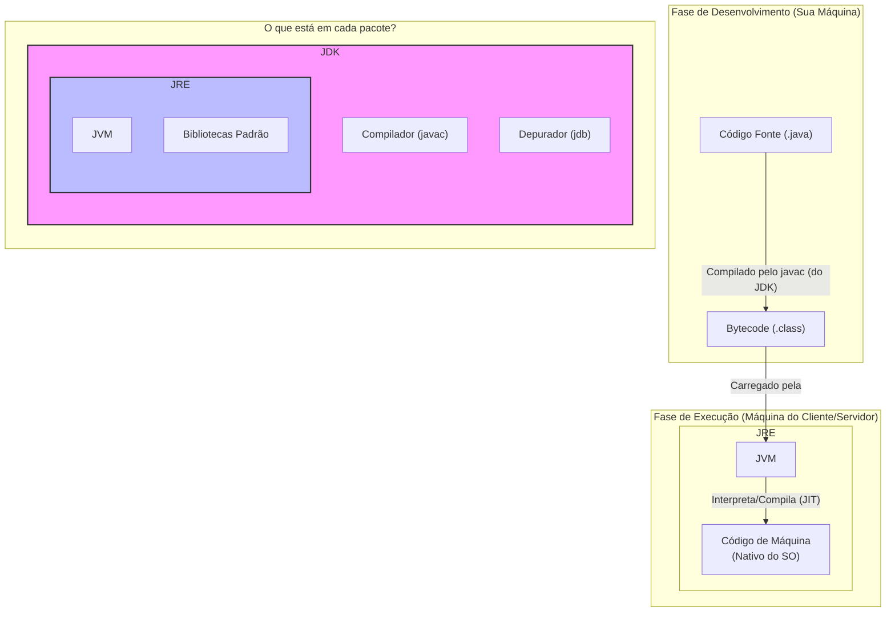

# Capítulo 1: O Ecossistema Java em Ação

No capítulo anterior, vimos a história e a filosofia do Java. Agora, vamos focar nos componentes técnicos que tornam a promessa do "Write Once, Run Anywhere" uma realidade. Entender essas três siglas é o primeiro passo técnico para qualquer desenvolvedor Java.

### 1.1. As Siglas Fundamentais: JVM, JRE e JDK

Para trabalhar com Java, você precisa entender três componentes chave que formam a base da plataforma:

*   **JDK (Java Development Kit):** É o seu **kit de ferramentas de desenvolvimento**. Pense nele como a caixa de ferramentas completa de um carpinteiro. Ele contém tudo o que você precisa para *criar*, *compilar* e *depurar* aplicações Java.
    *   **O que contém?** O compilador (`javac`), o depurador (`jdb`), geradores de documentação (`javadoc`) e, crucialmente, ele também inclui um JRE completo.
    *   **Quem usa?** Desenvolvedores. **Se você vai escrever código Java, é o JDK que você precisa instalar.**

*   **JRE (Java Runtime Environment):** É o **ambiente de execução**. Se o JDK é a oficina do carpinteiro, o JRE é a casa pronta com toda a fiação e encanamento necessários para que os eletrodomésticos (as aplicações) funcionem. Ele fornece as bibliotecas de classes e a JVM para *rodar* aplicações Java.
    *   **O que contém?** A JVM e as bibliotecas Java principais.
    *   **Quem usa?** Usuários finais que precisam apenas executar uma aplicação Java. *Observação de mentor: Hoje em dia, com a modularização e a prática de empacotar o runtime junto com a aplicação (usando ferramentas como jlink ou nativamente em frameworks como o Quarkus), a necessidade de um usuário final instalar um JRE separadamente tornou-se muito menos comum.*

*   **JVM (Java Virtual Machine):** É o **coração mágico do Java**. É um programa (uma "máquina virtual") que cria uma camada de abstração entre o seu código e o sistema operacional (Windows, Linux, macOS).
    *   **Como funciona?**
        1.  Você escreve seu código em um arquivo `.java`.
        2.  O compilador do JDK (`javac`) transforma seu código em um formato intermediário, neutro, chamado **bytecode**, e o salva em um arquivo `.class`.
        3.  Quando você roda a aplicação, a JVM é iniciada. Ela carrega o arquivo `.class`, verifica a segurança do bytecode e, em seguida, traduz essas instruções de bytecode para o código de máquina nativo que o seu processador entende.
    *   **Por que é tão importante?** É a JVM que permite a portabilidade. Você distribui o mesmo arquivo `.class` (bytecode), e a JVM específica de cada sistema operacional se encarrega de fazê-lo funcionar.

### 1.2. Diagrama do Fluxo

Vamos visualizar como esses componentes interagem:

Com essa base técnica estabelecida, estamos prontos para avançar e ver como organizar nosso código e dados com as estruturas que o Java nos oferece. 