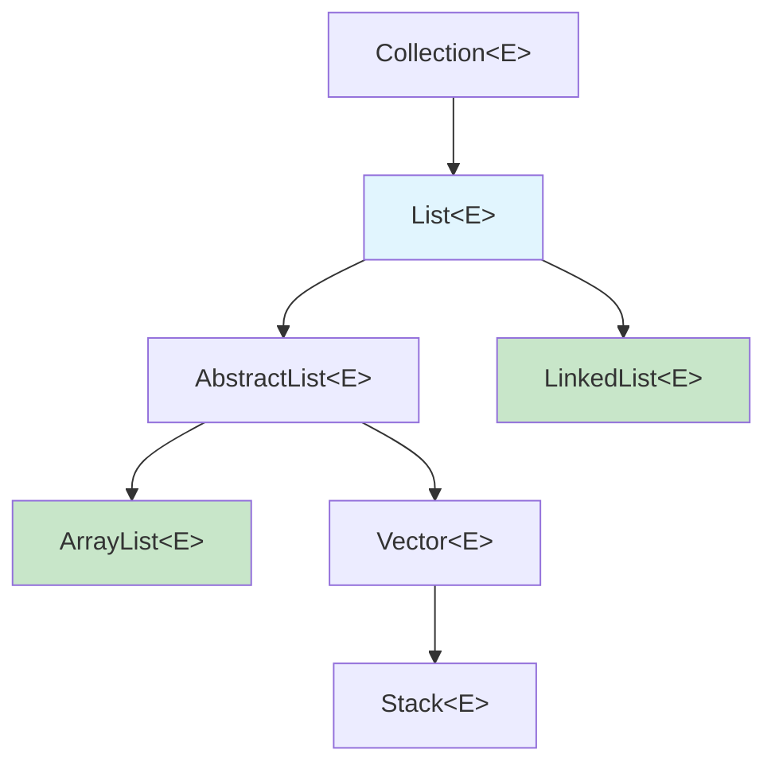

# Lista (List): Análise Técnica Aprofundada

A interface `List` é uma das mais utilizadas no Java Collections Framework. Representa uma coleção **ordenada** e **indexada** que permite elementos duplicados. Como desenvolvedor Java avançado, é crucial entender não apenas *como* usar cada implementação, mas *por que* elas foram projetadas de determinada forma e *quando* cada uma é mais apropriada.

---

## Hierarquia e Design



---

## ArrayList: O Array Dinâmico Otimizado

### Estrutura Interna
O `ArrayList` é implementado usando um **array redimensionável**. Internamente, mantém:
- `Object[] elementData`: O array que armazena os elementos
- `int size`: O número atual de elementos
- `int modCount`: Contador de modificações (para fail-fast iterators)

### Estratégia de Crescimento
```java
// Capacidade inicial padrão
private static final int DEFAULT_CAPACITY = 10;

// Quando o array está cheio, cresce para:
int newCapacity = oldCapacity + (oldCapacity >> 1); // ~1.5x o tamanho anterior
```

**Por que 1.5x e não 2x?**
- **Memória:** Crescimento menor reduz desperdício de memória
- **Performance:** 1.5x oferece um bom equilíbrio entre realocações frequentes e uso de memória

### Análise de Complexidade

| Operação | Complexidade | Explicação |
|----------|--------------|------------|
| `get(index)` | **O(1)** | Acesso direto ao array: `elementData[index]` |
| `set(index, element)` | **O(1)** | Substituição direta: `elementData[index] = element` |
| `add(element)` | **O(1) amortizado** | Na maioria das vezes é O(1), mas O(n) quando precisa redimensionar |
| `add(index, element)` | **O(n)** | Precisa deslocar todos os elementos à direita |
| `remove(index)` | **O(n)** | Precisa deslocar todos os elementos à esquerda |
| `contains(element)` | **O(n)** | Busca linear através do array |

### Quando Usar ArrayList
✅ **Ideal para:**
- Acesso frequente por índice
- Iteração sequencial
- Adições no final da lista
- Quando você conhece aproximadamente o tamanho final (use o construtor com capacidade)

❌ **Evite para:**
- Muitas inserções/remoções no meio
- Lista que cresce muito sem previsibilidade
- Acesso concorrente (não é thread-safe)

### Exemplo Técnico: Otimização de Performance
```java
// ❌ Ineficiente: múltiplas realocações
List<String> lista = new ArrayList<>(); // capacidade inicial: 10
for (int i = 0; i < 1000; i++) {
    lista.add("item" + i); // Vai realocar várias vezes
}

// ✅ Eficiente: dimensiona corretamente desde o início
List<String> lista = new ArrayList<>(1000); // capacidade inicial: 1000
for (int i = 0; i < 1000; i++) {
    lista.add("item" + i); // Nenhuma realocação
}
```

---

## LinkedList: Lista Duplamente Encadeada

### Estrutura Interna
O `LinkedList` é implementado como uma **lista duplamente encadeada**. Cada elemento é um nó (`Node`) que contém:

```java
private static class Node<E> {
    E item;          // O elemento armazenado
    Node<E> next;    // Referência para o próximo nó
    Node<E> prev;    // Referência para o nó anterior
}
```

A classe mantém referências para:
- `Node<E> first`: Primeiro nó da lista
- `Node<E> last`: Último nó da lista
- `int size`: Número de elementos

### Análise de Complexidade

| Operação | Complexidade | Explicação |
|----------|--------------|------------|
| `get(index)` | **O(n)** | Precisa percorrer até o índice (otimizada: começa do início ou fim) |
| `set(index, element)` | **O(n)** | Precisa encontrar o nó primeiro |
| `add(element)` | **O(1)** | Adiciona no final: apenas atualiza `last` |
| `add(index, element)` | **O(n)** | Precisa navegar até a posição |
| `remove(index)` | **O(n)** | Precisa navegar até a posição |
| `addFirst()`, `addLast()` | **O(1)** | Operações otimizadas nas extremidades |
| `removeFirst()`, `removeLast()` | **O(1)** | Operações otimizadas nas extremidades |

### Otimização do get(index)
O `LinkedList` possui uma otimização inteligente:

```java
Node<E> node(int index) {
    if (index < (size >> 1)) {
        // Se o índice está na primeira metade, começa do início
        Node<E> x = first;
        for (int i = 0; i < index; i++)
            x = x.next;
        return x;
    } else {
        // Se está na segunda metade, começa do fim
        Node<E> x = last;
        for (int i = size - 1; i > index; i--)
            x = x.prev;
        return x;
    }
}
```

### Quando Usar LinkedList
✅ **Ideal para:**
- Implementar filas (Queue) e pilhas (Deque)
- Muitas inserções/remoções nas extremidades
- Lista que funciona como buffer circular
- Quando você não sabe o tamanho final

❌ **Evite para:**
- Acesso frequente por índice
- Quando a memória é limitada (overhead dos ponteiros)
- Aplicações que precisam de cache-friendly access patterns

### Exemplo: LinkedList como Fila (Queue)
```java
LinkedList<String> fila = new LinkedList<>();

// Adiciona no final (enqueue)
fila.addLast("Cliente 1");
fila.addLast("Cliente 2");
fila.addLast("Cliente 3");

// Remove do início (dequeue)
String proximo = fila.removeFirst(); // "Cliente 1"
```

---

## Vector: O Veterano Sincronizado

### Características Principais
- **Thread-safe**: Todos os métodos são `synchronized`
- **Legacy**: Existe desde o Java 1.0
- **Crescimento**: Dobra de tamanho quando precisa expandir (diferente do ArrayList)

### Por que Geralmente Evitamos Vector?
1. **Performance**: A sincronização adiciona overhead desnecessário em aplicações single-thread
2. **Sincronização Inadequada**: A sincronização por método não garante atomicidade em operações compostas
3. **Alternativas Melhores**: `Collections.synchronizedList()` ou `CopyOnWriteArrayList`

```java
// ❌ Não é thread-safe mesmo com Vector!
if (!vector.isEmpty()) {
    Object item = vector.get(0); // Outro thread pode ter removido entre isEmpty() e get()
}

// ✅ Thread-safe com sincronização externa
synchronized(vector) {
    if (!vector.isEmpty()) {
        Object item = vector.get(0);
    }
}
```

---

## Comparação Prática: Benchmarks

### Cenário 1: Acesso Sequencial (10.000 elementos)
```
ArrayList: ~0.05ms
LinkedList: ~2.1ms
Resultado: ArrayList é ~42x mais rápido
```

### Cenário 2: Inserção no Início (1.000 operações)
```
ArrayList: ~15ms (precisa deslocar elementos)
LinkedList: ~0.02ms (apenas atualiza ponteiros)
Resultado: LinkedList é ~750x mais rápido
```

### Cenário 3: Uso de Memória (1.000.000 elementos Integer)
```
ArrayList: ~24MB (apenas o array + elementos)
LinkedList: ~72MB (elementos + overhead dos nós)
Resultado: ArrayList usa ~3x menos memória
```

---

## Melhores Práticas

### 1. Escolha da Implementação
```java
// Para uso geral: ArrayList
List<String> lista = new ArrayList<>();

// Para filas e operações nas extremidades: LinkedList
Deque<String> fila = new LinkedList<>();

// Para acesso concorrente: CopyOnWriteArrayList (para mais leituras que escritas)
List<String> listaConcorrente = new CopyOnWriteArrayList<>();
```

### 2. Inicialização com Capacidade
```java
// Se você sabe o tamanho aproximado
List<String> lista = new ArrayList<>(expectedSize);
```

### 3. Conversão entre Tipos
```java
// ArrayList para LinkedList (quando o padrão de uso muda)
List<String> arrayList = new ArrayList<>(Arrays.asList("a", "b", "c"));
List<String> linkedList = new LinkedList<>(arrayList);
```

---

**Próximos Passos:** No próximo arquivo, vamos mergulhar nas implementações de `Map`, incluindo as otimizações internas do `HashMap` e quando usar cada variante. 