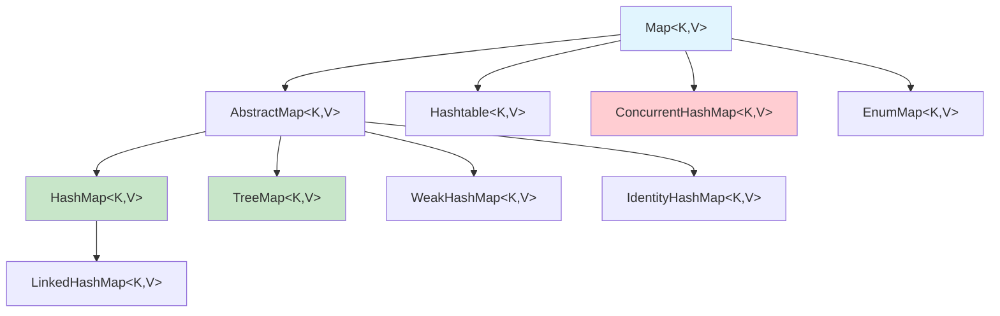
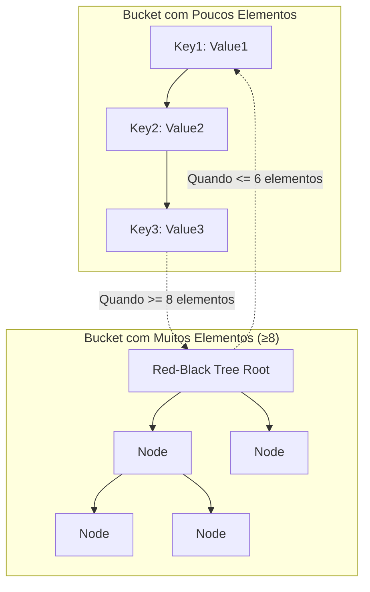

# Map: Análise Técnica Aprofundada das Estruturas Chave-Valor

A interface `Map` é uma das mais sofisticadas do Java Collections Framework. Representa uma estrutura de dados que mapeia **chaves únicas** para **valores**. A implementação mais importante e amplamente usada é o `HashMap`, que utiliza uma das estruturas de dados mais elegantes da ciência da computação: a **tabela de hash**.

---

## Hierarquia e Design



---

## HashMap: A Obra-Prima da Engenharia

### Estrutura Interna (Java 8+)

O `HashMap` moderno utiliza uma **estrutura híbrida**:
- **Array de buckets**: Array principal onde cada posição é um "bucket"
- **Lista encadeada**: Para resolver colisões (quando múltiplas chaves mapeiam para o mesmo bucket)
- **Árvore Red-Black**: Quando uma lista encadeada fica muito longa (≥8 elementos), é convertida em árvore

```java
// Estrutura simplificada do HashMap
class HashMap<K,V> {
    Node<K,V>[] table;          // Array principal (buckets)
    int size;                   // Número de elementos
    int threshold;              // Limite para resize
    float loadFactor = 0.75f;   // Fator de carga
    
    static class Node<K,V> {
        final int hash;
        final K key;
        V value;
        Node<K,V> next;         // Próximo nó na lista encadeada
    }
}
```

### O Algoritmo de Hash

**Passo 1: Hash da Chave**
```java
static final int hash(Object key) {
    int h;
    // XOR com os 16 bits superiores para melhor distribuição
    return (key == null) ? 0 : (h = key.hashCode()) ^ (h >>> 16);
}
```

**Passo 2: Determinação do Bucket**
```java
// Encontra o índice no array usando bitwise AND (mais rápido que %)
int index = (table.length - 1) & hash;
```

**Por que `table.length` é sempre uma potência de 2?**
- Permite usar `&` em vez de `%` (muito mais rápido)
- Garante distribuição uniforme dos elementos
- Exemplo: se `length = 16` (10000₂), então `length-1 = 15` (01111₂)

### Resolução de Colisões: Lista → Árvore



### Análise de Complexidade

| Operação | Caso Médio | Pior Caso | Explicação |
|----------|------------|-----------|------------|
| `get(key)` | **O(1)** | **O(log n)** | O(1) com boa distribuição, O(log n) se bucket vira árvore |
| `put(key, value)` | **O(1)** | **O(log n)** | Mesma lógica do get |
| `remove(key)` | **O(1)** | **O(log n)** | Mesma lógica do get |
| `containsKey(key)` | **O(1)** | **O(log n)** | Mesma lógica do get |

### Load Factor e Redimensionamento

**Load Factor = 0.75 (padrão)**
```java
// Quando size > capacity * loadFactor, o HashMap redimensiona
if (size > threshold) {
    resize(); // Dobra o tamanho e redistribui todos os elementos
}
```

**Por que 0.75?**
- **< 0.75**: Muito espaço desperdiçado, mas menos colisões
- **> 0.75**: Mais colisões, performance degrada
- **0.75**: Equilíbrio ótimo entre espaço e tempo

### Quando Usar HashMap
✅ **Ideal para:**
- Lookups rápidos por chave
- Mapeamentos sem necessidade de ordenação
- Cache de dados
- Contadores e índices

❌ **Evite para:**
- Quando precisa de ordem (use LinkedHashMap ou TreeMap)
- Acesso concorrente (use ConcurrentHashMap)
- Chaves que mudam depois de inseridas

---

## LinkedHashMap: HashMap + Ordem de Inserção

### Diferencial Principal
Mantém uma **lista duplamente encadeada** adicional que preserva a ordem de inserção:

```java
static class Entry<K,V> extends HashMap.Node<K,V> {
    Entry<K,V> before, after;  // Ponteiros para ordem de inserção
}
```

### Complexidade
- **Mesma do HashMap** para operações básicas
- **Overhead mínimo** de memória (~10-15% adicional)

### Casos de Uso Especiais

**1. Cache LRU (Least Recently Used)**
```java
LinkedHashMap<String, String> lruCache = new LinkedHashMap<String, String>(16, 0.75f, true) {
    protected boolean removeEldestEntry(Map.Entry<String, String> eldest) {
        return size() > MAX_CACHE_SIZE;
    }
};
```

**2. Preservar Ordem de Configurações**
```java
Map<String, String> config = new LinkedHashMap<>();
config.put("database.url", "jdbc:mysql://localhost");
config.put("database.user", "admin");
config.put("database.password", "secret");
// Iteração mantém a ordem de inserção
```

---

## TreeMap: Mapa Ordenado com Red-Black Tree

### Estrutura Interna
- **Red-Black Tree**: Árvore binária balanceada
- **Comparação**: Usa `Comparable` ou `Comparator` fornecido
- **Ordenação**: Chaves sempre em ordem natural ou customizada

### Análise de Complexidade
| Operação | Complexidade | Explicação |
|----------|--------------|------------|
| `get(key)` | **O(log n)** | Busca na árvore balanceada |
| `put(key, value)` | **O(log n)** | Inserção + rebalanceamento |
| `remove(key)` | **O(log n)** | Remoção + rebalanceamento |
| `firstKey()`, `lastKey()` | **O(log n)** | Navegação até extremidades |

### Quando Usar TreeMap
✅ **Ideal para:**
- Necessidade de chaves ordenadas
- Operações de range (subMap, headMap, tailMap)
- Navegação sequencial por chaves

```java
TreeMap<Integer, String> mapa = new TreeMap<>();
mapa.put(3, "três");
mapa.put(1, "um");
mapa.put(2, "dois");

// Sempre iterará em ordem: 1, 2, 3
for (Integer chave : mapa.keySet()) {
    System.out.println(chave + ": " + mapa.get(chave));
}

// Operações de range
SortedMap<Integer, String> subMapa = mapa.subMap(1, 3); // [1, 3)
```

---

## ConcurrentHashMap: HashMap Thread-Safe

### Inovação: Segmentação (Java 7) → CAS + Synchronized (Java 8+)

**Java 8+ Strategy:**
- **CAS (Compare-And-Swap)** para operações atômicas
- **Synchronized** apenas nos buckets quando necessário
- **Lock-free** para leituras na maioria dos casos

### Características Principais
- **Thread-safe** sem sincronizar o mapa inteiro
- **Performance superior** ao `Collections.synchronizedMap()`
- **Iteradores fail-safe** (não lançam ConcurrentModificationException)

### Exemplo de Uso
```java
ConcurrentHashMap<String, Integer> contadores = new ConcurrentHashMap<>();

// Operação atômica: incrementa ou inicializa
contadores.merge("clicks", 1, Integer::sum);

// Computação atômica
contadores.compute("views", (key, val) -> val == null ? 1 : val + 1);
```

---

## Implementações Especializadas

### WeakHashMap: Garbage Collection Friendly
- **Chaves fracas**: Permite que o GC colete chaves não referenciadas
- **Uso típico**: Caches que não devem impedir a coleta de lixo

```java
WeakHashMap<BigObject, String> cache = new WeakHashMap<>();
BigObject obj = new BigObject();
cache.put(obj, "dados");

obj = null; // Remove a referência forte
System.gc(); // obj pode ser coletado, entrada removida do mapa
```

### IdentityHashMap: Comparação por Referência
- **Usa `==` em vez de `equals()`** para comparar chaves
- **Casos específicos**: Quando você precisa distinguir objetos com mesmo conteúdo

```java
IdentityHashMap<String, Integer> mapa = new IdentityHashMap<>();
String s1 = new String("test");
String s2 = new String("test");

mapa.put(s1, 1);
mapa.put(s2, 2); // s1 != s2 (referências diferentes)
System.out.println(mapa.size()); // 2
```

### EnumMap: Otimizado para Enums
- **Array interno**: Usa ordinal() do enum como índice
- **Performance excepcional**: Mais rápido que HashMap para chaves enum

```java
enum Status { PENDING, PROCESSING, COMPLETED }

EnumMap<Status, Integer> contadores = new EnumMap<>(Status.class);
contadores.put(Status.PENDING, 5);
contadores.put(Status.PROCESSING, 2);
```

---

## Benchmarks de Performance

### Inserção de 1.000.000 elementos
```
HashMap:           ~180ms
LinkedHashMap:     ~190ms (+5%)
TreeMap:           ~850ms (+370%)
ConcurrentHashMap: ~220ms (+22%)
```

### Lookup de 1.000.000 elementos
```
HashMap:           ~45ms
LinkedHashMap:     ~47ms (+4%)
TreeMap:           ~180ms (+300%)
ConcurrentHashMap: ~55ms (+22%)
```

---

## Melhores Práticas

### 1. Escolha da Implementação
```java
// Uso geral, performance máxima
Map<String, Object> geral = new HashMap<>();

// Precisa manter ordem de inserção
Map<String, Object> ordenado = new LinkedHashMap<>();

// Precisa de chaves ordenadas
Map<String, Object> sorted = new TreeMap<>();

// Acesso concorrente
Map<String, Object> concurrent = new ConcurrentHashMap<>();
```

### 2. Dimensionamento Inicial
```java
// Se você sabe o tamanho aproximado
Map<String, Object> mapa = new HashMap<>(expectedSize / 0.75f + 1);
```

### 3. Implementação de hashCode() e equals()
```java
public class Pessoa {
    private String nome;
    private int idade;
    
    @Override
    public int hashCode() {
        return Objects.hash(nome, idade);
    }
    
    @Override
    public boolean equals(Object obj) {
        if (this == obj) return true;
        if (obj == null || getClass() != obj.getClass()) return false;
        Pessoa pessoa = (Pessoa) obj;
        return idade == pessoa.idade && Objects.equals(nome, pessoa.nome);
    }
}
```

---

**Próximos Passos:** No próximo arquivo, exploraremos as implementações de `Set`, que compartilham muitas características com os `Map`s, mas com suas próprias otimizações e casos de uso específicos. 