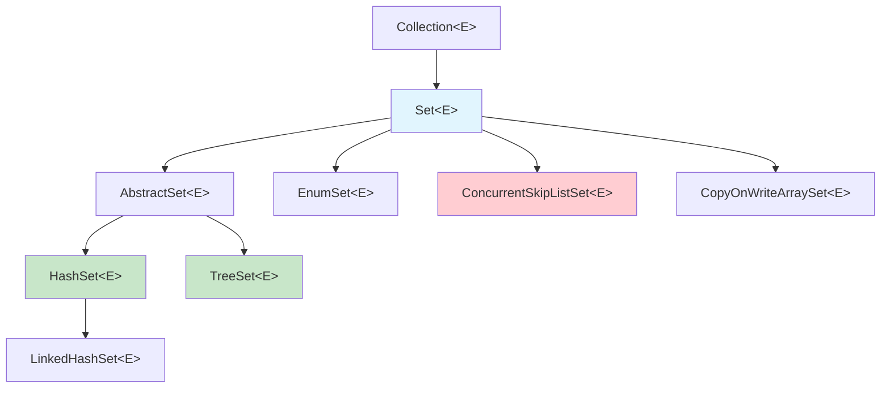

# Set: Análise Técnica Aprofundada das Coleções de Elementos Únicos

A interface `Set` representa uma coleção que **não permite elementos duplicados**. É uma das interfaces mais elegantes do Java Collections Framework, pois sua implementação está intimamente ligada aos `Map`s. Na verdade, a maioria das implementações de `Set` usa um `Map` internamente, onde o elemento do set é a chave e um objeto dummy é o valor.

---

## Hierarquia e Design



---

## HashSet: O Set Baseado em HashMap

### Estrutura Interna: O Truque do Objeto Dummy

```java
public class HashSet<E> extends AbstractSet<E> implements Set<E> {
    private transient HashMap<E,Object> map;
    
    // Objeto dummy usado como valor para todas as chaves
    private static final Object PRESENT = new Object();
    
    public boolean add(E e) {
        return map.put(e, PRESENT) == null;
    }
    
    public boolean contains(Object o) {
        return map.containsKey(o);
    }
    
    public boolean remove(Object o) {
        return map.remove(o) == PRESENT;
    }
}
```

### Por que Usar um Map Internamente?
1. **Reutilização**: Aproveita toda a sofisticação do HashMap (hash, colisões, redimensionamento)
2. **Consistência**: Garante que `HashSet` tenha exatamente a mesma performance do `HashMap`
3. **Manutenção**: Uma única implementação de hash table para manter

### Análise de Complexidade
Como o `HashSet` usa `HashMap` internamente, suas complexidades são idênticas:

| Operação | Caso Médio | Pior Caso | Explicação |
|----------|------------|-----------|------------|
| `add(element)` | **O(1)** | **O(log n)** | Mesma lógica do HashMap.put() |
| `contains(element)` | **O(1)** | **O(log n)** | Mesma lógica do HashMap.containsKey() |
| `remove(element)` | **O(1)** | **O(log n)** | Mesma lógica do HashMap.remove() |
| `size()` | **O(1)** | **O(1)** | Mantém contador interno |

### Quando Usar HashSet
✅ **Ideal para:**
- Verificação rápida de existência de elementos
- Remoção de duplicatas de outras coleções
- Operações de conjunto (união, interseção, diferença)
- Quando a ordem não importa

❌ **Evite para:**
- Quando precisa manter ordem de inserção (use LinkedHashSet)
- Quando precisa de elementos ordenados (use TreeSet)
- Acesso concorrente intenso (considere ConcurrentSkipListSet)

### Exemplo: Operações de Conjunto
```java
Set<String> conjunto1 = new HashSet<>(Arrays.asList("A", "B", "C"));
Set<String> conjunto2 = new HashSet<>(Arrays.asList("B", "C", "D"));

// União
Set<String> uniao = new HashSet<>(conjunto1);
uniao.addAll(conjunto2); // [A, B, C, D]

// Interseção
Set<String> intersecao = new HashSet<>(conjunto1);
intersecao.retainAll(conjunto2); // [B, C]

// Diferença
Set<String> diferenca = new HashSet<>(conjunto1);
diferenca.removeAll(conjunto2); // [A]
```

---

## LinkedHashSet: HashSet + Ordem de Inserção

### Diferencial Principal
Usa `LinkedHashMap` internamente em vez de `HashMap`:

```java
public class LinkedHashSet<E> extends HashSet<E> {
    // Construtor que força o uso de LinkedHashMap
    public LinkedHashSet() {
        super(16, .75f, true); // O 'true' indica para usar LinkedHashMap
    }
}
```

### Complexidade e Performance
- **Mesma complexidade** do HashSet
- **Overhead mínimo** de memória (~10-15% adicional)
- **Iteração previsível**: Sempre na ordem de inserção

### Quando Usar LinkedHashSet
✅ **Ideal para:**
- Quando você precisa de elementos únicos MAS em ordem de inserção
- Remoção de duplicatas mantendo ordem original
- Casos onde a ordem de iteração é importante para o usuário

```java
// Removendo duplicatas mantendo ordem original
List<String> listaComDuplicatas = Arrays.asList("C", "A", "B", "A", "C");
Set<String> semDuplicatas = new LinkedHashSet<>(listaComDuplicatas);
System.out.println(semDuplicatas); // [C, A, B] - ordem preservada
```

---

## TreeSet: Set Ordenado com Red-Black Tree

### Estrutura Interna: TreeMap Como Base
```java
public class TreeSet<E> extends AbstractSet<E> implements NavigableSet<E> {
    private transient NavigableMap<E,Object> m;
    private static final Object PRESENT = new Object();
    
    public TreeSet() {
        this(new TreeMap<E,Object>());
    }
    
    public boolean add(E e) {
        return m.put(e, PRESENT) == null;
    }
}
```

### Análise de Complexidade
Como usa `TreeMap` internamente, herda suas características:

| Operação | Complexidade | Explicação |
|----------|--------------|------------|
| `add(element)` | **O(log n)** | Inserção em árvore balanceada |
| `contains(element)` | **O(log n)** | Busca em árvore balanceada |
| `remove(element)` | **O(log n)** | Remoção + rebalanceamento |
| `first()`, `last()` | **O(log n)** | Navegação até extremidades |
| `ceiling()`, `floor()` | **O(log n)** | Busca por proximidade |

### Operações Especiais do TreeSet
```java
TreeSet<Integer> numeros = new TreeSet<>(Arrays.asList(5, 2, 8, 1, 9));

// Elementos sempre em ordem: [1, 2, 5, 8, 9]
System.out.println(numeros);

// Navegação
Integer menor = numeros.first();        // 1
Integer maior = numeros.last();         // 9
Integer ceiling = numeros.ceiling(3);   // 5 (menor >= 3)
Integer floor = numeros.floor(7);       // 5 (maior <= 7)

// Subconjuntos
SortedSet<Integer> subSet = numeros.subSet(2, 8); // [2, 5] (2 inclusive, 8 exclusive)
```

### Quando Usar TreeSet
✅ **Ideal para:**
- Elementos sempre em ordem natural ou customizada
- Operações de range e navegação
- Quando você precisa do menor/maior elemento frequentemente
- Implementação de algoritmos que dependem de ordem

---

## EnumSet: A Implementação Mais Eficiente

### Estrutura Interna: Bit Vector
O `EnumSet` é uma obra-prima de otimização. Usa um **bit vector** para representar os elementos:

```java
// Para enums com <= 64 elementos: usa um único long
class RegularEnumSet<E extends Enum<E>> extends EnumSet<E> {
    private long elements = 0L;
    
    public boolean add(E e) {
        long oldElements = elements;
        elements |= (1L << e.ordinal()); // Set bit na posição do enum
        return elements != oldElements;
    }
    
    public boolean contains(Object e) {
        return (elements & (1L << ((Enum<?>)e).ordinal())) != 0;
    }
}
```

### Performance Excepcional
- **Operações O(1)**: Todas as operações básicas são bit manipulation
- **Memória mínima**: 64 enums cabem em apenas 8 bytes!
- **Operações de conjunto ultra-rápidas**: União, interseção via OR, AND

### Exemplo de Uso
```java
enum DiaSemana {
    SEGUNDA, TERCA, QUARTA, QUINTA, SEXTA, SABADO, DOMINGO
}

EnumSet<DiaSemana> diasUteis = EnumSet.of(
    DiaSemana.SEGUNDA, DiaSemana.TERCA, DiaSemana.QUARTA, 
    DiaSemana.QUINTA, DiaSemana.SEXTA
);

EnumSet<DiaSemana> fimSemana = EnumSet.of(DiaSemana.SABADO, DiaSemana.DOMINGO);

// Operações ultra-rápidas
EnumSet<DiaSemana> todosOsDias = EnumSet.allOf(DiaSemana.class);
EnumSet<DiaSemana> nenhum = EnumSet.noneOf(DiaSemana.class);
```

---

## Implementações para Concorrência

### CopyOnWriteArraySet: Para Mais Leituras que Escritas
```java
public class CopyOnWriteArraySet<E> extends AbstractSet<E> {
    private final CopyOnWriteArrayList<E> al;
    
    public boolean add(E e) {
        return al.addIfAbsent(e); // Thread-safe, mas copia array inteiro
    }
}
```

**Características:**
- **Thread-safe** sem sincronização
- **Cópia na escrita**: Cada modificação cria um novo array
- **Ideal para**: Muitas leituras, poucas escritas

### ConcurrentSkipListSet: TreeSet Thread-Safe
- **Baseado em Skip List**: Estrutura probabilística balanceada
- **Performance O(log n)** para todas as operações
- **Thread-safe** sem locks
- **Mantém ordem** dos elementos

```java
ConcurrentSkipListSet<String> setOrdenado = new ConcurrentSkipListSet<>();
// Thread-safe e mantém ordem, mas com overhead de concorrência
```

---

## Benchmarks de Performance

### Inserção de 1.000.000 elementos únicos
```
HashSet:                ~120ms
LinkedHashSet:          ~130ms (+8%)
TreeSet:               ~680ms (+467%)
EnumSet (64 elements):   ~15ms (-87%)
ConcurrentSkipListSet:  ~890ms (+642%)
```

### Verificação contains() - 1.000.000 operações
```
HashSet:                ~35ms
LinkedHashSet:          ~37ms (+6%)
TreeSet:               ~180ms (+414%)
EnumSet:                ~8ms (-77%)
ConcurrentSkipListSet:  ~210ms (+500%)
```

---

## Padrões de Uso Avançados

### 1. Set como Cache de Existência
```java
// Cache rápido para verificar se ID já foi processado
Set<Long> idsProcessados = new HashSet<>();

public boolean jaFoiProcessado(Long id) {
    return idsProcessados.contains(id);
}

public void marcarComoProcessado(Long id) {
    idsProcessados.add(id);
}
```

### 2. Filtragem com Set
```java
// Filtrar lista removendo elementos de um blacklist
Set<String> blacklist = new HashSet<>(Arrays.asList("spam", "virus", "malware"));
List<String> emails = // ... lista de emails

List<String> emailsLimpos = emails.stream()
    .filter(email -> !blacklist.contains(email))
    .collect(Collectors.toList());
```

### 3. Interseção Eficiente de Múltiplos Sets
```java
public static <T> Set<T> intersecaoMultipla(Set<T>... sets) {
    if (sets.length == 0) return new HashSet<>();
    
    // Começa com o menor set para otimizar
    Set<T> resultado = new HashSet<>(Arrays.stream(sets)
        .min(Comparator.comparing(Set::size))
        .orElse(new HashSet<>()));
    
    for (Set<T> set : sets) {
        resultado.retainAll(set);
    }
    
    return resultado;
}
```

---

## Melhores Práticas

### 1. Escolha da Implementação
```java
// Uso geral, performance máxima
Set<String> geral = new HashSet<>();

// Precisa manter ordem de inserção
Set<String> ordenado = new LinkedHashSet<>();

// Precisa de elementos ordenados
Set<String> sorted = new TreeSet<>();

// Para enums: sempre EnumSet
Set<Status> status = EnumSet.noneOf(Status.class);

// Para concorrência com muitas leituras
Set<String> concurrent = new CopyOnWriteArraySet<>();
```

### 2. Dimensionamento Inicial
```java
// Se você sabe o tamanho aproximado
Set<String> set = new HashSet<>(expectedSize / 0.75f + 1);
```

### 3. Conversão entre Tipos
```java
// De qualquer Collection para Set (remove duplicatas)
Set<String> set = new HashSet<>(anyCollection);

// Preservando ordem original
Set<String> setOrdenado = new LinkedHashSet<>(anyCollection);
```

---

**Próximos Passos:** No próximo arquivo, criaremos exercícios práticos que consolidam todo esse conhecimento técnico, permitindo que você teste e pratique esses conceitos em cenários reais. 