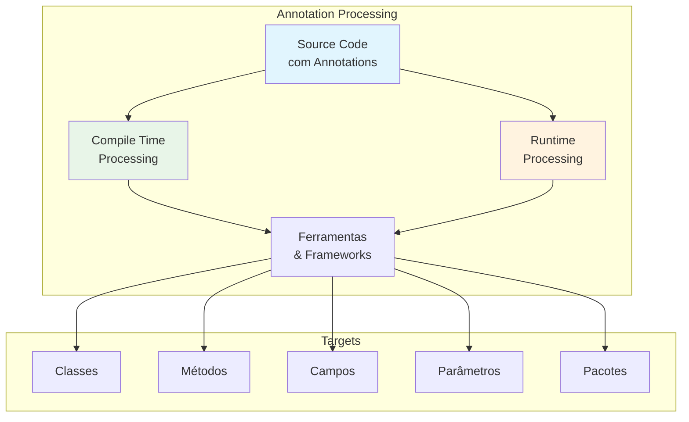

# Annotations API: Metadados Estruturados

As **Annotations** em Java são uma forma poderosa de adicionar metadados ao código, permitindo que informações adicionais sejam associadas a classes, métodos, campos e outros elementos. Elas são fundamentais em frameworks modernos como Spring, Hibernate, JUnit, e são processadas tanto em tempo de compilação quanto em tempo de execução.

---

## Conceitos Fundamentais

### O que são Annotations?

**Annotations** são metadados que fornecem dados sobre um programa que não fazem parte do programa em si. Elas não afetam diretamente a operação do código que anotam, mas podem ser usadas por ferramentas, frameworks e bibliotecas para gerar código, configurar comportamentos ou validar estruturas.



### Annotations Built-in do Java

```java
public class BuiltInAnnotations {
    
    // @Override - Indica que método sobrescreve método da superclasse
    @Override
    public String toString() {
        return "BuiltInAnnotations";
    }
    
    // @Deprecated - Marca elemento como obsoleto
    @Deprecated(since = "1.5", forRemoval = true)
    public void metodoObsoleto() {
        System.out.println("Este método será removido");
    }
    
    // @SuppressWarnings - Suprime avisos do compilador
    @SuppressWarnings("unchecked")
    public void exemploSuppressWarnings() {
        List lista = new ArrayList(); // Raw type - normalmente geraria warning
        lista.add("item");
    }
    
    // @SafeVarargs - Indica que método com varargs é seguro
    @SafeVarargs
    public static <T> void exemploSafeVarargs(T... items) {
        for (T item : items) {
            System.out.println(item);
        }
    }
    
    // @FunctionalInterface - Marca interface funcional
    @FunctionalInterface
    interface MinhaInterface {
        void execute();
        
        // Métodos default são permitidos
        default void setup() {
            System.out.println("Setup padrão");
        }
    }
}
```

---

## Meta-Annotations: Annotations para Annotations

### Controlando Comportamento das Annotations

```java
// Meta-annotations essenciais
import java.lang.annotation.*;

public class MetaAnnotations {
    
    // @Retention - Define quando a annotation está disponível
    @Retention(RetentionPolicy.SOURCE)    // Apenas no código fonte
    public @interface SourceOnly {
        String value();
    }
    
    @Retention(RetentionPolicy.CLASS)     // No bytecode, mas não em runtime
    public @interface CompileTimeOnly {
        String value();
    }
    
    @Retention(RetentionPolicy.RUNTIME)   // Disponível em runtime via reflection
    public @interface RuntimeAvailable {
        String value();
    }
    
    // @Target - Define onde a annotation pode ser usada
    @Target(ElementType.TYPE)             // Apenas em classes/interfaces
    public @interface ClassLevel {
        String value();
    }
    
    @Target(ElementType.METHOD)           // Apenas em métodos
    public @interface MethodLevel {
        String value();
    }
    
    @Target(ElementType.FIELD)            // Apenas em campos
    public @interface FieldLevel {
        String value();
    }
    
    @Target({ElementType.TYPE, ElementType.METHOD})  // Múltiplos targets
    public @interface MultiTarget {
        String value();
    }
    
    // @Documented - Inclui annotation na documentação JavaDoc
    @Documented
    @Retention(RetentionPolicy.RUNTIME)
    @Target(ElementType.TYPE)
    public @interface PublicAPI {
        String version() default "1.0";
        String author();
    }
    
    // @Inherited - Annotation é herdada por subclasses
    @Inherited
    @Retention(RetentionPolicy.RUNTIME)
    @Target(ElementType.TYPE)
    public @interface InheritedAnnotation {
        String value();
    }
    
    // @Repeatable - Permite múltiplas instâncias da mesma annotation
    @Repeatable(Authors.class)
    @Retention(RetentionPolicy.RUNTIME)
    @Target(ElementType.TYPE)
    public @interface Author {
        String name();
        String email() default "";
    }
    
    // Container annotation para @Author
    @Retention(RetentionPolicy.RUNTIME)
    @Target(ElementType.TYPE)
    public @interface Authors {
        Author[] value();
    }
    
    // Exemplo de uso das annotations
    @PublicAPI(version = "2.0", author = "João Silva")
    @InheritedAnnotation("Base class")
    @Author(name = "João Silva", email = "joao@email.com")
    @Author(name = "Maria Santos", email = "maria@email.com")
    static class ExampleClass {
        
        @FieldLevel("Campo importante")
        private String field;
        
        @MethodLevel("Método principal")
        public void method() {
            // Implementação
        }
    }
    
    // Subclasse herda @InheritedAnnotation
    static class SubClass extends ExampleClass {
        // Automaticamente tem @InheritedAnnotation("Base class")
    }
}
```

---

## Criando Annotations Customizadas

### Annotations com Elementos

```java
public class CustomAnnotations {
    
    // Annotation simples sem elementos
    @Retention(RetentionPolicy.RUNTIME)
    @Target(ElementType.METHOD)
    public @interface Test {
    }
    
    // Annotation com elementos
    @Retention(RetentionPolicy.RUNTIME)
    @Target(ElementType.METHOD)
    public @interface TestCase {
        String description();                    // Elemento obrigatório
        int timeout() default 1000;            // Elemento com valor padrão
        String[] tags() default {};            // Array com padrão vazio
        Priority priority() default Priority.MEDIUM;  // Enum com padrão
        boolean enabled() default true;         // Boolean com padrão
    }
    
    // Enum para usar em annotations
    public enum Priority {
        LOW, MEDIUM, HIGH, CRITICAL
    }
    
    // Annotation para validação
    @Retention(RetentionPolicy.RUNTIME)
    @Target(ElementType.FIELD)
    public @interface Validate {
        // Estratégias de validação
        boolean required() default true;
        int minLength() default 0;
        int maxLength() default Integer.MAX_VALUE;
        String pattern() default "";
        String message() default "Validação falhou";
        
        // Usando classes para validadores customizados
        Class<? extends Validator> validator() default DefaultValidator.class;
    }
    
    // Interface para validadores customizados
    public interface Validator {
        boolean isValid(Object value);
        String getMessage();
    }
    
    // Implementação padrão
    public static class DefaultValidator implements Validator {
        @Override
        public boolean isValid(Object value) {
            return value != null;
        }
        
        @Override
        public String getMessage() {
            return "Valor não pode ser nulo";
        }
    }
    
    // Validador customizado para email
    public static class EmailValidator implements Validator {
        @Override
        public boolean isValid(Object value) {
            if (!(value instanceof String)) return false;
            String email = (String) value;
            return email.contains("@") && email.split("@").length == 2;
        }
        
        @Override
        public String getMessage() {
            return "Email deve ter formato válido";
        }
    }
    
    // Annotation para configuração
    @Retention(RetentionPolicy.RUNTIME)
    @Target(ElementType.TYPE)
    public @interface Configuration {
        String profile() default "default";
        String[] activeProfiles() default {};
        boolean autoConfiguration() default true;
        
        // Nested annotation
        Database database() default @Database;
    }
    
    // Nested annotation
    @Retention(RetentionPolicy.RUNTIME)
    public @interface Database {
        String url() default "jdbc:h2:mem:testdb";
        String driver() default "org.h2.Driver";
        int maxConnections() default 10;
    }
    
    // Exemplos de uso
    @Configuration(
        profile = "production",
        activeProfiles = {"web", "security"},
        database = @Database(
            url = "jdbc:postgresql://localhost:5432/mydb",
            driver = "org.postgresql.Driver",
            maxConnections = 20
        )
    )
    static class ProductionConfig {
        
        @Validate(
            required = true,
            minLength = 2,
            maxLength = 100,
            message = "Nome deve ter entre 2 e 100 caracteres"
        )
        private String nome;
        
        @Validate(
            required = true,
            validator = EmailValidator.class,
            message = "Email deve ser válido"
        )
        private String email;
        
        @TestCase(
            description = "Teste de validação de usuário",
            timeout = 5000,
            tags = {"validation", "user"},
            priority = Priority.HIGH
        )
        public void testUserValidation() {
            // Implementação do teste
        }
    }
}
```

---

## Processamento de Annotations em Runtime

### Lendo Annotations com Reflection

```java
public class AnnotationProcessor {
    
    // Annotation para mapeamento de entidades
    @Retention(RetentionPolicy.RUNTIME)
    @Target(ElementType.TYPE)
    public @interface Entity {
        String table();
        String schema() default "";
    }
    
    @Retention(RetentionPolicy.RUNTIME)
    @Target(ElementType.FIELD)
    public @interface Column {
        String name() default "";
        boolean nullable() default true;
        int length() default 255;
        boolean unique() default false;
    }
    
    @Retention(RetentionPolicy.RUNTIME)
    @Target(ElementType.FIELD)
    public @interface Id {
        boolean autoGenerated() default true;
    }
    
    // Classe de exemplo
    @Entity(table = "usuarios", schema = "app")
    static class Usuario {
        @Id(autoGenerated = true)
        @Column(name = "id", nullable = false)
        private Long id;
        
        @Column(name = "nome", nullable = false, length = 100)
        private String nome;
        
        @Column(name = "email", unique = true, length = 150)
        private String email;
        
        @Column(name = "idade")
        private Integer idade;
        
        // Construtores, getters, setters...
        public Usuario() {}
        
        public Usuario(String nome, String email, Integer idade) {
            this.nome = nome;
            this.email = email;
            this.idade = idade;
        }
        
        // Getters e Setters
        public Long getId() { return id; }
        public void setId(Long id) { this.id = id; }
        public String getNome() { return nome; }
        public void setNome(String nome) { this.nome = nome; }
        public String getEmail() { return email; }
        public void setEmail(String email) { this.email = email; }
        public Integer getIdade() { return idade; }
        public void setIdade(Integer idade) { this.idade = idade; }
    }
    
    // Processador de annotations
    public void processarEntity(Class<?> entityClass) {
        // Verificar se a classe tem @Entity
        if (!entityClass.isAnnotationPresent(Entity.class)) {
            System.out.println("Classe " + entityClass.getSimpleName() + " não é uma entidade");
            return;
        }
        
        // Obter informações da entidade
        Entity entityAnnotation = entityClass.getAnnotation(Entity.class);
        String tableName = entityAnnotation.table();
        String schema = entityAnnotation.schema();
        
        System.out.println("=== Entidade: " + entityClass.getSimpleName() + " ===");
        System.out.println("Tabela: " + (schema.isEmpty() ? "" : schema + ".") + tableName);
        
        // Processar campos
        Field[] fields = entityClass.getDeclaredFields();
        for (Field field : fields) {
            processarCampo(field);
        }
    }
    
    private void processarCampo(Field field) {
        System.out.println("\nCampo: " + field.getName());
        System.out.println("Tipo: " + field.getType().getSimpleName());
        
        // Verificar @Id
        if (field.isAnnotationPresent(Id.class)) {
            Id idAnnotation = field.getAnnotation(Id.class);
            System.out.println("É ID: " + (idAnnotation.autoGenerated() ? "auto-gerado" : "manual"));
        }
        
        // Verificar @Column
        if (field.isAnnotationPresent(Column.class)) {
            Column columnAnnotation = field.getAnnotation(Column.class);
            String columnName = columnAnnotation.name().isEmpty() ? 
                field.getName() : columnAnnotation.name();
            
            System.out.println("Coluna: " + columnName);
            System.out.println("Nullable: " + columnAnnotation.nullable());
            System.out.println("Length: " + columnAnnotation.length());
            System.out.println("Unique: " + columnAnnotation.unique());
        }
    }
    
    // Gerador de SQL baseado em annotations
    public String gerarCreateTable(Class<?> entityClass) {
        if (!entityClass.isAnnotationPresent(Entity.class)) {
            throw new IllegalArgumentException("Classe deve ter annotation @Entity");
        }
        
        Entity entityAnnotation = entityClass.getAnnotation(Entity.class);
        String tableName = entityAnnotation.table();
        String schema = entityAnnotation.schema();
        String fullTableName = schema.isEmpty() ? tableName : schema + "." + tableName;
        
        StringBuilder sql = new StringBuilder("CREATE TABLE ");
        sql.append(fullTableName).append(" (\n");
        
        Field[] fields = entityClass.getDeclaredFields();
        List<String> columnDefinitions = new ArrayList<>();
        String primaryKey = null;
        
        for (Field field : fields) {
            if (field.isAnnotationPresent(Column.class)) {
                Column column = field.getAnnotation(Column.class);
                String columnName = column.name().isEmpty() ? field.getName() : column.name();
                
                StringBuilder columnDef = new StringBuilder();
                columnDef.append("  ").append(columnName);
                
                // Tipo de dados baseado no tipo Java
                String sqlType = mapJavaTypeToSql(field.getType(), column.length());
                columnDef.append(" ").append(sqlType);
                
                // Constraints
                if (!column.nullable()) {
                    columnDef.append(" NOT NULL");
                }
                
                if (column.unique()) {
                    columnDef.append(" UNIQUE");
                }
                
                columnDefinitions.add(columnDef.toString());
                
                // Verificar se é chave primária
                if (field.isAnnotationPresent(Id.class)) {
                    primaryKey = columnName;
                }
            }
        }
        
        sql.append(String.join(",\n", columnDefinitions));
        
        // Adicionar chave primária
        if (primaryKey != null) {
            sql.append(",\n  PRIMARY KEY (").append(primaryKey).append(")");
        }
        
        sql.append("\n)");
        
        return sql.toString();
    }
    
    private String mapJavaTypeToSql(Class<?> javaType, int length) {
        if (javaType == String.class) {
            return "VARCHAR(" + length + ")";
        } else if (javaType == Integer.class || javaType == int.class) {
            return "INTEGER";
        } else if (javaType == Long.class || javaType == long.class) {
            return "BIGINT";
        } else if (javaType == Double.class || javaType == double.class) {
            return "DOUBLE";
        } else if (javaType == Boolean.class || javaType == boolean.class) {
            return "BOOLEAN";
        } else if (javaType == LocalDate.class) {
            return "DATE";
        } else if (javaType == LocalDateTime.class) {
            return "TIMESTAMP";
        } else {
            return "VARCHAR(255)"; // Padrão
        }
    }
    
    public void exemploUso() {
        // Processar a classe Usuario
        processarEntity(Usuario.class);
        
        // Gerar SQL
        String createTableSQL = gerarCreateTable(Usuario.class);
        System.out.println("\n=== SQL Gerado ===");
        System.out.println(createTableSQL);
    }
}
```

---

## Casos de Uso Empresariais

### 1. Framework de Validação Avançado

```java
public class AdvancedValidationFramework {
    
    // Annotations de validação
    @Retention(RetentionPolicy.RUNTIME)
    @Target(ElementType.FIELD)
    public @interface NotBlank {
        String message() default "Campo não pode estar em branco";
        String[] groups() default {};
    }
    
    @Retention(RetentionPolicy.RUNTIME)
    @Target(ElementType.FIELD)
    public @interface Email {
        String message() default "Email deve ser válido";
        String[] groups() default {};
    }
    
    @Retention(RetentionPolicy.RUNTIME)
    @Target(ElementType.FIELD)
    public @interface Range {
        int min() default 0;
        int max() default Integer.MAX_VALUE;
        String message() default "Valor deve estar entre {min} e {max}";
        String[] groups() default {};
    }
    
    @Retention(RetentionPolicy.RUNTIME)
    @Target(ElementType.FIELD)
    public @interface Pattern {
        String value();
        String message() default "Valor não corresponde ao padrão esperado";
        String[] groups() default {};
    }
    
    @Retention(RetentionPolicy.RUNTIME)
    @Target(ElementType.TYPE)
    public @interface ValidateWith {
        Class<? extends ClassValidator> value();
    }
    
    // Validador de classe
    public interface ClassValidator {
        ValidationResult validate(Object object);
    }
    
    // Validador customizado para usuário
    public static class UserValidator implements ClassValidator {
        @Override
        public ValidationResult validate(Object object) {
            if (!(object instanceof UsuarioCompleto)) {
                return new ValidationResult(false, List.of("Tipo de objeto inválido"));
            }
            
            UsuarioCompleto user = (UsuarioCompleto) object;
            List<String> errors = new ArrayList<>();
            
            // Validação customizada: email e username não podem ser iguais
            if (user.getEmail() != null && user.getUsername() != null && 
                user.getEmail().equals(user.getUsername())) {
                errors.add("Email e username não podem ser iguais");
            }
            
            // Validação de idade vs categoria
            if (user.getIdade() != null && user.getCategoria() != null) {
                if (user.getIdade() < 18 && "PREMIUM".equals(user.getCategoria())) {
                    errors.add("Usuários menores de 18 anos não podem ser PREMIUM");
                }
            }
            
            return new ValidationResult(errors.isEmpty(), errors);
        }
    }
    
    // Classe para validação
    @ValidateWith(UserValidator.class)
    static class UsuarioCompleto {
        @NotBlank(message = "Nome é obrigatório", groups = {"create", "update"})
        private String nome;
        
        @NotBlank(groups = {"create"})
        @Pattern(value = "^[a-zA-Z0-9_]{3,20}$", message = "Username deve ter 3-20 caracteres alfanuméricos")
        private String username;
        
        @NotBlank(groups = {"create", "update"})
        @Email(message = "Formato de email inválido")
        private String email;
        
        @Range(min = 0, max = 120, message = "Idade deve estar entre 0 e 120 anos")
        private Integer idade;
        
        @Pattern(value = "^(BASIC|PREMIUM|VIP)$", message = "Categoria deve ser BASIC, PREMIUM ou VIP")
        private String categoria;
        
        // Construtores, getters, setters...
        public UsuarioCompleto() {}
        
        public UsuarioCompleto(String nome, String username, String email, Integer idade, String categoria) {
            this.nome = nome;
            this.username = username;
            this.email = email;
            this.idade = idade;
            this.categoria = categoria;
        }
        
        // Getters e Setters
        public String getNome() { return nome; }
        public void setNome(String nome) { this.nome = nome; }
        public String getUsername() { return username; }
        public void setUsername(String username) { this.username = username; }
        public String getEmail() { return email; }
        public void setEmail(String email) { this.email = email; }
        public Integer getIdade() { return idade; }
        public void setIdade(Integer idade) { this.idade = idade; }
        public String getCategoria() { return categoria; }
        public void setCategoria(String categoria) { this.categoria = categoria; }
    }
    
    // Resultado de validação
    static class ValidationResult {
        private final boolean valid;
        private final List<String> errors;
        
        public ValidationResult(boolean valid, List<String> errors) {
            this.valid = valid;
            this.errors = errors;
        }
        
        public boolean isValid() { return valid; }
        public List<String> getErrors() { return errors; }
        
        @Override
        public String toString() {
            return valid ? "Válido" : "Inválido: " + String.join(", ", errors);
        }
    }
    
    // Validador principal
    public ValidationResult validate(Object object, String... groups) throws Exception {
        List<String> errors = new ArrayList<>();
        Class<?> clazz = object.getClass();
        Set<String> activeGroups = Set.of(groups);
        
        // Validação de campos
        Field[] fields = clazz.getDeclaredFields();
        for (Field field : fields) {
            field.setAccessible(true);
            Object value = field.get(object);
            
            // @NotBlank
            if (field.isAnnotationPresent(NotBlank.class)) {
                NotBlank annotation = field.getAnnotation(NotBlank.class);
                if (shouldValidate(annotation.groups(), activeGroups)) {
                    if (value == null || (value instanceof String && ((String) value).trim().isEmpty())) {
                        errors.add(field.getName() + ": " + annotation.message());
                    }
                }
            }
            
            // @Email
            if (field.isAnnotationPresent(Email.class)) {
                Email annotation = field.getAnnotation(Email.class);
                if (shouldValidate(annotation.groups(), activeGroups)) {
                    if (value != null && !isValidEmail(value.toString())) {
                        errors.add(field.getName() + ": " + annotation.message());
                    }
                }
            }
            
            // @Range
            if (field.isAnnotationPresent(Range.class)) {
                Range annotation = field.getAnnotation(Range.class);
                if (shouldValidate(annotation.groups(), activeGroups)) {
                    if (value instanceof Integer) {
                        int intValue = (Integer) value;
                        if (intValue < annotation.min() || intValue > annotation.max()) {
                            String message = annotation.message()
                                .replace("{min}", String.valueOf(annotation.min()))
                                .replace("{max}", String.valueOf(annotation.max()));
                            errors.add(field.getName() + ": " + message);
                        }
                    }
                }
            }
            
            // @Pattern
            if (field.isAnnotationPresent(Pattern.class)) {
                Pattern annotation = field.getAnnotation(Pattern.class);
                if (shouldValidate(annotation.groups(), activeGroups)) {
                    if (value != null && !value.toString().matches(annotation.value())) {
                        errors.add(field.getName() + ": " + annotation.message());
                    }
                }
            }
        }
        
        // Validação de classe
        if (clazz.isAnnotationPresent(ValidateWith.class)) {
            ValidateWith annotation = clazz.getAnnotation(ValidateWith.class);
            ClassValidator validator = annotation.value().getDeclaredConstructor().newInstance();
            ValidationResult classResult = validator.validate(object);
            if (!classResult.isValid()) {
                errors.addAll(classResult.getErrors());
            }
        }
        
        return new ValidationResult(errors.isEmpty(), errors);
    }
    
    private boolean shouldValidate(String[] annotationGroups, Set<String> activeGroups) {
        // Se não há grupos especificados na annotation, sempre validar
        if (annotationGroups.length == 0) {
            return true;
        }
        
        // Se não há grupos ativos, não validar
        if (activeGroups.isEmpty()) {
            return false;
        }
        
        // Verificar se algum grupo da annotation está ativo
        return Arrays.stream(annotationGroups).anyMatch(activeGroups::contains);
    }
    
    private boolean isValidEmail(String email) {
        return email.contains("@") && email.split("@").length == 2;
    }
    
    public void exemploUso() throws Exception {
        // Usuário válido
        UsuarioCompleto usuarioValido = new UsuarioCompleto(
            "João Silva", "joaosilva", "joao@email.com", 25, "PREMIUM");
        
        // Usuário inválido
        UsuarioCompleto usuarioInvalido = new UsuarioCompleto(
            "", "ab", "email-invalido", 150, "CATEGORIA_INVALIDA");
        
        // Validação completa
        System.out.println("Usuário válido: " + validate(usuarioValido));
        System.out.println("Usuário inválido: " + validate(usuarioInvalido));
        
        // Validação por grupos
        System.out.println("Validação grupo 'create': " + validate(usuarioInvalido, "create"));
        System.out.println("Validação grupo 'update': " + validate(usuarioInvalido, "update"));
    }
}
```

### 2. Sistema de Configuração Baseado em Annotations

```java
public class ConfigurationFramework {
    
    // Annotations para configuração
    @Retention(RetentionPolicy.RUNTIME)
    @Target(ElementType.TYPE)
    public @interface ConfigurationProperties {
        String prefix();
        boolean ignoreUnknownFields() default true;
    }
    
    @Retention(RetentionPolicy.RUNTIME)
    @Target(ElementType.FIELD)
    public @interface ConfigValue {
        String key() default "";
        String defaultValue() default "";
        boolean required() default false;
        String description() default "";
    }
    
    @Retention(RetentionPolicy.RUNTIME)
    @Target(ElementType.FIELD)
    public @interface NestedConfig {
    }
    
    // Classes de configuração
    @ConfigurationProperties(prefix = "app")
    static class ApplicationConfig {
        @ConfigValue(key = "name", defaultValue = "MyApp", description = "Nome da aplicação")
        private String name;
        
        @ConfigValue(key = "version", defaultValue = "1.0.0", description = "Versão da aplicação")
        private String version;
        
        @ConfigValue(key = "debug", defaultValue = "false", description = "Modo debug")
        private Boolean debug;
        
        @NestedConfig
        private DatabaseConfig database;
        
        @NestedConfig
        private SecurityConfig security;
        
        // Getters e Setters
        public String getName() { return name; }
        public void setName(String name) { this.name = name; }
        public String getVersion() { return version; }
        public void setVersion(String version) { this.version = version; }
        public Boolean getDebug() { return debug; }
        public void setDebug(Boolean debug) { this.debug = debug; }
        public DatabaseConfig getDatabase() { return database; }
        public void setDatabase(DatabaseConfig database) { this.database = database; }
        public SecurityConfig getSecurity() { return security; }
        public void setSecurity(SecurityConfig security) { this.security = security; }
    }
    
    @ConfigurationProperties(prefix = "database")
    static class DatabaseConfig {
        @ConfigValue(key = "url", required = true, description = "URL do banco de dados")
        private String url;
        
        @ConfigValue(key = "username", required = true, description = "Usuário do banco")
        private String username;
        
        @ConfigValue(key = "password", required = true, description = "Senha do banco")
        private String password;
        
        @ConfigValue(key = "maxConnections", defaultValue = "10", description = "Máximo de conexões")
        private Integer maxConnections;
        
        // Getters e Setters
        public String getUrl() { return url; }
        public void setUrl(String url) { this.url = url; }
        public String getUsername() { return username; }
        public void setUsername(String username) { this.username = username; }
        public String getPassword() { return password; }
        public void setPassword(String password) { this.password = password; }
        public Integer getMaxConnections() { return maxConnections; }
        public void setMaxConnections(Integer maxConnections) { this.maxConnections = maxConnections; }
    }
    
    @ConfigurationProperties(prefix = "security")
    static class SecurityConfig {
        @ConfigValue(key = "enabled", defaultValue = "true", description = "Habilitar segurança")
        private Boolean enabled;
        
        @ConfigValue(key = "jwtSecret", required = true, description = "Chave secreta JWT")
        private String jwtSecret;
        
        @ConfigValue(key = "sessionTimeout", defaultValue = "3600", description = "Timeout da sessão em segundos")
        private Integer sessionTimeout;
        
        // Getters e Setters
        public Boolean getEnabled() { return enabled; }
        public void setEnabled(Boolean enabled) { this.enabled = enabled; }
        public String getJwtSecret() { return jwtSecret; }
        public void setJwtSecret(String jwtSecret) { this.jwtSecret = jwtSecret; }
        public Integer getSessionTimeout() { return sessionTimeout; }
        public void setSessionTimeout(Integer sessionTimeout) { this.sessionTimeout = sessionTimeout; }
    }
    
    // Processador de configuração
    public <T> T loadConfiguration(Class<T> configClass, Properties properties) throws Exception {
        if (!configClass.isAnnotationPresent(ConfigurationProperties.class)) {
            throw new IllegalArgumentException("Classe deve ter @ConfigurationProperties");
        }
        
        ConfigurationProperties configProps = configClass.getAnnotation(ConfigurationProperties.class);
        String prefix = configProps.prefix();
        
        T instance = configClass.getDeclaredConstructor().newInstance();
        
        Field[] fields = configClass.getDeclaredFields();
        for (Field field : fields) {
            field.setAccessible(true);
            
            if (field.isAnnotationPresent(ConfigValue.class)) {
                processConfigValue(instance, field, prefix, properties);
            } else if (field.isAnnotationPresent(NestedConfig.class)) {
                processNestedConfig(instance, field, properties);
            }
        }
        
        return instance;
    }
    
    private void processConfigValue(Object instance, Field field, String prefix, Properties properties) 
            throws Exception {
        ConfigValue configValue = field.getAnnotation(ConfigValue.class);
        
        String key = configValue.key().isEmpty() ? field.getName() : configValue.key();
        String fullKey = prefix.isEmpty() ? key : prefix + "." + key;
        
        String value = properties.getProperty(fullKey);
        
        if (value == null) {
            if (configValue.required()) {
                throw new IllegalStateException("Propriedade obrigatória não encontrada: " + fullKey);
            } else if (!configValue.defaultValue().isEmpty()) {
                value = configValue.defaultValue();
            }
        }
        
        if (value != null) {
            Object convertedValue = convertValue(value, field.getType());
            field.set(instance, convertedValue);
        }
    }
    
    private void processNestedConfig(Object instance, Field field, Properties properties) throws Exception {
        Class<?> fieldType = field.getType();
        Object nestedInstance = loadConfiguration(fieldType, properties);
        field.set(instance, nestedInstance);
    }
    
    private Object convertValue(String value, Class<?> targetType) {
        if (targetType == String.class) {
            return value;
        } else if (targetType == Integer.class || targetType == int.class) {
            return Integer.parseInt(value);
        } else if (targetType == Boolean.class || targetType == boolean.class) {
            return Boolean.parseBoolean(value);
        } else if (targetType == Long.class || targetType == long.class) {
            return Long.parseLong(value);
        } else if (targetType == Double.class || targetType == double.class) {
            return Double.parseDouble(value);
        } else {
            throw new IllegalArgumentException("Tipo não suportado: " + targetType);
        }
    }
    
    // Gerador de documentação
    public void generateConfigurationDocumentation(Class<?> configClass) throws Exception {
        if (!configClass.isAnnotationPresent(ConfigurationProperties.class)) {
            return;
        }
        
        ConfigurationProperties configProps = configClass.getAnnotation(ConfigurationProperties.class);
        String prefix = configProps.prefix();
        
        System.out.println("=== Configuração: " + configClass.getSimpleName() + " ===");
        System.out.println("Prefixo: " + prefix);
        System.out.println();
        
        Field[] fields = configClass.getDeclaredFields();
        for (Field field : fields) {
            if (field.isAnnotationPresent(ConfigValue.class)) {
                ConfigValue configValue = field.getAnnotation(ConfigValue.class);
                
                String key = configValue.key().isEmpty() ? field.getName() : configValue.key();
                String fullKey = prefix.isEmpty() ? key : prefix + "." + key;
                
                System.out.println("Propriedade: " + fullKey);
                System.out.println("Tipo: " + field.getType().getSimpleName());
                System.out.println("Obrigatório: " + (configValue.required() ? "Sim" : "Não"));
                if (!configValue.defaultValue().isEmpty()) {
                    System.out.println("Valor padrão: " + configValue.defaultValue());
                }
                if (!configValue.description().isEmpty()) {
                    System.out.println("Descrição: " + configValue.description());
                }
                System.out.println();
            } else if (field.isAnnotationPresent(NestedConfig.class)) {
                System.out.println("Configuração aninhada: " + field.getType().getSimpleName());
                generateConfigurationDocumentation(field.getType());
            }
        }
    }
    
    public void exemploUso() throws Exception {
        // Propriedades de exemplo
        Properties props = new Properties();
        props.setProperty("app.name", "MeuApp");
        props.setProperty("app.version", "2.0.0");
        props.setProperty("app.debug", "true");
        props.setProperty("database.url", "jdbc:postgresql://localhost:5432/mydb");
        props.setProperty("database.username", "admin");
        props.setProperty("database.password", "secret");
        props.setProperty("database.maxConnections", "20");
        props.setProperty("security.enabled", "true");
        props.setProperty("security.jwtSecret", "my-secret-key");
        props.setProperty("security.sessionTimeout", "7200");
        
        // Carregar configuração
        ApplicationConfig config = loadConfiguration(ApplicationConfig.class, props);
        
        System.out.println("=== Configuração Carregada ===");
        System.out.println("App Name: " + config.getName());
        System.out.println("App Version: " + config.getVersion());
        System.out.println("Debug: " + config.getDebug());
        System.out.println("DB URL: " + config.getDatabase().getUrl());
        System.out.println("Max Connections: " + config.getDatabase().getMaxConnections());
        System.out.println("Security Enabled: " + config.getSecurity().getEnabled());
        System.out.println("JWT Secret: " + config.getSecurity().getJwtSecret());
        
        // Gerar documentação
        System.out.println("\n=== Documentação ===");
        generateConfigurationDocumentation(ApplicationConfig.class);
    }
}
```

---

## Melhores Práticas e Considerações

### ✅ Melhores Práticas

```java
public class AnnotationBestPractices {
    
    // 1. Use @Retention adequado
    @Retention(RetentionPolicy.SOURCE)    // Para ferramentas de build
    public @interface Generated {
        String value();
        String date();
    }
    
    @Retention(RetentionPolicy.RUNTIME)   // Para processamento em runtime
    public @interface Service {
        String value() default "";
    }
    
    // 2. Seja específico com @Target
    @Target(ElementType.METHOD)           // Só métodos
    public @interface Transactional {
        boolean readOnly() default false;
    }
    
    // 3. Forneça valores padrão sensatos
    @Retention(RetentionPolicy.RUNTIME)
    @Target(ElementType.TYPE)
    public @interface Controller {
        String path() default "/";        // Padrão útil
        String[] methods() default {"GET", "POST"}; // Array padrão
        boolean secured() default false;   // Boolean padrão
    }
    
    // 4. Use enums para opções limitadas
    public enum CacheType {
        MEMORY, REDIS, DATABASE
    }
    
    @Retention(RetentionPolicy.RUNTIME)
    @Target(ElementType.METHOD)
    public @interface Cacheable {
        String key();
        CacheType type() default CacheType.MEMORY;
        int ttl() default 3600;
    }
    
    // 5. Documente suas annotations
    /**
     * Marca um método como endpoint REST.
     * 
     * @param path O caminho do endpoint
     * @param method O método HTTP
     * @param produces O tipo de conteúdo produzido
     */
    @Documented
    @Retention(RetentionPolicy.RUNTIME)
    @Target(ElementType.METHOD)
    public @interface RestEndpoint {
        String path();
        String method() default "GET";
        String produces() default "application/json";
    }
    
    // 6. Valide parâmetros de annotations
    @Retention(RetentionPolicy.RUNTIME)
    @Target(ElementType.FIELD)
    public @interface Range {
        int min();
        int max();
        String message() default "Valor fora do range permitido";
        
        // Validação em tempo de compilação seria ideal,
        // mas podemos validar em runtime
        static class Validator {
            public static void validate(Range range) {
                if (range.min() > range.max()) {
                    throw new IllegalArgumentException("min não pode ser maior que max");
                }
            }
        }
    }
}
```

### ❌ Armadilhas Comuns

```java
public class AnnotationPitfalls {
    
    // ❌ Não usar @Retention adequado
    // @Retention(RetentionPolicy.SOURCE) // Não disponível em runtime!
    public @interface BadRuntimeAnnotation {
        String value();
    }
    
    // ❌ Annotation muito genérica
    @Target({ElementType.TYPE, ElementType.METHOD, ElementType.FIELD, ElementType.PARAMETER})
    public @interface TooGeneric {
        String value();
    }
    
    // ❌ Muitos elementos obrigatórios
    public @interface TooManyRequired {
        String name();           // Obrigatório
        String description();    // Obrigatório
        String author();         // Obrigatório
        String version();        // Obrigatório
        String[] tags();         // Obrigatório
        // Difícil de usar!
    }
    
    // ❌ Não documentar o propósito
    public @interface Mysterious {
        int value();
        boolean flag();
        // O que isso faz?
    }
    
    // ❌ Nomes inconsistentes
    public @interface InconsistentNaming {
        String val();      // Deveria ser 'value'
        boolean isActive(); // Deveria ser 'active'
        int maxNum();      // Deveria ser 'maxNumber'
    }
    
    // ❌ Não considerar herança
    // @Inherited // Esqueceu de adicionar se necessário
    @Retention(RetentionPolicy.RUNTIME)
    @Target(ElementType.TYPE)
    public @interface ShouldBeInherited {
        String value();
    }
}
```

---

**Próximos Passos:** As Annotations são fundamentais para frameworks modernos e permitem criar código declarativo e limpo. Dominar sua criação e processamento é essencial para arquitetos e desenvolvedores que querem criar soluções elegantes e reutilizáveis. 