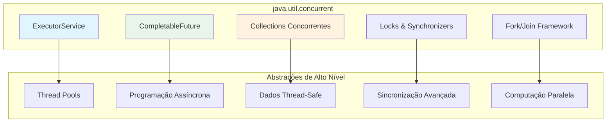

# Concurrency Framework: Dominando o Paralelismo em Java

O **Concurrency Framework** é uma das APIs mais poderosas e complexas do Java, introduzida no Java 5 e constantemente evoluída. Ela fornece abstrações de alto nível para programação concorrente, permitindo que desenvolvedores criem aplicações paralelas robustas e eficientes sem lidar diretamente com threads de baixo nível.

---

## Arquitetura do Framework

### Componentes Principais



---

## ExecutorService: Gerenciamento Inteligente de Threads

### O Problema das Threads Nativas
```java
// ❌ Abordagem problemática: criação manual de threads
for (int i = 0; i < 1000; i++) {
    new Thread(() -> {
        // Processamento pesado
        processarDados();
    }).start(); // Cria 1000 threads! Desastre de performance
}
```

### A Solução: Thread Pools
```java
// ✅ Abordagem correta: pool de threads gerenciado
ExecutorService executor = Executors.newFixedThreadPool(Runtime.getRuntime().availableProcessors());

for (int i = 0; i < 1000; i++) {
    executor.submit(() -> {
        processarDados();
    });
}

executor.shutdown();
```

### Tipos de Executors

#### 1. FixedThreadPool
```java
// Pool com número fixo de threads
ExecutorService fixedPool = Executors.newFixedThreadPool(4);

// Ideal para: Carga de trabalho constante, controle de recursos
// Exemplo: Processamento de pedidos em e-commerce
for (Pedido pedido : pedidos) {
    fixedPool.submit(() -> processarPedido(pedido));
}
```

#### 2. CachedThreadPool
```java
// Pool que cresce conforme necessário
ExecutorService cachedPool = Executors.newCachedThreadPool();

// Ideal para: Tarefas curtas e esporádicas
// Exemplo: Requisições HTTP esporádicas
cachedPool.submit(() -> fazerRequisicaoHTTP());
```

#### 3. SingleThreadExecutor
```java
// Uma única thread para execução sequencial
ExecutorService singleExecutor = Executors.newSingleThreadExecutor();

// Ideal para: Operações que devem ser sequenciais
// Exemplo: Logging ordenado
singleExecutor.submit(() -> escreverLog("Evento importante"));
```

#### 4. ScheduledThreadPool
```java
ScheduledExecutorService scheduler = Executors.newScheduledThreadPool(2);

// Tarefas agendadas
scheduler.schedule(() -> limparCache(), 5, TimeUnit.MINUTES);

// Tarefas periódicas
scheduler.scheduleAtFixedRate(() -> coletarMetricas(), 0, 30, TimeUnit.SECONDS);
```

---

## CompletableFuture: Programação Assíncrona Moderna

### Evolução da Programação Assíncrona

#### Antes: Callbacks Hell
```java
// ❌ Callbacks aninhados = código difícil de manter
public void processarUsuario(String userId) {
    buscarUsuario(userId, usuario -> {
        buscarPedidos(usuario.getId(), pedidos -> {
            calcularTotal(pedidos, total -> {
                enviarEmail(usuario.getEmail(), total, resultado -> {
                    // Callback hell!
                });
            });
        });
    });
}
```

#### Agora: CompletableFuture
```java
// ✅ Programação assíncrona fluente
public CompletableFuture<Void> processarUsuario(String userId) {
    return buscarUsuarioAsync(userId)
        .thenCompose(usuario -> buscarPedidosAsync(usuario.getId()))
        .thenCompose(pedidos -> calcularTotalAsync(pedidos))
        .thenCompose(total -> enviarEmailAsync(usuario.getEmail(), total))
        .exceptionally(this::tratarErro);
}
```

### Operações Fundamentais

#### 1. Criação e Execução Assíncrona
```java
// Criação básica
CompletableFuture<String> future = CompletableFuture.supplyAsync(() -> {
    // Simulação de operação pesada
    try {
        Thread.sleep(2000);
        return "Resultado processado";
    } catch (InterruptedException e) {
        throw new RuntimeException(e);
    }
});

// Execução com executor customizado
CompletableFuture<String> customFuture = CompletableFuture.supplyAsync(
    () -> processarDados(),
    Executors.newFixedThreadPool(4)
);
```

#### 2. Transformação de Resultados
```java
CompletableFuture<String> dados = CompletableFuture.supplyAsync(() -> "dados brutos");

// Transformação síncrona
CompletableFuture<String> processados = dados.thenApply(String::toUpperCase);

// Transformação assíncrona
CompletableFuture<String> processadosAsync = dados.thenApplyAsync(this::processarComplexo);

// Composição (flat map)
CompletableFuture<String> resultado = dados.thenCompose(this::processarERetornarFuture);
```

#### 3. Combinação de Múltiplos Futures
```java
CompletableFuture<String> usuario = buscarUsuarioAsync("123");
CompletableFuture<List<String>> pedidos = buscarPedidosAsync("123");
CompletableFuture<String> preferencias = buscarPreferenciasAsync("123");

// Combina dois futures
CompletableFuture<String> relatorio = usuario.thenCombine(pedidos, 
    (u, p) -> gerarRelatorio(u, p));

// Combina múltiplos futures
CompletableFuture<Void> todosCompletos = CompletableFuture.allOf(usuario, pedidos, preferencias);
CompletableFuture<Object> primeiroCompleto = CompletableFuture.anyOf(usuario, pedidos, preferencias);
```

### Caso de Uso Real: Sistema de Checkout
```java
public class CheckoutService {
    
    public CompletableFuture<ResultadoCheckout> processarCheckout(Pedido pedido) {
        // 1. Validações paralelas
        CompletableFuture<Boolean> validarEstoque = validarEstoqueAsync(pedido);
        CompletableFuture<Boolean> validarPagamento = validarPagamentoAsync(pedido);
        CompletableFuture<Boolean> validarEntrega = validarEntregaAsync(pedido);
        
        // 2. Aguarda todas as validações
        return CompletableFuture.allOf(validarEstoque, validarPagamento, validarEntrega)
            .thenCompose(ignored -> {
                // 3. Se todas passaram, processa o pedido
                return processarPedidoAsync(pedido);
            })
            .thenCompose(pedidoProcessado -> {
                // 4. Operações pós-processamento (paralelas)
                CompletableFuture<Void> enviarEmail = enviarEmailConfirmacaoAsync(pedidoProcessado);
                CompletableFuture<Void> atualizarEstoque = atualizarEstoqueAsync(pedidoProcessado);
                CompletableFuture<Void> gerarNota = gerarNotaFiscalAsync(pedidoProcessado);
                
                return CompletableFuture.allOf(enviarEmail, atualizarEstoque, gerarNota)
                    .thenApply(ignored -> new ResultadoCheckout(pedidoProcessado));
            })
            .exceptionally(this::tratarErroCheckout);
    }
    
    private ResultadoCheckout tratarErroCheckout(Throwable throwable) {
        // Log do erro
        logger.error("Erro no checkout", throwable);
        
        // Retorna resultado de erro
        return ResultadoCheckout.erro(throwable.getMessage());
    }
}
```

---

## Fork/Join Framework: Divide e Conquista

### Conceito: Work-Stealing Algorithm
O Fork/Join é baseado no algoritmo **work-stealing**, onde threads que terminam suas tarefas "roubam" trabalho de outras threads, maximizando a utilização de CPU.

```java
public class SomaParalela extends RecursiveTask<Long> {
    private final int[] array;
    private final int inicio;
    private final int fim;
    private static final int THRESHOLD = 1000; // Limite para divisão
    
    public SomaParalela(int[] array, int inicio, int fim) {
        this.array = array;
        this.inicio = inicio;
        this.fim = fim;
    }
    
    @Override
    protected Long compute() {
        if (fim - inicio <= THRESHOLD) {
            // Caso base: soma sequencial
            long soma = 0;
            for (int i = inicio; i < fim; i++) {
                soma += array[i];
            }
            return soma;
        } else {
            // Divide a tarefa
            int meio = (inicio + fim) / 2;
            
            SomaParalela tarefaEsquerda = new SomaParalela(array, inicio, meio);
            SomaParalela tarefaDireita = new SomaParalela(array, meio, fim);
            
            // Fork: executa em paralelo
            tarefaEsquerda.fork();
            
            // Compute: executa na thread atual
            Long resultadoDireita = tarefaDireita.compute();
            
            // Join: aguarda resultado da outra thread
            Long resultadoEsquerda = tarefaEsquerda.join();
            
            return resultadoEsquerda + resultadoDireita;
        }
    }
}

// Uso
ForkJoinPool pool = new ForkJoinPool();
int[] array = new int[10_000_000];
// ... popular array
SomaParalela tarefa = new SomaParalela(array, 0, array.length);
Long resultado = pool.invoke(tarefa);
```

---

## Locks Avançados: Além do synchronized

### ReadWriteLock: Otimização para Leitura/Escrita
```java
public class CacheOtimizado<K, V> {
    private final Map<K, V> cache = new HashMap<>();
    private final ReadWriteLock lock = new ReentrantReadWriteLock();
    private final Lock readLock = lock.readLock();
    private final Lock writeLock = lock.writeLock();
    
    public V get(K key) {
        readLock.lock();
        try {
            return cache.get(key);
        } finally {
            readLock.unlock();
        }
    }
    
    public void put(K key, V value) {
        writeLock.lock();
        try {
            cache.put(key, value);
        } finally {
            writeLock.unlock();
        }
    }
}
```

### StampedLock: Lock Otimista (Java 8+)
```java
public class ContadorOtimista {
    private int count = 0;
    private final StampedLock lock = new StampedLock();
    
    public int getCount() {
        long stamp = lock.tryOptimisticRead();
        int currentCount = count;
        
        if (!lock.validate(stamp)) {
            // Fallback para read lock
            stamp = lock.readLock();
            try {
                currentCount = count;
            } finally {
                lock.unlockRead(stamp);
            }
        }
        return currentCount;
    }
    
    public void increment() {
        long stamp = lock.writeLock();
        try {
            count++;
        } finally {
            lock.unlockWrite(stamp);
        }
    }
}
```

---

## Synchronizers: Coordenação Entre Threads

### CountDownLatch: Aguardar Múltiplas Operações
```java
public class InicializadorSistema {
    private final CountDownLatch latch = new CountDownLatch(3);
    
    public void inicializarSistema() {
        // Inicia componentes em paralelo
        CompletableFuture.runAsync(this::inicializarBancoDados);
        CompletableFuture.runAsync(this::inicializarCache);
        CompletableFuture.runAsync(this::inicializarConexoesRede);
        
        try {
            // Aguarda todos os componentes terminarem
            latch.await(30, TimeUnit.SECONDS);
            System.out.println("Sistema inicializado com sucesso!");
        } catch (InterruptedException e) {
            Thread.currentThread().interrupt();
            throw new RuntimeException("Falha na inicialização", e);
        }
    }
    
    private void inicializarBancoDados() {
        try {
            // Simula inicialização
            Thread.sleep(2000);
            System.out.println("Banco de dados inicializado");
        } catch (InterruptedException e) {
            Thread.currentThread().interrupt();
        } finally {
            latch.countDown();
        }
    }
    
    // Métodos similares para cache e rede...
}
```

### Semaphore: Controle de Recursos Limitados
```java
public class PoolConexoes {
    private final Semaphore semaforo = new Semaphore(10); // Máximo 10 conexões
    private final Queue<Conexao> conexoesDisponiveis = new ConcurrentLinkedQueue<>();
    
    public Conexao obterConexao() throws InterruptedException {
        semaforo.acquire(); // Aguarda uma "permissão"
        try {
            Conexao conexao = conexoesDisponiveis.poll();
            if (conexao == null) {
                conexao = criarNovaConexao();
            }
            return conexao;
        } catch (Exception e) {
            semaforo.release(); // Libera permissão em caso de erro
            throw e;
        }
    }
    
    public void liberarConexao(Conexao conexao) {
        conexoesDisponiveis.offer(conexao);
        semaforo.release(); // Libera uma "permissão"
    }
}
```

---

## Padrões de Concorrência Avançados

### Producer-Consumer com BlockingQueue
```java
public class ProcessadorMensagens {
    private final BlockingQueue<Mensagem> fila = new ArrayBlockingQueue<>(1000);
    private final ExecutorService producers = Executors.newFixedThreadPool(3);
    private final ExecutorService consumers = Executors.newFixedThreadPool(5);
    
    public void iniciar() {
        // Inicia producers
        for (int i = 0; i < 3; i++) {
            producers.submit(this::produzirMensagens);
        }
        
        // Inicia consumers
        for (int i = 0; i < 5; i++) {
            consumers.submit(this::consumirMensagens);
        }
    }
    
    private void produzirMensagens() {
        while (!Thread.currentThread().isInterrupted()) {
            try {
                Mensagem mensagem = gerarNovaMensagem();
                fila.put(mensagem); // Bloqueia se a fila estiver cheia
            } catch (InterruptedException e) {
                Thread.currentThread().interrupt();
                break;
            }
        }
    }
    
    private void consumirMensagens() {
        while (!Thread.currentThread().isInterrupted()) {
            try {
                Mensagem mensagem = fila.take(); // Bloqueia se a fila estiver vazia
                processarMensagem(mensagem);
            } catch (InterruptedException e) {
                Thread.currentThread().interrupt();
                break;
            }
        }
    }
}
```

---

## Melhores Práticas e Armadilhas

### ✅ Melhores Práticas

1. **Always shutdown executors**
```java
ExecutorService executor = Executors.newFixedThreadPool(4);
try {
    // Use executor
} finally {
    executor.shutdown();
    if (!executor.awaitTermination(60, TimeUnit.SECONDS)) {
        executor.shutdownNow();
    }
}
```

2. **Handle exceptions properly**
```java
CompletableFuture<String> future = CompletableFuture.supplyAsync(() -> {
    // Operação que pode falhar
    return operacaoQuePodesfalhar();
}).exceptionally(throwable -> {
    logger.error("Erro na operação assíncrona", throwable);
    return "Valor padrão";
});
```

3. **Use appropriate thread pool sizes**
```java
// Para operações I/O: mais threads
int ioThreads = Runtime.getRuntime().availableProcessors() * 2;

// Para operações CPU-intensive: threads = cores
int cpuThreads = Runtime.getRuntime().availableProcessors();
```

### ❌ Armadilhas Comuns

1. **Thread leaks**
```java
// ❌ Nunca faça isso!
while (true) {
    new Thread(() -> processarTarefa()).start();
}
```

2. **Blocking operations in CompletableFuture**
```java
// ❌ Bloquear em uma CompletableFuture
CompletableFuture.supplyAsync(() -> {
    try {
        Thread.sleep(10000); // Bloqueia thread do pool
    } catch (InterruptedException e) { }
    return result;
});
```

---

**Próximos Passos:** Esta base sólida em concorrência é fundamental para todas as outras APIs que exploraremos. A programação concorrente permeia logging, networking, I/O e muitas outras áreas do desenvolvimento Java moderno. 