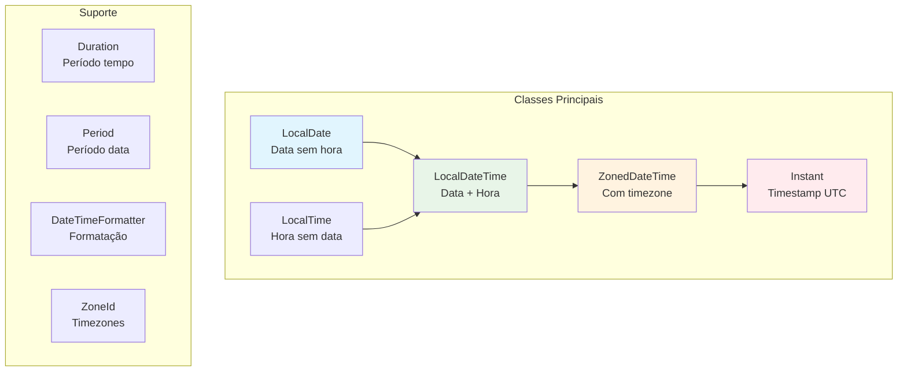

# Date and Time API: Manipulação Temporal Moderna

A **Date and Time API** (JSR-310), introduzida no Java 8, representa uma revolução completa na manipulação de datas e tempo. Inspirada na biblioteca **Joda-Time**, ela substitui as problemáticas classes `Date`, `Calendar` e `SimpleDateFormat` por um conjunto de classes imutáveis, thread-safe e com uma API muito mais expressiva.

---

## Problemas das APIs Antigas

### Por que Date e Calendar eram problemáticos?

```java
// ❌ Problemas da API antiga
public class ProblemasAntigos {
    
    public void demonstrarProblemas() {
        // 1. Date é mutável (não thread-safe)
        Date data = new Date();
        data.setTime(System.currentTimeMillis() + 86400000); // Modifica objeto!
        
        // 2. Meses começam em 0 (confuso)
        Calendar cal = Calendar.getInstance();
        cal.set(2023, 11, 25); // 25 de DEZEMBRO, não novembro!
        
        // 3. SimpleDateFormat não é thread-safe
        SimpleDateFormat formato = new SimpleDateFormat("yyyy-MM-dd");
        // ☠️ Perigoso em aplicações multi-thread
        
        // 4. Timezone handling confuso
        cal.setTimeZone(TimeZone.getTimeZone("America/Sao_Paulo"));
        
        // 5. Operações de data complexas
        cal.add(Calendar.DAY_OF_MONTH, 30); // E se passar do mês?
    }
}
```

### A Nova Abordagem: Imutabilidade e Clareza

```java
// ✅ Nova API: clara, imutável e expressiva
public class NovaAbordagem {
    
    public void demonstrarMelhorias() {
        // 1. Imutável e thread-safe
        LocalDate hoje = LocalDate.now();
        LocalDate amanha = hoje.plusDays(1); // Cria novo objeto
        
        // 2. Tipos específicos para cada necessidade
        LocalDate data = LocalDate.of(2023, Month.DECEMBER, 25); // Mês é enum!
        LocalTime hora = LocalTime.of(14, 30, 0);
        LocalDateTime dataHora = LocalDateTime.of(data, hora);
        
        // 3. Thread-safe formatters
        DateTimeFormatter formato = DateTimeFormatter.ofPattern("yyyy-MM-dd");
        
        // 4. Timezone handling claro
        ZonedDateTime comTimezone = dataHora.atZone(ZoneId.of("America/Sao_Paulo"));
        
        // 5. Operações fluentes e seguras
        LocalDate proximoFeriado = hoje
            .plusMonths(2)
            .with(TemporalAdjusters.lastDayOfMonth())
            .minusDays(1);
    }
}
```

---

## Hierarquia das Classes Temporais

### Visão Geral da Arquitetura



---

## LocalDate: Trabalhando com Datas

### Criação e Operações Básicas
```java
public class LocalDateExamples {
    
    public void operacoesBasicas() {
        // Criação
        LocalDate hoje = LocalDate.now();
        LocalDate natal = LocalDate.of(2023, Month.DECEMBER, 25);
        LocalDate natal2 = LocalDate.of(2023, 12, 25); // Também funciona
        LocalDate parseada = LocalDate.parse("2023-12-25");
        
        // Informações sobre a data
        System.out.println("Ano: " + hoje.getYear());
        System.out.println("Mês: " + hoje.getMonth()); // Enum Month
        System.out.println("Dia do mês: " + hoje.getDayOfMonth());
        System.out.println("Dia da semana: " + hoje.getDayOfWeek()); // Enum DayOfWeek
        System.out.println("Dia do ano: " + hoje.getDayOfYear());
        
        // Verificações
        boolean isLeapYear = hoje.isLeapYear();
        boolean isBefore = hoje.isBefore(natal);
        boolean isAfter = hoje.isAfter(natal);
        boolean isEqual = hoje.isEqual(natal);
        
        System.out.printf("É ano bissexto? %b%n", isLeapYear);
        System.out.printf("Hoje é antes do natal? %b%n", isBefore);
    }
    
    public void operacoesManipulacao() {
        LocalDate hoje = LocalDate.now();
        
        // Adição e subtração
        LocalDate proximaSemana = hoje.plusWeeks(1);
        LocalDate proximoMes = hoje.plusMonths(1);
        LocalDate proximoAno = hoje.plusYears(1);
        LocalDate ontem = hoje.minusDays(1);
        
        // Operações mais complexas com TemporalAdjusters
        LocalDate proximaSegunda = hoje.with(TemporalAdjusters.next(DayOfWeek.MONDAY));
        LocalDate ultimoDiaDoMes = hoje.with(TemporalAdjusters.lastDayOfMonth());
        LocalDate primeiraSegundaDoProximoMes = hoje
            .plusMonths(1)
            .with(TemporalAdjusters.firstInMonth(DayOfWeek.MONDAY));
        
        System.out.println("Próxima segunda: " + proximaSegunda);
        System.out.println("Último dia do mês: " + ultimoDiaDoMes);
        System.out.println("Primeira segunda do próximo mês: " + primeiraSegundaDoProximoMes);
    }
}
```

### TemporalAdjusters: Operações Avançadas
```java
public class AdvancedDateOperations {
    
    // Adjuster customizado: próximo dia útil
    public static TemporalAdjuster proximoDiaUtil() {
        return temporal -> {
            LocalDate data = LocalDate.from(temporal);
            DayOfWeek diaDaSemana = data.getDayOfWeek();
            
            int diasAdicionar = switch (diaDaSemana) {
                case FRIDAY -> 3;    // Sexta -> Segunda
                case SATURDAY -> 2;  // Sábado -> Segunda
                case SUNDAY -> 1;    // Domingo -> Segunda
                default -> 1;        // Outros -> próximo dia
            };
            
            return data.plusDays(diasAdicionar);
        };
    }
    
    // Adjuster para encontrar o último dia útil do mês
    public static TemporalAdjuster ultimoDiaUtilDoMes() {
        return temporal -> {
            LocalDate data = LocalDate.from(temporal);
            LocalDate ultimoDia = data.with(TemporalAdjusters.lastDayOfMonth());
            
            // Se o último dia for fim de semana, volta para sexta
            while (ultimoDia.getDayOfWeek() == DayOfWeek.SATURDAY || 
                   ultimoDia.getDayOfWeek() == DayOfWeek.SUNDAY) {
                ultimoDia = ultimoDia.minusDays(1);
            }
            
            return ultimoDia;
        };
    }
    
    public void exemploUso() {
        LocalDate hoje = LocalDate.now();
        
        LocalDate proximoDiaUtil = hoje.with(proximoDiaUtil());
        LocalDate ultimoDiaUtilMes = hoje.with(ultimoDiaUtilDoMes());
        
        System.out.println("Próximo dia útil: " + proximoDiaUtil);
        System.out.println("Último dia útil do mês: " + ultimoDiaUtilMes);
    }
}
```

---

## LocalTime e LocalDateTime: Hora e Data+Hora

### LocalTime: Trabalhando com Horários
```java
public class LocalTimeExamples {
    
    public void operacoesComHorario() {
        // Criação
        LocalTime agora = LocalTime.now();
        LocalTime meioDia = LocalTime.of(12, 0);
        LocalTime horaCompleta = LocalTime.of(14, 30, 45, 123456789); // nano precision
        LocalTime parseado = LocalTime.parse("14:30:45");
        
        // Informações
        System.out.println("Hora: " + agora.getHour());
        System.out.println("Minuto: " + agora.getMinute());
        System.out.println("Segundo: " + agora.getSecond());
        System.out.println("Nanosegundo: " + agora.getNano());
        
        // Operações
        LocalTime daquiAUmaHora = agora.plusHours(1);
        LocalTime trinta MinutosAtras = agora.minusMinutes(30);
        
        // Comparações
        boolean isAfter = agora.isAfter(meioDia);
        boolean isBefore = agora.isBefore(LocalTime.of(18, 0));
        
        System.out.printf("É depois do meio-dia? %b%n", isAfter);
    }
    
    // Cálculo de duração entre horários
    public void calcularDuracoes() {
        LocalTime inicio = LocalTime.of(9, 0);
        LocalTime fim = LocalTime.of(17, 30);
        
        Duration duracao = Duration.between(inicio, fim);
        
        System.out.println("Duração em horas: " + duracao.toHours());
        System.out.println("Duração em minutos: " + duracao.toMinutes());
        System.out.println("Duração em segundos: " + duracao.getSeconds());
    }
}
```

### LocalDateTime: Combinando Data e Hora
```java
public class LocalDateTimeExamples {
    
    public void operacoesCombinadas() {
        // Criação
        LocalDateTime agora = LocalDateTime.now();
        LocalDateTime especifico = LocalDateTime.of(2023, Month.DECEMBER, 25, 14, 30);
        LocalDateTime combinado = LocalDate.now().atTime(14, 30);
        LocalDateTime parseado = LocalDateTime.parse("2023-12-25T14:30:00");
        
        // Extração de componentes
        LocalDate apenasData = agora.toLocalDate();
        LocalTime apenasHora = agora.toLocalTime();
        
        // Operações
        LocalDateTime proximaHora = agora.plusHours(1);
        LocalDateTime proximaSemana = agora.plusWeeks(1);
        LocalDateTime dataPersonalizada = agora
            .withYear(2024)
            .withMonth(1)
            .withDayOfMonth(1)
            .withHour(0)
            .withMinute(0)
            .withSecond(0);
        
        System.out.println("Data/hora atual: " + agora);
        System.out.println("Apenas data: " + apenasData);
        System.out.println("Apenas hora: " + apenasHora);
        System.out.println("Ano novo: " + dataPersonalizada);
    }
}
```

---

## ZonedDateTime e Instant: Trabalhando com Timezones

### ZonedDateTime: Data com Timezone
```java
public class ZonedDateTimeExamples {
    
    public void trabalhandoComTimezones() {
        // Criação
        ZonedDateTime agoraSaoPaulo = ZonedDateTime.now(ZoneId.of("America/Sao_Paulo"));
        ZonedDateTime agoraUtc = ZonedDateTime.now(ZoneOffset.UTC);
        ZonedDateTime agoraTokyo = ZonedDateTime.now(ZoneId.of("Asia/Tokyo"));
        
        // Conversão entre timezones
        ZonedDateTime saoPauloParaTokyo = agoraSaoPaulo.withZoneSameInstant(ZoneId.of("Asia/Tokyo"));
        
        System.out.println("São Paulo: " + agoraSaoPaulo);
        System.out.println("UTC: " + agoraUtc);
        System.out.println("Tokyo: " + agoraTokyo);
        System.out.println("SP convertido para Tokyo: " + saoPauloParaTokyo);
        
        // Listar todos os timezones disponíveis
        ZoneId.getAvailableZoneIds()
            .stream()
            .filter(zone -> zone.contains("America"))
            .sorted()
            .limit(10)
            .forEach(System.out::println);
    }
    
    public void lidandoComHorarioDeVerao() {
        ZoneId saoPaulo = ZoneId.of("America/Sao_Paulo");
        
        // Data durante horário de verão
        ZonedDateTime verao = ZonedDateTime.of(2023, 1, 15, 12, 0, 0, 0, saoPaulo);
        
        // Data durante horário normal
        ZonedDateTime inverno = ZonedDateTime.of(2023, 7, 15, 12, 0, 0, 0, saoPaulo);
        
        System.out.println("Verão (UTC-2): " + verao);
        System.out.println("Inverno (UTC-3): " + inverno);
        System.out.println("Offset verão: " + verao.getOffset());
        System.out.println("Offset inverno: " + inverno.getOffset());
    }
}
```

### Instant: Timestamp Universal
```java
public class InstantExamples {
    
    public void trabalhandoComInstants() {
        // Criação
        Instant agora = Instant.now();
        Instant epoch = Instant.EPOCH; // 1970-01-01T00:00:00Z
        Instant especifico = Instant.ofEpochSecond(1609459200); // 2021-01-01T00:00:00Z
        Instant parseado = Instant.parse("2023-12-25T12:00:00Z");
        
        // Operações
        Instant umaHoraAtras = agora.minusSeconds(3600);
        Instant amanha = agora.plus(Duration.ofDays(1));
        
        // Conversões
        long epochSeconds = agora.getEpochSecond();
        long epochMillis = agora.toEpochMilli();
        
        // Para ZonedDateTime
        ZonedDateTime zonedDateTime = agora.atZone(ZoneId.of("America/Sao_Paulo"));
        
        System.out.println("Instant atual: " + agora);
        System.out.println("Epoch seconds: " + epochSeconds);
        System.out.println("Com timezone: " + zonedDateTime);
        
        // Useful para logs e timestamps
        System.out.println("Timestamp para log: " + Instant.now());
    }
    
    // Conversão entre diferentes representações
    public void conversoes() {
        // Instant <-> ZonedDateTime
        Instant instant = Instant.now();
        ZonedDateTime zoned = instant.atZone(ZoneId.systemDefault());
        Instant backToInstant = zoned.toInstant();
        
        // Instant <-> LocalDateTime (cuidado com timezone!)
        LocalDateTime local = LocalDateTime.ofInstant(instant, ZoneId.systemDefault());
        Instant fromLocal = local.atZone(ZoneId.systemDefault()).toInstant();
        
        System.out.println("Instant: " + instant);
        System.out.println("ZonedDateTime: " + zoned);
        System.out.println("LocalDateTime: " + local);
        System.out.println("De volta para Instant: " + backToInstant);
    }
}
```

---

## Period e Duration: Calculando Intervalos

### Period: Intervalos baseados em Data
```java
public class PeriodExamples {
    
    public void trabalhandoComPeriodos() {
        LocalDate nascimento = LocalDate.of(1990, Month.JUNE, 15);
        LocalDate hoje = LocalDate.now();
        
        // Calcular idade
        Period idade = Period.between(nascimento, hoje);
        
        System.out.printf("Idade: %d anos, %d meses, %d dias%n",
            idade.getYears(), idade.getMonths(), idade.getDays());
        
        // Criação de períodos
        Period umAno = Period.ofYears(1);
        Period treseMeses = Period.ofMonths(3);
        Period duasSemanas = Period.ofWeeks(2);
        Period dezemDias = Period.ofDays(10);
        Period complexo = Period.of(1, 6, 15); // 1 ano, 6 meses, 15 dias
        
        // Operações com períodos
        LocalDate futuro = hoje.plus(complexo);
        LocalDate passado = hoje.minus(umAno);
        
        System.out.println("Data futura: " + futuro);
        System.out.println("Data passada: " + passado);
        
        // Normalização (importante!)
        Period naoNormalizado = Period.of(0, 25, 40); // 25 meses, 40 dias
        Period normalizado = naoNormalizado.normalized(); // 2 anos, 1 mês, 40 dias
        
        System.out.println("Não normalizado: " + naoNormalizado);
        System.out.println("Normalizado: " + normalizado);
    }
    
    public void calculosDeVencimento() {
        LocalDate hoje = LocalDate.now();
        Period prazoVencimento = Period.ofDays(30);
        
        LocalDate dataVencimento = hoje.plus(prazoVencimento);
        
        // Verificar se venceu
        boolean venceu = LocalDate.now().isAfter(dataVencimento);
        
        if (venceu) {
            Period atraso = Period.between(dataVencimento, LocalDate.now());
            System.out.println("Vencido há: " + atraso.getDays() + " dias");
        } else {
            Period paraVencer = Period.between(LocalDate.now(), dataVencimento);
            System.out.println("Vence em: " + paraVencer.getDays() + " dias");
        }
    }
}
```

### Duration: Intervalos baseados em Tempo
```java
public class DurationExamples {
    
    public void trabalhandoComDuracoes() {
        LocalTime inicio = LocalTime.of(9, 0);
        LocalTime fim = LocalTime.of(17, 30);
        
        Duration jornada = Duration.between(inicio, fim);
        
        System.out.println("Jornada de trabalho:");
        System.out.println("Horas: " + jornada.toHours());
        System.out.println("Minutos: " + jornada.toMinutes());
        System.out.println("Segundos: " + jornada.getSeconds());
        
        // Criação de durações
        Duration umaHora = Duration.ofHours(1);
        Duration trintaMinutos = Duration.ofMinutes(30);
        Duration cincoSegundos = Duration.ofSeconds(5);
        Duration milisegundos = Duration.ofMillis(500);
        
        // Operações
        Duration total = umaHora.plus(trintaMinutos).plus(cincoSegundos);
        Duration metade = total.dividedBy(2);
        
        System.out.println("Duração total: " + total);
        System.out.println("Metade: " + metade);
        
        // Comparações
        boolean isMaior = total.compareTo(umaHora) > 0;
        boolean isZero = Duration.ZERO.equals(Duration.ofSeconds(0));
        
        System.out.println("Total é maior que uma hora? " + isMaior);
    }
    
    public void cronometroSimples() {
        Instant inicio = Instant.now();
        
        // Simular operação
        try {
            Thread.sleep(2000); // 2 segundos
        } catch (InterruptedException e) {
            Thread.currentThread().interrupt();
        }
        
        Instant fim = Instant.now();
        Duration duracao = Duration.between(inicio, fim);
        
        System.out.println("Operação levou: " + duracao.toMillis() + "ms");
    }
}
```

---

## Formatação e Parsing

### DateTimeFormatter: Formatação Flexível
```java
public class FormattingExamples {
    
    public void formatacaoBasica() {
        LocalDateTime agora = LocalDateTime.now();
        
        // Formatadores pré-definidos
        String iso = agora.format(DateTimeFormatter.ISO_LOCAL_DATE_TIME);
        String basico = agora.format(DateTimeFormatter.BASIC_ISO_DATE);
        
        // Formatadores customizados
        DateTimeFormatter customizado = DateTimeFormatter.ofPattern("dd/MM/yyyy HH:mm:ss");
        String formatado = agora.format(customizado);
        
        // Formatação localizada
        DateTimeFormatter brasileiro = DateTimeFormatter.ofPattern("dd 'de' MMMM 'de' yyyy", 
                                                                   new Locale("pt", "BR"));
        String emPortugues = agora.format(brasileiro);
        
        System.out.println("ISO: " + iso);
        System.out.println("Básico: " + basico);
        System.out.println("Customizado: " + formatado);
        System.out.println("Em português: " + emPortugues);
    }
    
    public void parsingAvancado() {
        DateTimeFormatter formatter = DateTimeFormatter.ofPattern("dd/MM/yyyy HH:mm");
        
        // Parsing simples
        String dataString = "25/12/2023 14:30";
        LocalDateTime parsed = LocalDateTime.parse(dataString, formatter);
        
        // Parsing flexível
        DateTimeFormatter flexivel = new DateTimeFormatterBuilder()
            .appendPattern("dd/MM/yyyy")
            .optionalStart()
            .appendPattern(" HH:mm")
            .optionalEnd()
            .toFormatter();
        
        LocalDateTime comHora = LocalDateTime.parse("25/12/2023 14:30", flexivel);
        // Para data sem hora, usaríamos TemporalAccessor
        
        System.out.println("Parsed: " + parsed);
        System.out.println("Com hora: " + comHora);
    }
    
    // Formatador thread-safe para uso em aplicações
    public static final DateTimeFormatter BRAZILIAN_DATE_TIME = 
        DateTimeFormatter.ofPattern("dd/MM/yyyy HH:mm:ss");
    
    public static final DateTimeFormatter LOG_TIMESTAMP = 
        DateTimeFormatter.ofPattern("yyyy-MM-dd HH:mm:ss.SSS");
}
```

---

## Casos de Uso Empresariais

### 1. Sistema de Agendamento
```java
public class SistemaAgendamento {
    
    public class Compromisso {
        private final LocalDateTime inicio;
        private final Duration duracao;
        private final String descricao;
        private final ZoneId timezone;
        
        public Compromisso(LocalDateTime inicio, Duration duracao, String descricao, ZoneId timezone) {
            this.inicio = inicio;
            this.duracao = duracao;
            this.descricao = descricao;
            this.timezone = timezone;
        }
        
        public LocalDateTime getFim() {
            return inicio.plus(duracao);
        }
        
        public boolean conflitaCom(Compromisso outro) {
            // Converter ambos para o mesmo timezone
            ZonedDateTime meuInicio = inicio.atZone(timezone);
            ZonedDateTime meuFim = getFim().atZone(timezone);
            ZonedDateTime outroInicio = outro.inicio.atZone(outro.timezone);
            ZonedDateTime outroFim = outro.getFim().atZone(outro.timezone);
            
            // Verificar sobreposição
            return meuInicio.isBefore(outroFim) && meuFim.isAfter(outroInicio);
        }
        
        public boolean isEmHorarioComercial() {
            LocalTime hora = inicio.toLocalTime();
            return !hora.isBefore(LocalTime.of(9, 0)) && 
                   !hora.isAfter(LocalTime.of(18, 0)) &&
                   inicio.getDayOfWeek().getValue() <= 5; // Segunda a sexta
        }
    }
    
    public List<LocalDateTime> gerarHorariosDisponiveis(
            LocalDate data, Duration duracao, List<Compromisso> compromissosExistentes) {
        
        List<LocalDateTime> horariosDisponiveis = new ArrayList<>();
        LocalDateTime inicioComercial = data.atTime(9, 0);
        LocalDateTime fimComercial = data.atTime(18, 0);
        
        LocalDateTime horarioAtual = inicioComercial;
        
        while (horarioAtual.plus(duracao).isBefore(fimComercial) || 
               horarioAtual.plus(duracao).equals(fimComercial)) {
            
            Compromisso tentativo = new Compromisso(horarioAtual, duracao, "Teste", ZoneId.systemDefault());
            
            boolean temConflito = compromissosExistentes.stream()
                .anyMatch(tentativo::conflitaCom);
            
            if (!temConflito) {
                horariosDisponiveis.add(horarioAtual);
            }
            
            horarioAtual = horarioAtual.plusMinutes(30); // Intervalos de 30 minutos
        }
        
        return horariosDisponiveis;
    }
}
```

### 2. Sistema de Relatórios com Períodos
```java
public class SistemaRelatorios {
    
    public class PeriodoRelatorio {
        private final LocalDate inicio;
        private final LocalDate fim;
        
        public PeriodoRelatorio(LocalDate inicio, LocalDate fim) {
            this.inicio = inicio;
            this.fim = fim;
        }
        
        public static PeriodoRelatorio mesAtual() {
            LocalDate hoje = LocalDate.now();
            return new PeriodoRelatorio(
                hoje.with(TemporalAdjusters.firstDayOfMonth()),
                hoje.with(TemporalAdjusters.lastDayOfMonth())
            );
        }
        
        public static PeriodoRelatorio ultimosTresMeses() {
            LocalDate hoje = LocalDate.now();
            return new PeriodoRelatorio(
                hoje.minusMonths(3).with(TemporalAdjusters.firstDayOfMonth()),
                hoje.with(TemporalAdjusters.lastDayOfMonth())
            );
        }
        
        public static PeriodoRelatorio anoFiscal(int ano) {
            // Ano fiscal: Abril a Março
            return new PeriodoRelatorio(
                LocalDate.of(ano, Month.APRIL, 1),
                LocalDate.of(ano + 1, Month.MARCH, 31)
            );
        }
        
        public long getDiasUteis() {
            return inicio.datesUntil(fim.plusDays(1))
                .filter(data -> {
                    DayOfWeek dia = data.getDayOfWeek();
                    return dia != DayOfWeek.SATURDAY && dia != DayOfWeek.SUNDAY;
                })
                .count();
        }
        
        public List<LocalDate> getDiasDoMes(Month mes) {
            return inicio.datesUntil(fim.plusDays(1))
                .filter(data -> data.getMonth() == mes)
                .collect(Collectors.toList());
        }
    }
    
    public void gerarRelatorioVendas(PeriodoRelatorio periodo) {
        System.out.println("=== Relatório de Vendas ===");
        System.out.println("Período: " + periodo.inicio + " até " + periodo.fim);
        System.out.println("Dias úteis: " + periodo.getDiasUteis());
        
        // Aqui viria a lógica de agregação de dados
        // usando as datas do período
    }
}
```

### 3. Cache com Expiração Baseada em Tempo
```java
public class CacheComExpiracao<K, V> {
    
    private static class CacheEntry<V> {
        private final V value;
        private final Instant expiration;
        
        public CacheEntry(V value, Duration ttl) {
            this.value = value;
            this.expiration = Instant.now().plus(ttl);
        }
        
        public boolean isExpired() {
            return Instant.now().isAfter(expiration);
        }
        
        public V getValue() {
            return value;
        }
    }
    
    private final Map<K, CacheEntry<V>> cache = new ConcurrentHashMap<>();
    private final ScheduledExecutorService cleanupService;
    
    public CacheComExpiracao() {
        this.cleanupService = Executors.newScheduledThreadPool(1);
        
        // Limpeza a cada 5 minutos
        cleanupService.scheduleAtFixedRate(
            this::removeExpiredEntries, 
            5, 5, TimeUnit.MINUTES
        );
    }
    
    public void put(K key, V value, Duration ttl) {
        cache.put(key, new CacheEntry<>(value, ttl));
    }
    
    public Optional<V> get(K key) {
        CacheEntry<V> entry = cache.get(key);
        
        if (entry == null) {
            return Optional.empty();
        }
        
        if (entry.isExpired()) {
            cache.remove(key);
            return Optional.empty();
        }
        
        return Optional.of(entry.getValue());
    }
    
    private void removeExpiredEntries() {
        cache.entrySet().removeIf(entry -> entry.getValue().isExpired());
    }
    
    public void shutdown() {
        cleanupService.shutdown();
    }
}
```

---

## Melhores Práticas e Armadilhas

### ✅ Melhores Práticas

1. **Use o tipo mais específico possível**
```java
// ✅ Específico para o que você precisa
LocalDate data = LocalDate.now();        // Só data
LocalTime hora = LocalTime.now();        // Só hora
Instant timestamp = Instant.now();       // Timestamp UTC
```

2. **Seja explícito com timezones**
```java
// ✅ Explícito
ZonedDateTime agora = ZonedDateTime.now(ZoneId.of("America/Sao_Paulo"));

// ❌ Implícito (usa timezone do sistema)
ZonedDateTime agora2 = ZonedDateTime.now();
```

3. **Use formatadores como constantes**
```java
// ✅ Thread-safe e reutilizável
public static final DateTimeFormatter BRAZILIAN_FORMAT = 
    DateTimeFormatter.ofPattern("dd/MM/yyyy");
```

### ❌ Armadilhas Comuns

1. **Confundir Period e Duration**
```java
// ❌ Period não funciona com tempo
LocalDateTime start = LocalDateTime.now();
LocalDateTime end = start.plus(Period.ofDays(1)); // OK
LocalDateTime wrong = start.plus(Period.ofHours(1)); // ERRO! Period não tem horas

// ✅ Use Duration para tempo
LocalDateTime correct = start.plus(Duration.ofHours(1));
```

2. **Ignorar timezone em conversões**
```java
// ❌ Perigoso: usa timezone do sistema
LocalDateTime local = LocalDateTime.now();
Instant instant = local.toInstant(ZoneOffset.UTC); // Pode estar errado!

// ✅ Seja explícito
ZonedDateTime zoned = local.atZone(ZoneId.of("America/Sao_Paulo"));
Instant correct = zoned.toInstant();
```

---

**Próximos Passos:** Com o domínio da Date and Time API, você pode trabalhar com datas de forma segura e expressiva. Esta base é fundamental para sistemas que dependem de agendamento, relatórios temporais e qualquer lógica baseada em tempo. 