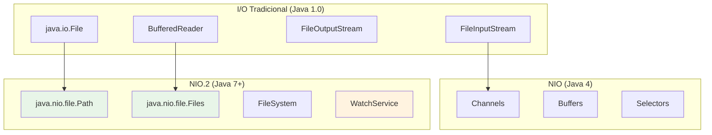

# File I/O (NIO): Manipulação Moderna de Arquivos

O **NIO (New I/O)**, introduzido no Java 4 e expandido drasticamente no Java 7 (NIO.2), revolucionou a forma como trabalhamos com arquivos, diretórios e I/O em geral. Oferece APIs mais expressivas, performance superior e recursos avançados como monitoramento de arquivos e operações assíncronas.

---

## Evolução do I/O em Java

### I/O Tradicional vs. NIO vs. NIO.2



### Comparação Prática

#### I/O Tradicional
```java
// ❌ Abordagem antiga: verbosa e propensa a erros
File arquivo = new File("dados.txt");
FileReader reader = null;
BufferedReader buffered = null;

try {
    reader = new FileReader(arquivo);
    buffered = new BufferedReader(reader);
    String linha;
    while ((linha = buffered.readLine()) != null) {
        System.out.println(linha);
    }
} catch (IOException e) {
    e.printStackTrace();
} finally {
    try {
        if (buffered != null) buffered.close();
        if (reader != null) reader.close();
    } catch (IOException e) {
        e.printStackTrace();
    }
}
```

#### NIO.2 Moderno
```java
// ✅ Abordagem moderna: concisa e segura
try {
    List<String> linhas = Files.readAllLines(Paths.get("dados.txt"));
    linhas.forEach(System.out::println);
} catch (IOException e) {
    e.printStackTrace();
}

// Ou ainda mais conciso com try-with-resources
try (Stream<String> linhas = Files.lines(Paths.get("dados.txt"))) {
    linhas.forEach(System.out::println);
} catch (IOException e) {
    e.printStackTrace();
}
```

---

## Path: A Nova Abstração de Caminhos

### Criação e Manipulação de Paths
```java
// Diferentes formas de criar Path
Path path1 = Paths.get("arquivo.txt");
Path path2 = Paths.get("src", "main", "java", "MinhaClasse.java");
Path path3 = Paths.get("/home/usuario/documentos");
Path path4 = Path.of("dados", "config.properties"); // Java 11+

// Paths absolutos vs relativos
Path absoluto = path1.toAbsolutePath();
Path relativo = absoluto.relativize(Paths.get("/other/path"));

System.out.println("Path original: " + path1);
System.out.println("Path absoluto: " + absoluto);
System.out.println("Path pai: " + path1.getParent());
System.out.println("Nome do arquivo: " + path1.getFileName());
System.out.println("Extensão: " + getFileExtension(path1));
```

### Operações Avançadas com Path
```java
public class PathOperations {
    
    public static void demonstrarOperacoes() {
        Path projeto = Paths.get("/projeto/java-app");
        
        // Navegação
        Path src = projeto.resolve("src/main/java");
        Path config = projeto.resolve("../config.yml");
        Path normalizado = config.normalize(); // Remove '..'
        
        // Comparação
        Path outro = Paths.get("/projeto/java-app/src/main/java");
        boolean saoIguais = src.equals(outro);
        boolean terminaCom = src.endsWith("main/java");
        boolean comecaCom = src.startsWith("/projeto");
        
        // Iteração sobre componentes
        for (Path componente : src) {
            System.out.println("Componente: " + componente);
        }
    }
    
    private static String getFileExtension(Path path) {
        String fileName = path.getFileName().toString();
        int dotIndex = fileName.lastIndexOf('.');
        return dotIndex > 0 ? fileName.substring(dotIndex + 1) : "";
    }
}
```

---

## Files: Operações de Alto Nível

### Leitura de Arquivos

#### Diferentes Estratégias para Diferentes Cenários
```java
public class FileReading {
    
    // Para arquivos pequenos (< 2GB)
    public List<String> lerArquivoPequeno(Path arquivo) throws IOException {
        return Files.readAllLines(arquivo, StandardCharsets.UTF_8);
    }
    
    // Para arquivos grandes (streaming)
    public void lerArquivoGrande(Path arquivo) throws IOException {
        try (Stream<String> linhas = Files.lines(arquivo)) {
            linhas
                .filter(linha -> linha.contains("ERROR"))
                .map(String::trim)
                .forEach(System.out::println);
        }
    }
    
    // Leitura binária
    public byte[] lerArquivoBinario(Path arquivo) throws IOException {
        return Files.readAllBytes(arquivo);
    }
    
    // Leitura com BufferedReader (controle total)
    public void lerComBufferedReader(Path arquivo) throws IOException {
        try (BufferedReader reader = Files.newBufferedReader(arquivo)) {
            String linha;
            int numeroLinha = 0;
            while ((linha = reader.readLine()) != null) {
                numeroLinha++;
                processarLinha(numeroLinha, linha);
            }
        }
    }
    
    private void processarLinha(int numero, String linha) {
        // Processamento customizado
        System.out.printf("%d: %s%n", numero, linha);
    }
}
```

### Escrita de Arquivos

#### Diferentes Estratégias de Escrita
```java
public class FileWriting {
    
    // Escrita simples (substitui arquivo)
    public void escreverSimples(Path arquivo, List<String> linhas) throws IOException {
        Files.write(arquivo, linhas, StandardCharsets.UTF_8);
    }
    
    // Escrita com append
    public void adicionarLinhas(Path arquivo, List<String> novasLinhas) throws IOException {
        Files.write(arquivo, novasLinhas, 
                   StandardCharsets.UTF_8, 
                   StandardOpenOption.CREATE, 
                   StandardOpenOption.APPEND);
    }
    
    // Escrita binária
    public void escreverBinario(Path arquivo, byte[] dados) throws IOException {
        Files.write(arquivo, dados);
    }
    
    // Escrita com BufferedWriter (para volumes grandes)
    public void escreverComBuffer(Path arquivo, Stream<String> dados) throws IOException {
        try (BufferedWriter writer = Files.newBufferedWriter(arquivo)) {
            dados.forEach(linha -> {
                try {
                    writer.write(linha);
                    writer.newLine();
                } catch (IOException e) {
                    throw new UncheckedIOException(e);
                }
            });
        }
    }
    
    // Escrita atômica (cria arquivo temporário e renomeia)
    public void escritaAtomica(Path arquivo, String conteudo) throws IOException {
        Path temp = Files.createTempFile(arquivo.getParent(), "temp_", ".tmp");
        try {
            Files.writeString(temp, conteudo);
            Files.move(temp, arquivo, StandardCopyOption.ATOMIC_MOVE);
        } catch (IOException e) {
            Files.deleteIfExists(temp); // Limpa em caso de erro
            throw e;
        }
    }
}
```

---

## Operações com Diretórios

### Criação e Manipulação
```java
public class DirectoryOperations {
    
    public void operacoesBasicas() throws IOException {
        Path diretorio = Paths.get("novo-projeto");
        
        // Criar diretório (e pais se necessário)
        Files.createDirectories(diretorio);
        
        // Criar estrutura de projeto
        Files.createDirectories(diretorio.resolve("src/main/java"));
        Files.createDirectories(diretorio.resolve("src/main/resources"));
        Files.createDirectories(diretorio.resolve("src/test/java"));
        
        // Verificações
        boolean existe = Files.exists(diretorio);
        boolean ehDiretorio = Files.isDirectory(diretorio);
        boolean ehRegular = Files.isRegularFile(diretorio);
        boolean ehLegivel = Files.isReadable(diretorio);
        
        System.out.printf("Diretório %s: existe=%b, é_dir=%b%n", 
                         diretorio, existe, ehDiretorio);
    }
    
    // Listar conteúdo
    public void listarConteudo(Path diretorio) throws IOException {
        // Lista direta (não recursiva)
        try (Stream<Path> stream = Files.list(diretorio)) {
            stream
                .filter(Files::isRegularFile)
                .sorted()
                .forEach(System.out::println);
        }
    }
    
    // Busca recursiva
    public void buscarArquivos(Path raiz, String padrao) throws IOException {
        PathMatcher matcher = FileSystems.getDefault().getPathMatcher("glob:" + padrao);
        
        try (Stream<Path> stream = Files.walk(raiz)) {
            stream
                .filter(Files::isRegularFile)
                .filter(path -> matcher.matches(path.getFileName()))
                .forEach(System.out::println);
        }
    }
    
    // Busca com critérios complexos
    public List<Path> buscarArquivosAvancado(Path raiz) throws IOException {
        try (Stream<Path> stream = Files.find(raiz, Integer.MAX_VALUE, 
                (path, attrs) -> 
                    attrs.isRegularFile() && 
                    path.toString().endsWith(".java") &&
                    attrs.size() > 1000 && // Maiores que 1KB
                    attrs.lastModifiedTime().toInstant()
                        .isAfter(Instant.now().minus(7, ChronoUnit.DAYS)) // Modificados na última semana
        )) {
            return stream.collect(Collectors.toList());
        }
    }
}
```

---

## Canais (Channels): I/O de Alta Performance

### FileChannel para Operações Eficientes
```java
public class ChannelOperations {
    
    // Cópia eficiente de arquivo
    public void copiarArquivoComChannel(Path origem, Path destino) throws IOException {
        try (FileChannel sourceChannel = FileChannel.open(origem, StandardOpenOption.READ);
             FileChannel destChannel = FileChannel.open(destino, 
                 StandardOpenOption.CREATE, StandardOpenOption.WRITE)) {
            
            // Cópia direta (zero-copy quando possível)
            destChannel.transferFrom(sourceChannel, 0, sourceChannel.size());
        }
    }
    
    // Leitura com mapeamento de memória (para arquivos grandes)
    public void lerComMemoryMapping(Path arquivo) throws IOException {
        try (FileChannel channel = FileChannel.open(arquivo, StandardOpenOption.READ)) {
            long tamanho = channel.size();
            
            // Mapeia arquivo na memória
            MappedByteBuffer buffer = channel.map(
                FileChannel.MapMode.READ_ONLY, 0, tamanho);
            
            // Leitura muito eficiente
            while (buffer.hasRemaining()) {
                byte b = buffer.get();
                // Processa byte
            }
        }
    }
    
    // Escrita com controle de buffer
    public void escreverComChannel(Path arquivo, String[] dados) throws IOException {
        try (FileChannel channel = FileChannel.open(arquivo, 
                StandardOpenOption.CREATE, StandardOpenOption.WRITE)) {
            
            ByteBuffer buffer = ByteBuffer.allocate(8192); // 8KB buffer
            
            for (String linha : dados) {
                byte[] bytes = (linha + System.lineSeparator()).getBytes();
                
                if (buffer.remaining() < bytes.length) {
                    // Buffer cheio, escreve no arquivo
                    buffer.flip();
                    channel.write(buffer);
                    buffer.clear();
                }
                
                buffer.put(bytes);
            }
            
            // Escreve dados restantes
            if (buffer.position() > 0) {
                buffer.flip();
                channel.write(buffer);
            }
        }
    }
}
```

---

## WatchService: Monitoramento de Arquivos

### Monitoramento em Tempo Real
```java
public class FileWatcher {
    private final WatchService watchService;
    private final Map<WatchKey, Path> watchKeys = new HashMap<>();
    private volatile boolean running = true;
    
    public FileWatcher() throws IOException {
        this.watchService = FileSystems.getDefault().newWatchService();
    }
    
    public void monitorarDiretorio(Path diretorio) throws IOException {
        WatchKey key = diretorio.register(watchService,
            StandardWatchEventKinds.ENTRY_CREATE,
            StandardWatchEventKinds.ENTRY_MODIFY,
            StandardWatchEventKinds.ENTRY_DELETE);
        
        watchKeys.put(key, diretorio);
        System.out.println("Monitorando: " + diretorio);
    }
    
    public void iniciarMonitoramento() {
        Thread watchThread = new Thread(this::processarEventos);
        watchThread.setDaemon(true);
        watchThread.start();
    }
    
    private void processarEventos() {
        while (running) {
            try {
                WatchKey key = watchService.take(); // Bloqueia até receber evento
                Path diretorio = watchKeys.get(key);
                
                if (diretorio == null) {
                    continue;
                }
                
                for (WatchEvent<?> event : key.pollEvents()) {
                    WatchEvent.Kind<?> kind = event.kind();
                    Path arquivo = diretorio.resolve((Path) event.context());
                    
                    tratarEvento(kind, arquivo);
                }
                
                // Reativa o watch key
                boolean valid = key.reset();
                if (!valid) {
                    watchKeys.remove(key);
                    if (watchKeys.isEmpty()) {
                        running = false;
                    }
                }
                
            } catch (InterruptedException e) {
                Thread.currentThread().interrupt();
                break;
            }
        }
    }
    
    private void tratarEvento(WatchEvent.Kind<?> kind, Path arquivo) {
        if (kind == StandardWatchEventKinds.ENTRY_CREATE) {
            System.out.println("Arquivo criado: " + arquivo);
            // Processar novo arquivo
            processarNovoArquivo(arquivo);
            
        } else if (kind == StandardWatchEventKinds.ENTRY_MODIFY) {
            System.out.println("Arquivo modificado: " + arquivo);
            // Reprocessar arquivo
            reprocessarArquivo(arquivo);
            
        } else if (kind == StandardWatchEventKinds.ENTRY_DELETE) {
            System.out.println("Arquivo removido: " + arquivo);
            // Limpar caches relacionados
            limparCacheArquivo(arquivo);
        }
    }
    
    // Métodos de processamento
    private void processarNovoArquivo(Path arquivo) {
        // Implementar lógica de processamento
    }
    
    private void reprocessarArquivo(Path arquivo) {
        // Implementar lógica de reprocessamento
    }
    
    private void limparCacheArquivo(Path arquivo) {
        // Implementar limpeza de cache
    }
    
    public void parar() throws IOException {
        running = false;
        watchService.close();
    }
}
```

### Uso Prático: Hot Reload de Configurações
```java
public class ConfigurationManager {
    private final Path configFile;
    private final FileWatcher watcher;
    private volatile Properties config;
    
    public ConfigurationManager(Path configFile) throws IOException {
        this.configFile = configFile;
        this.watcher = new FileWatcher();
        
        // Carregamento inicial
        carregarConfiguracao();
        
        // Monitora mudanças
        watcher.monitorarDiretorio(configFile.getParent());
        watcher.iniciarMonitoramento();
    }
    
    private void carregarConfiguracao() {
        try {
            Properties novasConfigs = new Properties();
            try (InputStream input = Files.newInputStream(configFile)) {
                novasConfigs.load(input);
            }
            
            this.config = novasConfigs;
            System.out.println("Configuração carregada: " + config.size() + " propriedades");
            
        } catch (IOException e) {
            System.err.println("Erro ao carregar configuração: " + e.getMessage());
        }
    }
    
    public String getProperty(String key) {
        return config.getProperty(key);
    }
    
    public String getProperty(String key, String defaultValue) {
        return config.getProperty(key, defaultValue);
    }
}
```

---

## Operações Assíncronas de Arquivo

### AsynchronousFileChannel (Java 7+)
```java
public class AsyncFileOperations {
    
    public CompletableFuture<String> lerArquivoAsync(Path arquivo) {
        return CompletableFuture.supplyAsync(() -> {
            try (AsynchronousFileChannel channel = AsynchronousFileChannel.open(arquivo)) {
                ByteBuffer buffer = ByteBuffer.allocate((int) channel.size());
                
                Future<Integer> result = channel.read(buffer, 0);
                result.get(); // Aguarda leitura
                
                buffer.flip();
                return StandardCharsets.UTF_8.decode(buffer).toString();
                
            } catch (IOException | InterruptedException | ExecutionException e) {
                throw new RuntimeException(e);
            }
        });
    }
    
    public CompletableFuture<Void> escreverArquivoAsync(Path arquivo, String conteudo) {
        return CompletableFuture.runAsync(() -> {
            try (AsynchronousFileChannel channel = AsynchronousFileChannel.open(arquivo,
                    StandardOpenOption.CREATE, StandardOpenOption.WRITE)) {
                
                ByteBuffer buffer = ByteBuffer.wrap(conteudo.getBytes());
                Future<Integer> result = channel.write(buffer, 0);
                result.get(); // Aguarda escrita
                
            } catch (IOException | InterruptedException | ExecutionException e) {
                throw new RuntimeException(e);
            }
        });
    }
}
```

---

## Casos de Uso Empresariais

### 1. Processador de Logs em Batch
```java
public class LogProcessor {
    private final Path inputDir;
    private final Path outputDir;
    private final Path processedDir;
    
    public LogProcessor(Path inputDir, Path outputDir, Path processedDir) {
        this.inputDir = inputDir;
        this.outputDir = outputDir;
        this.processedDir = processedDir;
    }
    
    public void processarLogs() throws IOException {
        try (Stream<Path> arquivos = Files.list(inputDir)) {
            arquivos
                .filter(Files::isRegularFile)
                .filter(path -> path.toString().endsWith(".log"))
                .parallel() // Processamento paralelo
                .forEach(this::processarArquivoLog);
        }
    }
    
    private void processarArquivoLog(Path arquivo) {
        try {
            Path saida = outputDir.resolve(arquivo.getFileName());
            
            try (Stream<String> linhas = Files.lines(arquivo);
                 BufferedWriter writer = Files.newBufferedWriter(saida)) {
                
                linhas
                    .filter(linha -> linha.contains("ERROR") || linha.contains("WARN"))
                    .map(this::formatarLinha)
                    .forEach(linha -> {
                        try {
                            writer.write(linha);
                            writer.newLine();
                        } catch (IOException e) {
                            throw new UncheckedIOException(e);
                        }
                    });
            }
            
            // Move arquivo processado
            Files.move(arquivo, processedDir.resolve(arquivo.getFileName()));
            
        } catch (IOException e) {
            System.err.println("Erro processando " + arquivo + ": " + e.getMessage());
        }
    }
    
    private String formatarLinha(String linha) {
        // Formatação customizada
        return Instant.now() + " | " + linha;
    }
}
```

### 2. Sistema de Backup Incremental
```java
public class BackupSystem {
    private final Path sourceDir;
    private final Path backupDir;
    private final Map<Path, FileTime> lastBackupTimes = new ConcurrentHashMap<>();
    
    public BackupSystem(Path sourceDir, Path backupDir) {
        this.sourceDir = sourceDir;
        this.backupDir = backupDir;
    }
    
    public void executarBackupIncremental() throws IOException {
        try (Stream<Path> arquivos = Files.walk(sourceDir)) {
            arquivos
                .filter(Files::isRegularFile)
                .filter(this::arquivoFoiModificado)
                .forEach(this::copiarArquivo);
        }
    }
    
    private boolean arquivoFoiModificado(Path arquivo) {
        try {
            FileTime ultimaModificacao = Files.getLastModifiedTime(arquivo);
            FileTime ultimoBackup = lastBackupTimes.get(arquivo);
            
            return ultimoBackup == null || ultimaModificacao.compareTo(ultimoBackup) > 0;
        } catch (IOException e) {
            return true; // Em caso de erro, inclui no backup
        }
    }
    
    private void copiarArquivo(Path origem) {
        try {
            Path relativo = sourceDir.relativize(origem);
            Path destino = backupDir.resolve(relativo);
            
            // Cria diretórios se necessário
            Files.createDirectories(destino.getParent());
            
            // Copia arquivo preservando atributos
            Files.copy(origem, destino, 
                      StandardCopyOption.REPLACE_EXISTING,
                      StandardCopyOption.COPY_ATTRIBUTES);
            
            // Atualiza registro de backup
            lastBackupTimes.put(origem, Files.getLastModifiedTime(origem));
            
            System.out.println("Backup: " + origem + " -> " + destino);
            
        } catch (IOException e) {
            System.err.println("Erro no backup de " + origem + ": " + e.getMessage());
        }
    }
}
```

---

## Performance e Melhores Práticas

### Escolha da Estratégia por Tamanho de Arquivo

```java
public class FileStrategy {
    
    public String lerArquivo(Path arquivo) throws IOException {
        long tamanho = Files.size(arquivo);
        
        if (tamanho < 1024 * 1024) { // < 1MB
            // Leitura completa na memória
            return Files.readString(arquivo);
            
        } else if (tamanho < 100 * 1024 * 1024) { // < 100MB
            // Leitura em streaming
            StringBuilder sb = new StringBuilder();
            try (Stream<String> linhas = Files.lines(arquivo)) {
                linhas.forEach(linha -> sb.append(linha).append('\n'));
            }
            return sb.toString();
            
        } else {
            // Memory mapping para arquivos muito grandes
            return lerComMemoryMapping(arquivo);
        }
    }
    
    private String lerComMemoryMapping(Path arquivo) throws IOException {
        try (FileChannel channel = FileChannel.open(arquivo)) {
            MappedByteBuffer buffer = channel.map(
                FileChannel.MapMode.READ_ONLY, 0, channel.size());
            return StandardCharsets.UTF_8.decode(buffer).toString();
        }
    }
}
```

### Dicas de Performance

1. **Use try-with-resources sempre**
2. **Para arquivos grandes, prefira streaming**
3. **Memory mapping é excelente para leitura de arquivos grandes**
4. **Channels são mais eficientes para operações binárias**
5. **BufferedReader/Writer são ideais para texto linha a linha**

---

**Próximos Passos:** Com o domínio do NIO, você está preparado para trabalhar eficientemente com arquivos em qualquer aplicação Java, desde processamento de logs até sistemas de backup empresariais. 