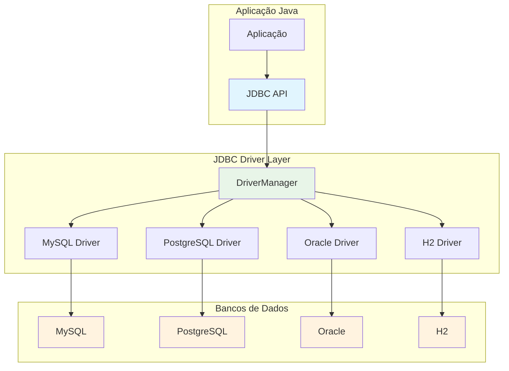

# JDBC API: Acesso Profissional a Bancos de Dados

A **JDBC (Java Database Connectivity) API** é a interface padrão do Java para acessar bancos de dados relacionais. Ela fornece um conjunto uniforme de classes e interfaces que permitem executar comandos SQL e processar resultados de forma independente do banco de dados específico, sendo fundamental para aplicações empresariais.

---

## Conceitos Fundamentais

### Arquitetura JDBC

A JDBC funciona como uma ponte entre aplicações Java e bancos de dados, utilizando drivers específicos para cada SGBD.



### Componentes Principais

```java
public class JDBCComponents {
    
    public void demonstrarComponentes() throws SQLException {
        // 1. DriverManager - Gerencia drivers e conexões
        String url = "jdbc:h2:mem:testdb";
        String username = "sa";
        String password = "";
        
        Connection connection = DriverManager.getConnection(url, username, password);
        
        // 2. Connection - Representa conexão com banco
        System.out.println("Conectado ao banco: " + connection.getMetaData().getDatabaseProductName());
        System.out.println("Versão: " + connection.getMetaData().getDatabaseProductVersion());
        System.out.println("Auto-commit: " + connection.getAutoCommit());
        
        // 3. Statement - Executa comandos SQL
        Statement statement = connection.createStatement();
        
        // Criar tabela
        statement.executeUpdate("""
            CREATE TABLE usuarios (
                id INT PRIMARY KEY AUTO_INCREMENT,
                nome VARCHAR(100) NOT NULL,
                email VARCHAR(150) UNIQUE NOT NULL,
                idade INT,
                ativo BOOLEAN DEFAULT TRUE,
                data_criacao TIMESTAMP DEFAULT CURRENT_TIMESTAMP
            )
        """);
        
        // 4. PreparedStatement - Comandos SQL parametrizados
        PreparedStatement insertStmt = connection.prepareStatement(
            "INSERT INTO usuarios (nome, email, idade) VALUES (?, ?, ?)"
        );
        
        // Inserir dados
        String[][] usuarios = {
            {"João Silva", "joao@email.com", "30"},
            {"Maria Santos", "maria@email.com", "25"},
            {"Pedro Oliveira", "pedro@email.com", "35"}
        };
        
        for (String[] usuario : usuarios) {
            insertStmt.setString(1, usuario[0]);
            insertStmt.setString(2, usuario[1]);
            insertStmt.setInt(3, Integer.parseInt(usuario[2]));
            insertStmt.executeUpdate();
        }
        
        // 5. ResultSet - Representa resultado de consulta
        ResultSet resultSet = statement.executeQuery("SELECT * FROM usuarios ORDER BY nome");
        
        System.out.println("\n=== Usuários Cadastrados ===");
        while (resultSet.next()) {
            int id = resultSet.getInt("id");
            String nome = resultSet.getString("nome");
            String email = resultSet.getString("email");
            int idade = resultSet.getInt("idade");
            Timestamp dataCriacao = resultSet.getTimestamp("data_criacao");
            
            System.out.printf("ID: %d, Nome: %s, Email: %s, Idade: %d, Criado: %s%n",
                id, nome, email, idade, dataCriacao);
        }
        
        // 6. DatabaseMetaData - Metadados do banco
        DatabaseMetaData metaData = connection.getMetaData();
        System.out.println("\n=== Informações do Banco ===");
        System.out.println("Produto: " + metaData.getDatabaseProductName());
        System.out.println("Versão: " + metaData.getDatabaseProductVersion());
        System.out.println("Driver: " + metaData.getDriverName());
        System.out.println("Suporta transações: " + metaData.supportsTransactions());
        
        // Limpeza de recursos
        resultSet.close();
        insertStmt.close();
        statement.close();
        connection.close();
    }
}
```

---

## Gerenciamento de Conexões

### Connection Pooling e DataSource

```java
public class ConnectionManagement {
    
    // Configuração de conexão simples
    public static class SimpleConnectionConfig {
        private final String url;
        private final String username;
        private final String password;
        private final Properties properties;
        
        public SimpleConnectionConfig(String url, String username, String password) {
            this.url = url;
            this.username = username;
            this.password = password;
            this.properties = new Properties();
            
            // Configurações padrão
            properties.setProperty("useSSL", "false");
            properties.setProperty("allowPublicKeyRetrieval", "true");
            properties.setProperty("serverTimezone", "UTC");
        }
        
        public Connection getConnection() throws SQLException {
            return DriverManager.getConnection(url, username, password);
        }
        
        public Connection getConnectionWithProperties() throws SQLException {
            properties.setProperty("user", username);
            properties.setProperty("password", password);
            return DriverManager.getConnection(url, properties);
        }
    }
    
    // Connection Pool simples
    public static class SimpleConnectionPool implements AutoCloseable {
        private final Queue<Connection> availableConnections = new ConcurrentLinkedQueue<>();
        private final Set<Connection> usedConnections = ConcurrentHashMap.newKeySet();
        private final String url;
        private final String username;
        private final String password;
        private final int maxPoolSize;
        private final AtomicInteger currentPoolSize = new AtomicInteger(0);
        
        public SimpleConnectionPool(String url, String username, String password, int maxPoolSize) {
            this.url = url;
            this.username = username;
            this.password = password;
            this.maxPoolSize = maxPoolSize;
        }
        
        public synchronized Connection getConnection() throws SQLException {
            // Tentar reutilizar conexão existente
            Connection connection = availableConnections.poll();
            
            if (connection != null && !connection.isClosed()) {
                usedConnections.add(connection);
                return connection;
            }
            
            // Criar nova conexão se não atingiu limite
            if (currentPoolSize.get() < maxPoolSize) {
                connection = DriverManager.getConnection(url, username, password);
                usedConnections.add(connection);
                currentPoolSize.incrementAndGet();
                return connection;
            }
            
            throw new SQLException("Pool de conexões esgotado. Máximo: " + maxPoolSize);
        }
        
        public synchronized void releaseConnection(Connection connection) {
            if (usedConnections.remove(connection)) {
                availableConnections.offer(connection);
            }
        }
        
        public int getAvailableConnections() {
            return availableConnections.size();
        }
        
        public int getUsedConnections() {
            return usedConnections.size();
        }
        
        public int getTotalConnections() {
            return currentPoolSize.get();
        }
        
        @Override
        public void close() throws SQLException {
            // Fechar todas as conexões
            for (Connection conn : availableConnections) {
                if (!conn.isClosed()) {
                    conn.close();
                }
            }
            
            for (Connection conn : usedConnections) {
                if (!conn.isClosed()) {
                    conn.close();
                }
            }
            
            availableConnections.clear();
            usedConnections.clear();
            currentPoolSize.set(0);
        }
    }
    
    // Wrapper para conexão com auto-release
    public static class PooledConnection implements AutoCloseable {
        private final Connection connection;
        private final SimpleConnectionPool pool;
        
        public PooledConnection(Connection connection, SimpleConnectionPool pool) {
            this.connection = connection;
            this.pool = pool;
        }
        
        public Connection getConnection() {
            return connection;
        }
        
        @Override
        public void close() {
            pool.releaseConnection(connection);
        }
    }
    
    public void exemploConnectionPool() throws SQLException {
        SimpleConnectionPool pool = new SimpleConnectionPool(
            "jdbc:h2:mem:testdb", "sa", "", 5);
        
        try {
            System.out.println("=== Teste de Connection Pool ===");
            
            // Usar conexões do pool
            List<PooledConnection> connections = new ArrayList<>();
            
            for (int i = 0; i < 3; i++) {
                PooledConnection pooledConn = new PooledConnection(pool.getConnection(), pool);
                connections.add(pooledConn);
                
                System.out.printf("Conexão %d obtida. Pool: %d/%d (disponíveis/total)%n", 
                    i + 1, pool.getAvailableConnections(), pool.getTotalConnections());
            }
            
            // Liberar uma conexão
            connections.get(0).close();
            System.out.printf("Conexão liberada. Pool: %d/%d%n", 
                pool.getAvailableConnections(), pool.getTotalConnections());
            
            // Obter conexão reutilizada
            PooledConnection reutilizada = new PooledConnection(pool.getConnection(), pool);
            System.out.printf("Conexão reutilizada. Pool: %d/%d%n", 
                pool.getAvailableConnections(), pool.getTotalConnections());
            
            // Limpar recursos
            for (PooledConnection conn : connections) {
                if (conn != connections.get(0)) { // Primeira já foi fechada
                    conn.close();
                }
            }
            reutilizada.close();
            
        } finally {
            pool.close();
        }
    }
}
```

---

## Operações CRUD Avançadas

### Repository Pattern com JDBC

```java
public class AdvancedCRUD {
    
    // Entidade Usuario
    public static class Usuario {
        private Long id;
        private String nome;
        private String email;
        private Integer idade;
        private Boolean ativo;
        private LocalDateTime dataCriacao;
        private LocalDateTime dataAtualizacao;
        
        // Construtores
        public Usuario() {}
        
        public Usuario(String nome, String email, Integer idade) {
            this.nome = nome;
            this.email = email;
            this.idade = idade;
            this.ativo = true;
        }
        
        // Getters e Setters
        public Long getId() { return id; }
        public void setId(Long id) { this.id = id; }
        public String getNome() { return nome; }
        public void setNome(String nome) { this.nome = nome; }
        public String getEmail() { return email; }
        public void setEmail(String email) { this.email = email; }
        public Integer getIdade() { return idade; }
        public void setIdade(Integer idade) { this.idade = idade; }
        public Boolean getAtivo() { return ativo; }
        public void setAtivo(Boolean ativo) { this.ativo = ativo; }
        public LocalDateTime getDataCriacao() { return dataCriacao; }
        public void setDataCriacao(LocalDateTime dataCriacao) { this.dataCriacao = dataCriacao; }
        public LocalDateTime getDataAtualizacao() { return dataAtualizacao; }
        public void setDataAtualizacao(LocalDateTime dataAtualizacao) { this.dataAtualizacao = dataAtualizacao; }
        
        @Override
        public String toString() {
            return String.format("Usuario{id=%d, nome='%s', email='%s', idade=%d, ativo=%b}", 
                id, nome, email, idade, ativo);
        }
    }
    
    // Repository para Usuario
    public static class UsuarioRepository {
        private final Connection connection;
        
        // SQL statements
        private static final String INSERT_SQL = 
            "INSERT INTO usuarios (nome, email, idade, ativo) VALUES (?, ?, ?, ?)";
        
        private static final String UPDATE_SQL = 
            "UPDATE usuarios SET nome = ?, email = ?, idade = ?, ativo = ?, data_atualizacao = CURRENT_TIMESTAMP WHERE id = ?";
        
        private static final String DELETE_SQL = 
            "DELETE FROM usuarios WHERE id = ?";
        
        private static final String SELECT_BY_ID_SQL = 
            "SELECT * FROM usuarios WHERE id = ?";
        
        private static final String SELECT_ALL_SQL = 
            "SELECT * FROM usuarios ORDER BY nome";
        
        private static final String SELECT_BY_EMAIL_SQL = 
            "SELECT * FROM usuarios WHERE email = ?";
        
        private static final String SELECT_ACTIVE_SQL = 
            "SELECT * FROM usuarios WHERE ativo = TRUE ORDER BY nome";
        
        private static final String COUNT_SQL = 
            "SELECT COUNT(*) FROM usuarios";
        
        public UsuarioRepository(Connection connection) {
            this.connection = connection;
        }
        
        // CREATE
        public Usuario save(Usuario usuario) throws SQLException {
            if (usuario.getId() == null) {
                return insert(usuario);
            } else {
                return update(usuario);
            }
        }
        
        private Usuario insert(Usuario usuario) throws SQLException {
            try (PreparedStatement stmt = connection.prepareStatement(INSERT_SQL, Statement.RETURN_GENERATED_KEYS)) {
                stmt.setString(1, usuario.getNome());
                stmt.setString(2, usuario.getEmail());
                stmt.setObject(3, usuario.getIdade());
                stmt.setBoolean(4, usuario.getAtivo());
                
                int rowsAffected = stmt.executeUpdate();
                
                if (rowsAffected == 0) {
                    throw new SQLException("Falha ao inserir usuário");
                }
                
                // Obter ID gerado
                try (ResultSet generatedKeys = stmt.getGeneratedKeys()) {
                    if (generatedKeys.next()) {
                        usuario.setId(generatedKeys.getLong(1));
                    }
                }
                
                return usuario;
            }
        }
        
        private Usuario update(Usuario usuario) throws SQLException {
            try (PreparedStatement stmt = connection.prepareStatement(UPDATE_SQL)) {
                stmt.setString(1, usuario.getNome());
                stmt.setString(2, usuario.getEmail());
                stmt.setObject(3, usuario.getIdade());
                stmt.setBoolean(4, usuario.getAtivo());
                stmt.setLong(5, usuario.getId());
                
                int rowsAffected = stmt.executeUpdate();
                
                if (rowsAffected == 0) {
                    throw new SQLException("Usuário não encontrado para atualização: " + usuario.getId());
                }
                
                return usuario;
            }
        }
        
        // READ
        public Optional<Usuario> findById(Long id) throws SQLException {
            try (PreparedStatement stmt = connection.prepareStatement(SELECT_BY_ID_SQL)) {
                stmt.setLong(1, id);
                
                try (ResultSet rs = stmt.executeQuery()) {
                    if (rs.next()) {
                        return Optional.of(mapResultSetToUsuario(rs));
                    }
                }
            }
            
            return Optional.empty();
        }
        
        public Optional<Usuario> findByEmail(String email) throws SQLException {
            try (PreparedStatement stmt = connection.prepareStatement(SELECT_BY_EMAIL_SQL)) {
                stmt.setString(1, email);
                
                try (ResultSet rs = stmt.executeQuery()) {
                    if (rs.next()) {
                        return Optional.of(mapResultSetToUsuario(rs));
                    }
                }
            }
            
            return Optional.empty();
        }
        
        public List<Usuario> findAll() throws SQLException {
            List<Usuario> usuarios = new ArrayList<>();
            
            try (Statement stmt = connection.createStatement();
                 ResultSet rs = stmt.executeQuery(SELECT_ALL_SQL)) {
                
                while (rs.next()) {
                    usuarios.add(mapResultSetToUsuario(rs));
                }
            }
            
            return usuarios;
        }
        
        public List<Usuario> findActive() throws SQLException {
            List<Usuario> usuarios = new ArrayList<>();
            
            try (Statement stmt = connection.createStatement();
                 ResultSet rs = stmt.executeQuery(SELECT_ACTIVE_SQL)) {
                
                while (rs.next()) {
                    usuarios.add(mapResultSetToUsuario(rs));
                }
            }
            
            return usuarios;
        }
        
        // DELETE
        public boolean deleteById(Long id) throws SQLException {
            try (PreparedStatement stmt = connection.prepareStatement(DELETE_SQL)) {
                stmt.setLong(1, id);
                
                int rowsAffected = stmt.executeUpdate();
                return rowsAffected > 0;
            }
        }
        
        // UTILS
        public long count() throws SQLException {
            try (Statement stmt = connection.createStatement();
                 ResultSet rs = stmt.executeQuery(COUNT_SQL)) {
                
                if (rs.next()) {
                    return rs.getLong(1);
                }
            }
            
            return 0;
        }
        
        private Usuario mapResultSetToUsuario(ResultSet rs) throws SQLException {
            Usuario usuario = new Usuario();
            usuario.setId(rs.getLong("id"));
            usuario.setNome(rs.getString("nome"));
            usuario.setEmail(rs.getString("email"));
            usuario.setIdade((Integer) rs.getObject("idade"));
            usuario.setAtivo(rs.getBoolean("ativo"));
            
            Timestamp dataCriacao = rs.getTimestamp("data_criacao");
            if (dataCriacao != null) {
                usuario.setDataCriacao(dataCriacao.toLocalDateTime());
            }
            
            Timestamp dataAtualizacao = rs.getTimestamp("data_atualizacao");
            if (dataAtualizacao != null) {
                usuario.setDataAtualizacao(dataAtualizacao.toLocalDateTime());
            }
            
            return usuario;
        }
    }
    
    public void exemploRepository() throws SQLException {
        // Configurar banco de dados H2 em memória
        Connection connection = DriverManager.getConnection("jdbc:h2:mem:testdb", "sa", "");
        
        // Criar tabela
        try (Statement stmt = connection.createStatement()) {
            stmt.executeUpdate("""
                CREATE TABLE usuarios (
                    id BIGINT PRIMARY KEY AUTO_INCREMENT,
                    nome VARCHAR(100) NOT NULL,
                    email VARCHAR(150) UNIQUE NOT NULL,
                    idade INT,
                    ativo BOOLEAN DEFAULT TRUE,
                    data_criacao TIMESTAMP DEFAULT CURRENT_TIMESTAMP,
                    data_atualizacao TIMESTAMP
                )
            """);
        }
        
        UsuarioRepository repository = new UsuarioRepository(connection);
        
        try {
            System.out.println("=== Teste Repository Pattern ===");
            
            // CREATE
            Usuario joao = new Usuario("João Silva", "joao@email.com", 30);
            joao = repository.save(joao);
            System.out.println("Usuário criado: " + joao);
            
            Usuario maria = new Usuario("Maria Santos", "maria@email.com", 25);
            maria = repository.save(maria);
            System.out.println("Usuário criado: " + maria);
            
            // READ
            Optional<Usuario> usuarioEncontrado = repository.findById(joao.getId());
            System.out.println("Usuário encontrado por ID: " + usuarioEncontrado.orElse(null));
            
            Optional<Usuario> usuarioPorEmail = repository.findByEmail("maria@email.com");
            System.out.println("Usuário encontrado por email: " + usuarioPorEmail.orElse(null));
            
            // UPDATE
            joao.setIdade(31);
            joao.setNome("João Silva Santos");
            repository.save(joao);
            System.out.println("Usuário atualizado: " + repository.findById(joao.getId()).orElse(null));
            
            // LIST
            List<Usuario> todosUsuarios = repository.findAll();
            System.out.println("Todos os usuários (" + todosUsuarios.size() + "):");
            todosUsuarios.forEach(u -> System.out.println("  " + u));
            
            // SOFT DELETE (desativar)
            maria.setAtivo(false);
            repository.save(maria);
            
            List<Usuario> usuariosAtivos = repository.findActive();
            System.out.println("Usuários ativos (" + usuariosAtivos.size() + "):");
            usuariosAtivos.forEach(u -> System.out.println("  " + u));
            
            // COUNT
            System.out.println("Total de usuários: " + repository.count());
            
            // DELETE
            boolean deletado = repository.deleteById(maria.getId());
            System.out.println("Usuário deletado: " + deletado);
            System.out.println("Total após deleção: " + repository.count());
            
        } finally {
            connection.close();
        }
    }
}
```

---

## Transações e Controle de Concorrência

### Gerenciamento de Transações

```java
public class TransactionManagement {
    
    // Service para transferência bancária
    public static class ContaBancariaService {
        private final Connection connection;
        
        public ContaBancariaService(Connection connection) {
            this.connection = connection;
        }
        
        // Transferência com controle transacional
        public void transferir(Long contaOrigemId, Long contaDestinoId, BigDecimal valor) 
                throws SQLException {
            
            // Desabilitar auto-commit
            boolean originalAutoCommit = connection.getAutoCommit();
            connection.setAutoCommit(false);
            
            try {
                // 1. Verificar saldo da conta origem
                BigDecimal saldoOrigem = obterSaldo(contaOrigemId);
                if (saldoOrigem.compareTo(valor) < 0) {
                    throw new SQLException("Saldo insuficiente. Saldo: " + saldoOrigem + ", Valor: " + valor);
                }
                
                // 2. Verificar se conta destino existe
                if (!contaExiste(contaDestinoId)) {
                    throw new SQLException("Conta destino não encontrada: " + contaDestinoId);
                }
                
                // 3. Debitar da conta origem
                debitar(contaOrigemId, valor);
                
                // 4. Creditar na conta destino
                creditar(contaDestinoId, valor);
                
                // 5. Registrar transação
                registrarTransacao(contaOrigemId, contaDestinoId, valor, "TRANSFERENCIA");
                
                // Confirmar transação
                connection.commit();
                System.out.printf("Transferência realizada: R$ %.2f de conta %d para conta %d%n", 
                    valor, contaOrigemId, contaDestinoId);
                
            } catch (SQLException e) {
                // Reverter transação em caso de erro
                connection.rollback();
                System.err.println("Erro na transferência - transação revertida: " + e.getMessage());
                throw e;
                
            } finally {
                // Restaurar auto-commit original
                connection.setAutoCommit(originalAutoCommit);
            }
        }
        
        // Transferência com Savepoint
        public void transferirComSavepoint(Long contaOrigemId, Long contaDestinoId, BigDecimal valor) 
                throws SQLException {
            
            boolean originalAutoCommit = connection.getAutoCommit();
            connection.setAutoCommit(false);
            
            Savepoint savepoint = null;
            
            try {
                // Criar savepoint antes das operações críticas
                savepoint = connection.setSavepoint("antes_transferencia");
                
                // Operações da transferência
                BigDecimal saldoOrigem = obterSaldo(contaOrigemId);
                if (saldoOrigem.compareTo(valor) < 0) {
                    throw new SQLException("Saldo insuficiente");
                }
                
                debitar(contaOrigemId, valor);
                
                // Simular erro condicional
                if (valor.compareTo(new BigDecimal("10000")) > 0) {
                    throw new SQLException("Valor muito alto para transferência automática");
                }
                
                creditar(contaDestinoId, valor);
                registrarTransacao(contaOrigemId, contaDestinoId, valor, "TRANSFERENCIA");
                
                // Liberar savepoint e confirmar
                connection.releaseSavepoint(savepoint);
                connection.commit();
                
            } catch (SQLException e) {
                if (savepoint != null) {
                    // Reverter apenas até o savepoint
                    connection.rollback(savepoint);
                    System.err.println("Revertido até savepoint: " + e.getMessage());
                } else {
                    // Reverter transação completa
                    connection.rollback();
                }
                throw e;
                
            } finally {
                connection.setAutoCommit(originalAutoCommit);
            }
        }
        
        private BigDecimal obterSaldo(Long contaId) throws SQLException {
            String sql = "SELECT saldo FROM contas WHERE id = ?";
            try (PreparedStatement stmt = connection.prepareStatement(sql)) {
                stmt.setLong(1, contaId);
                
                try (ResultSet rs = stmt.executeQuery()) {
                    if (rs.next()) {
                        return rs.getBigDecimal("saldo");
                    } else {
                        throw new SQLException("Conta não encontrada: " + contaId);
                    }
                }
            }
        }
        
        private boolean contaExiste(Long contaId) throws SQLException {
            String sql = "SELECT 1 FROM contas WHERE id = ?";
            try (PreparedStatement stmt = connection.prepareStatement(sql)) {
                stmt.setLong(1, contaId);
                
                try (ResultSet rs = stmt.executeQuery()) {
                    return rs.next();
                }
            }
        }
        
        private void debitar(Long contaId, BigDecimal valor) throws SQLException {
            String sql = "UPDATE contas SET saldo = saldo - ? WHERE id = ?";
            try (PreparedStatement stmt = connection.prepareStatement(sql)) {
                stmt.setBigDecimal(1, valor);
                stmt.setLong(2, contaId);
                
                int rowsAffected = stmt.executeUpdate();
                if (rowsAffected == 0) {
                    throw new SQLException("Falha ao debitar conta: " + contaId);
                }
            }
        }
        
        private void creditar(Long contaId, BigDecimal valor) throws SQLException {
            String sql = "UPDATE contas SET saldo = saldo + ? WHERE id = ?";
            try (PreparedStatement stmt = connection.prepareStatement(sql)) {
                stmt.setBigDecimal(1, valor);
                stmt.setLong(2, contaId);
                
                int rowsAffected = stmt.executeUpdate();
                if (rowsAffected == 0) {
                    throw new SQLException("Falha ao creditar conta: " + contaId);
                }
            }
        }
        
        private void registrarTransacao(Long contaOrigem, Long contaDestino, BigDecimal valor, String tipo) 
                throws SQLException {
            String sql = """
                INSERT INTO transacoes (conta_origem, conta_destino, valor, tipo, data_transacao) 
                VALUES (?, ?, ?, ?, CURRENT_TIMESTAMP)
            """;
            
            try (PreparedStatement stmt = connection.prepareStatement(sql)) {
                stmt.setLong(1, contaOrigem);
                stmt.setLong(2, contaDestino);
                stmt.setBigDecimal(3, valor);
                stmt.setString(4, tipo);
                
                stmt.executeUpdate();
            }
        }
    }
    
    // Demonstração de isolamento de transações
    public void demonstrarIsolamento() throws SQLException {
        Connection conn1 = DriverManager.getConnection("jdbc:h2:mem:testdb", "sa", "");
        Connection conn2 = DriverManager.getConnection("jdbc:h2:mem:testdb", "sa", "");
        
        try {
            // Configurar tabelas
            setupBankingTables(conn1);
            
            // Inserir dados iniciais
            insertInitialData(conn1);
            
            System.out.println("=== Teste de Isolamento de Transações ===");
            
            // READ_UNCOMMITTED - pode ler dados não commitados (dirty read)
            testReadUncommitted(conn1, conn2);
            
            // READ_COMMITTED - só lê dados commitados
            testReadCommitted(conn1, conn2);
            
            // REPEATABLE_READ - mantém consistência durante transação
            testRepeatableRead(conn1, conn2);
            
        } finally {
            conn1.close();
            conn2.close();
        }
    }
    
    private void setupBankingTables(Connection conn) throws SQLException {
        try (Statement stmt = conn.createStatement()) {
            // Tabela de contas
            stmt.executeUpdate("""
                CREATE TABLE contas (
                    id BIGINT PRIMARY KEY,
                    titular VARCHAR(100) NOT NULL,
                    saldo DECIMAL(15,2) NOT NULL DEFAULT 0,
                    data_criacao TIMESTAMP DEFAULT CURRENT_TIMESTAMP
                )
            """);
            
            // Tabela de transações
            stmt.executeUpdate("""
                CREATE TABLE transacoes (
                    id BIGINT PRIMARY KEY AUTO_INCREMENT,
                    conta_origem BIGINT,
                    conta_destino BIGINT,
                    valor DECIMAL(15,2) NOT NULL,
                    tipo VARCHAR(50) NOT NULL,
                    data_transacao TIMESTAMP DEFAULT CURRENT_TIMESTAMP,
                    FOREIGN KEY (conta_origem) REFERENCES contas(id),
                    FOREIGN KEY (conta_destino) REFERENCES contas(id)
                )
            """);
        }
    }
    
    private void insertInitialData(Connection conn) throws SQLException {
        try (PreparedStatement stmt = conn.prepareStatement(
                "INSERT INTO contas (id, titular, saldo) VALUES (?, ?, ?)")) {
            
            stmt.setLong(1, 1L);
            stmt.setString(2, "João Silva");
            stmt.setBigDecimal(3, new BigDecimal("1000.00"));
            stmt.executeUpdate();
            
            stmt.setLong(1, 2L);
            stmt.setString(2, "Maria Santos");
            stmt.setBigDecimal(3, new BigDecimal("500.00"));
            stmt.executeUpdate();
        }
    }
    
    private void testReadUncommitted(Connection conn1, Connection conn2) throws SQLException {
        System.out.println("\n--- READ_UNCOMMITTED ---");
        
        conn1.setTransactionIsolation(Connection.TRANSACTION_READ_UNCOMMITTED);
        conn2.setTransactionIsolation(Connection.TRANSACTION_READ_UNCOMMITTED);
        
        conn1.setAutoCommit(false);
        conn2.setAutoCommit(false);
        
        try {
            // Conn1: Modificar saldo sem commit
            try (PreparedStatement stmt = conn1.prepareStatement("UPDATE contas SET saldo = 2000 WHERE id = 1")) {
                stmt.executeUpdate();
                System.out.println("Conn1: Saldo alterado para 2000 (não commitado)");
            }
            
            // Conn2: Ler saldo (dirty read)
            try (PreparedStatement stmt = conn2.prepareStatement("SELECT saldo FROM contas WHERE id = 1");
                 ResultSet rs = stmt.executeQuery()) {
                if (rs.next()) {
                    System.out.println("Conn2: Leu saldo = " + rs.getBigDecimal("saldo") + " (dirty read!)");
                }
            }
            
            // Conn1: Rollback
            conn1.rollback();
            System.out.println("Conn1: Rollback executado");
            
            // Conn2: Ler novamente
            try (PreparedStatement stmt = conn2.prepareStatement("SELECT saldo FROM contas WHERE id = 1");
                 ResultSet rs = stmt.executeQuery()) {
                if (rs.next()) {
                    System.out.println("Conn2: Saldo real = " + rs.getBigDecimal("saldo"));
                }
            }
            
        } finally {
            conn1.setAutoCommit(true);
            conn2.setAutoCommit(true);
        }
    }
    
    private void testReadCommitted(Connection conn1, Connection conn2) throws SQLException {
        System.out.println("\n--- READ_COMMITTED ---");
        
        conn1.setTransactionIsolation(Connection.TRANSACTION_READ_COMMITTED);
        conn2.setTransactionIsolation(Connection.TRANSACTION_READ_COMMITTED);
        
        // Teste similar ao anterior, mas conn2 não verá dados não commitados
        // (implementação similar à anterior, mas sem dirty reads)
    }
    
    private void testRepeatableRead(Connection conn1, Connection conn2) throws SQLException {
        System.out.println("\n--- REPEATABLE_READ ---");
        
        conn1.setTransactionIsolation(Connection.TRANSACTION_REPEATABLE_READ);
        conn2.setTransactionIsolation(Connection.TRANSACTION_REPEATABLE_READ);
        
        // Teste de leituras repetíveis durante a transação
        // (implementação que demonstra consistência de leitura)
    }
    
    public void exemploTransacoes() throws SQLException {
        Connection connection = DriverManager.getConnection("jdbc:h2:mem:testdb", "sa", "");
        
        try {
            setupBankingTables(connection);
            insertInitialData(connection);
            
            ContaBancariaService service = new ContaBancariaService(connection);
            
            System.out.println("=== Teste de Transferências ===");
            
            // Transferência normal
            service.transferir(1L, 2L, new BigDecimal("100.00"));
            
            // Transferência que falhará (saldo insuficiente)
            try {
                service.transferir(2L, 1L, new BigDecimal("10000.00"));
            } catch (SQLException e) {
                System.err.println("Transferência rejeitada: " + e.getMessage());
            }
            
            // Demonstrar savepoints
            try {
                service.transferirComSavepoint(1L, 2L, new BigDecimal("15000.00"));
            } catch (SQLException e) {
                System.err.println("Transferência com savepoint falhou: " + e.getMessage());
            }
            
        } finally {
            connection.close();
        }
    }
}
```

---

## Batch Processing e Performance

### Operações em Lote

```java
public class BatchProcessing {
    
    // Importador de dados em lote
    public static class DataImporter {
        private final Connection connection;
        private final int batchSize;
        
        public DataImporter(Connection connection, int batchSize) {
            this.connection = connection;
            this.batchSize = batchSize;
        }
        
        // Import com PreparedStatement batch
        public void importarUsuarios(List<Usuario> usuarios) throws SQLException {
            String sql = "INSERT INTO usuarios (nome, email, idade, ativo) VALUES (?, ?, ?, ?)";
            
            connection.setAutoCommit(false);
            
            try (PreparedStatement stmt = connection.prepareStatement(sql)) {
                int count = 0;
                
                for (Usuario usuario : usuarios) {
                    stmt.setString(1, usuario.getNome());
                    stmt.setString(2, usuario.getEmail());
                    stmt.setObject(3, usuario.getIdade());
                    stmt.setBoolean(4, usuario.getAtivo());
                    
                    stmt.addBatch();
                    count++;
                    
                    // Executar batch quando atingir o tamanho ou no final
                    if (count % batchSize == 0 || count == usuarios.size()) {
                        int[] results = stmt.executeBatch();
                        System.out.printf("Batch executado: %d registros processados%n", results.length);
                        
                        connection.commit();
                        stmt.clearBatch();
                    }
                }
                
                System.out.printf("Import concluído: %d usuários importados%n", usuarios.size());
                
            } catch (SQLException e) {
                connection.rollback();
                System.err.println("Erro no import - rollback executado: " + e.getMessage());
                throw e;
                
            } finally {
                connection.setAutoCommit(true);
            }
        }
        
        // Import com Statement batch (para SQLs diferentes)
        public void executarScriptSQL(List<String> sqlStatements) throws SQLException {
            connection.setAutoCommit(false);
            
            try (Statement stmt = connection.createStatement()) {
                for (String sql : sqlStatements) {
                    stmt.addBatch(sql);
                }
                
                int[] results = stmt.executeBatch();
                connection.commit();
                
                System.out.printf("Script executado: %d comandos processados%n", results.length);
                
            } catch (SQLException e) {
                connection.rollback();
                throw e;
                
            } finally {
                connection.setAutoCommit(true);
            }
        }
        
        // Update em lote com diferentes condições
        public void atualizarSalariosEmLote(Map<Long, BigDecimal> funcionarioSalarios) throws SQLException {
            String sql = "UPDATE funcionarios SET salario = ? WHERE id = ?";
            
            connection.setAutoCommit(false);
            
            try (PreparedStatement stmt = connection.prepareStatement(sql)) {
                int count = 0;
                
                for (Map.Entry<Long, BigDecimal> entry : funcionarioSalarios.entrySet()) {
                    stmt.setBigDecimal(1, entry.getValue());
                    stmt.setLong(2, entry.getKey());
                    stmt.addBatch();
                    
                    count++;
                    
                    if (count % batchSize == 0) {
                        int[] results = stmt.executeBatch();
                        connection.commit();
                        stmt.clearBatch();
                        
                        System.out.printf("Lote de atualizações: %d registros%n", results.length);
                    }
                }
                
                // Executar restante
                if (count % batchSize != 0) {
                    int[] results = stmt.executeBatch();
                    connection.commit();
                    System.out.printf("Lote final: %d registros%n", results.length);
                }
                
            } catch (SQLException e) {
                connection.rollback();
                throw e;
                
            } finally {
                connection.setAutoCommit(true);
            }
        }
    }
    
    // Benchmark de performance
    public void benchmarkInserts() throws SQLException {
        Connection connection = DriverManager.getConnection("jdbc:h2:mem:testdb", "sa", "");
        
        // Criar tabela
        try (Statement stmt = connection.createStatement()) {
            stmt.executeUpdate("""
                CREATE TABLE benchmark_users (
                    id BIGINT PRIMARY KEY AUTO_INCREMENT,
                    nome VARCHAR(100),
                    email VARCHAR(150),
                    idade INT,
                    data_criacao TIMESTAMP DEFAULT CURRENT_TIMESTAMP
                )
            """);
        }
        
        int totalRecords = 10000;
        List<Usuario> usuarios = gerarUsuariosFicticios(totalRecords);
        
        System.out.println("=== Benchmark de Inserções ===");
        System.out.printf("Total de registros: %d%n", totalRecords);
        
        // 1. Insert individual (muito lento)
        long start = System.currentTimeMillis();
        insertIndividual(connection, usuarios.subList(0, 1000)); // Só 1000 para não demorar muito
        long tempoIndividual = System.currentTimeMillis() - start;
        System.out.printf("Insert individual (1000 registros): %d ms%n", tempoIndividual);
        
        // Limpar tabela
        try (Statement stmt = connection.createStatement()) {
            stmt.executeUpdate("DELETE FROM benchmark_users");
        }
        
        // 2. Batch insert
        start = System.currentTimeMillis();
        DataImporter importer = new DataImporter(connection, 1000);
        importer.importarUsuarios(usuarios);
        long tempoBatch = System.currentTimeMillis() - start;
        System.out.printf("Batch insert (%d registros): %d ms%n", totalRecords, tempoBatch);
        
        // Calcular speedup
        if (tempoIndividual > 0) {
            double speedup = (double) (tempoIndividual * (totalRecords / 1000.0)) / tempoBatch;
            System.out.printf("Speedup do batch: %.2fx mais rápido%n", speedup);
        }
        
        connection.close();
    }
    
    private void insertIndividual(Connection connection, List<Usuario> usuarios) throws SQLException {
        String sql = "INSERT INTO benchmark_users (nome, email, idade) VALUES (?, ?, ?)";
        
        try (PreparedStatement stmt = connection.prepareStatement(sql)) {
            for (Usuario usuario : usuarios) {
                stmt.setString(1, usuario.getNome());
                stmt.setString(2, usuario.getEmail());
                stmt.setObject(3, usuario.getIdade());
                stmt.executeUpdate(); // Uma execução por registro
            }
        }
    }
    
    private List<Usuario> gerarUsuariosFicticios(int quantidade) {
        List<Usuario> usuarios = new ArrayList<>();
        Random random = new Random();
        
        String[] nomes = {"João", "Maria", "Pedro", "Ana", "Carlos", "Lucia", "Roberto", "Fernanda"};
        String[] sobrenomes = {"Silva", "Santos", "Oliveira", "Souza", "Lima", "Costa", "Pereira"};
        
        for (int i = 0; i < quantidade; i++) {
            String nome = nomes[random.nextInt(nomes.length)] + " " + 
                         sobrenomes[random.nextInt(sobrenomes.length)];
            String email = "user" + i + "@exemplo.com";
            int idade = 18 + random.nextInt(50);
            
            usuarios.add(new Usuario(nome, email, idade));
        }
        
        return usuarios;
    }
    
    // Classe Usuario (referência da seção anterior)
    public static class Usuario {
        private Long id;
        private String nome;
        private String email;
        private Integer idade;
        private Boolean ativo = true;
        
        public Usuario() {}
        
        public Usuario(String nome, String email, Integer idade) {
            this.nome = nome;
            this.email = email;
            this.idade = idade;
        }
        
        // Getters e setters
        public Long getId() { return id; }
        public void setId(Long id) { this.id = id; }
        public String getNome() { return nome; }
        public void setNome(String nome) { this.nome = nome; }
        public String getEmail() { return email; }
        public void setEmail(String email) { this.email = email; }
        public Integer getIdade() { return idade; }
        public void setIdade(Integer idade) { this.idade = idade; }
        public Boolean getAtivo() { return ativo; }
        public void setAtivo(Boolean ativo) { this.ativo = ativo; }
    }
}
```

---

## Casos de Uso Empresariais

### 1. Sistema de Auditoria

```java
public class AuditSystem {
    
    // Entidade de Auditoria
    public static class AuditLog {
        private Long id;
        private String tableName;
        private String operation;
        private Long recordId;
        private String oldValues;
        private String newValues;
        private String userId;
        private LocalDateTime timestamp;
        
        // Construtores, getters e setters
        public AuditLog() {}
        
        public AuditLog(String tableName, String operation, Long recordId, 
                       String oldValues, String newValues, String userId) {
            this.tableName = tableName;
            this.operation = operation;
            this.recordId = recordId;
            this.oldValues = oldValues;
            this.newValues = newValues;
            this.userId = userId;
            this.timestamp = LocalDateTime.now();
        }
        
        // Getters e setters...
        public Long getId() { return id; }
        public void setId(Long id) { this.id = id; }
        public String getTableName() { return tableName; }
        public void setTableName(String tableName) { this.tableName = tableName; }
        public String getOperation() { return operation; }
        public void setOperation(String operation) { this.operation = operation; }
        public Long getRecordId() { return recordId; }
        public void setRecordId(Long recordId) { this.recordId = recordId; }
        public String getOldValues() { return oldValues; }
        public void setOldValues(String oldValues) { this.oldValues = oldValues; }
        public String getNewValues() { return newValues; }
        public void setNewValues(String newValues) { this.newValues = newValues; }
        public String getUserId() { return userId; }
        public void setUserId(String userId) { this.userId = userId; }
        public LocalDateTime getTimestamp() { return timestamp; }
        public void setTimestamp(LocalDateTime timestamp) { this.timestamp = timestamp; }
        
        @Override
        public String toString() {
            return String.format("AuditLog{table='%s', operation='%s', recordId=%d, user='%s', timestamp=%s}",
                tableName, operation, recordId, userId, timestamp);
        }
    }
    
    // Repository de Auditoria
    public static class AuditRepository {
        private final Connection connection;
        
        private static final String INSERT_AUDIT_SQL = """
            INSERT INTO audit_logs (table_name, operation, record_id, old_values, new_values, user_id, timestamp)
            VALUES (?, ?, ?, ?, ?, ?, ?)
        """;
        
        private static final String SELECT_BY_TABLE_SQL = """
            SELECT * FROM audit_logs WHERE table_name = ? ORDER BY timestamp DESC LIMIT ?
        """;
        
        private static final String SELECT_BY_RECORD_SQL = """
            SELECT * FROM audit_logs WHERE table_name = ? AND record_id = ? ORDER BY timestamp DESC
        """;
        
        public AuditRepository(Connection connection) {
            this.connection = connection;
        }
        
        public void logAudit(AuditLog audit) throws SQLException {
            try (PreparedStatement stmt = connection.prepareStatement(INSERT_AUDIT_SQL)) {
                stmt.setString(1, audit.getTableName());
                stmt.setString(2, audit.getOperation());
                stmt.setObject(3, audit.getRecordId());
                stmt.setString(4, audit.getOldValues());
                stmt.setString(5, audit.getNewValues());
                stmt.setString(6, audit.getUserId());
                stmt.setTimestamp(7, Timestamp.valueOf(audit.getTimestamp()));
                
                stmt.executeUpdate();
            }
        }
        
        public List<AuditLog> getAuditsByTable(String tableName, int limit) throws SQLException {
            List<AuditLog> audits = new ArrayList<>();
            
            try (PreparedStatement stmt = connection.prepareStatement(SELECT_BY_TABLE_SQL)) {
                stmt.setString(1, tableName);
                stmt.setInt(2, limit);
                
                try (ResultSet rs = stmt.executeQuery()) {
                    while (rs.next()) {
                        audits.add(mapResultSetToAudit(rs));
                    }
                }
            }
            
            return audits;
        }
        
        public List<AuditLog> getAuditsByRecord(String tableName, Long recordId) throws SQLException {
            List<AuditLog> audits = new ArrayList<>();
            
            try (PreparedStatement stmt = connection.prepareStatement(SELECT_BY_RECORD_SQL)) {
                stmt.setString(1, tableName);
                stmt.setLong(2, recordId);
                
                try (ResultSet rs = stmt.executeQuery()) {
                    while (rs.next()) {
                        audits.add(mapResultSetToAudit(rs));
                    }
                }
            }
            
            return audits;
        }
        
        private AuditLog mapResultSetToAudit(ResultSet rs) throws SQLException {
            AuditLog audit = new AuditLog();
            audit.setId(rs.getLong("id"));
            audit.setTableName(rs.getString("table_name"));
            audit.setOperation(rs.getString("operation"));
            audit.setRecordId((Long) rs.getObject("record_id"));
            audit.setOldValues(rs.getString("old_values"));
            audit.setNewValues(rs.getString("new_values"));
            audit.setUserId(rs.getString("user_id"));
            
            Timestamp timestamp = rs.getTimestamp("timestamp");
            if (timestamp != null) {
                audit.setTimestamp(timestamp.toLocalDateTime());
            }
            
            return audit;
        }
    }
    
    // Service com auditoria automática
    public static class AuditableUserService {
        private final Connection connection;
        private final AuditRepository auditRepository;
        private String currentUserId = "system"; // Em aplicação real, viria do contexto de segurança
        
        public AuditableUserService(Connection connection) {
            this.connection = connection;
            this.auditRepository = new AuditRepository(connection);
        }
        
        public void setCurrentUserId(String userId) {
            this.currentUserId = userId;
        }
        
        public Usuario createUser(Usuario usuario) throws SQLException {
            String insertSQL = "INSERT INTO usuarios (nome, email, idade, ativo) VALUES (?, ?, ?, ?)";
            
            try (PreparedStatement stmt = connection.prepareStatement(insertSQL, Statement.RETURN_GENERATED_KEYS)) {
                stmt.setString(1, usuario.getNome());
                stmt.setString(2, usuario.getEmail());
                stmt.setObject(3, usuario.getIdade());
                stmt.setBoolean(4, usuario.getAtivo());
                
                stmt.executeUpdate();
                
                // Obter ID gerado
                try (ResultSet keys = stmt.getGeneratedKeys()) {
                    if (keys.next()) {
                        usuario.setId(keys.getLong(1));
                    }
                }
                
                // Log de auditoria para criação
                AuditLog audit = new AuditLog(
                    "usuarios", "INSERT", usuario.getId(),
                    null, // Sem valores antigos na criação
                    formatUserAsJson(usuario),
                    currentUserId
                );
                auditRepository.logAudit(audit);
                
                return usuario;
            }
        }
        
        public Usuario updateUser(Usuario usuario) throws SQLException {
            // Primeiro, obter valores atuais para auditoria
            Usuario oldUser = findUserById(usuario.getId());
            if (oldUser == null) {
                throw new SQLException("Usuário não encontrado: " + usuario.getId());
            }
            
            String updateSQL = "UPDATE usuarios SET nome = ?, email = ?, idade = ?, ativo = ? WHERE id = ?";
            
            try (PreparedStatement stmt = connection.prepareStatement(updateSQL)) {
                stmt.setString(1, usuario.getNome());
                stmt.setString(2, usuario.getEmail());
                stmt.setObject(3, usuario.getIdade());
                stmt.setBoolean(4, usuario.getAtivo());
                stmt.setLong(5, usuario.getId());
                
                int rowsAffected = stmt.executeUpdate();
                if (rowsAffected == 0) {
                    throw new SQLException("Nenhum registro foi atualizado");
                }
                
                // Log de auditoria para atualização
                AuditLog audit = new AuditLog(
                    "usuarios", "UPDATE", usuario.getId(),
                    formatUserAsJson(oldUser),
                    formatUserAsJson(usuario),
                    currentUserId
                );
                auditRepository.logAudit(audit);
                
                return usuario;
            }
        }
        
        public boolean deleteUser(Long userId) throws SQLException {
            // Obter dados antes da exclusão
            Usuario oldUser = findUserById(userId);
            if (oldUser == null) {
                return false;
            }
            
            String deleteSQL = "DELETE FROM usuarios WHERE id = ?";
            
            try (PreparedStatement stmt = connection.prepareStatement(deleteSQL)) {
                stmt.setLong(1, userId);
                
                int rowsAffected = stmt.executeUpdate();
                if (rowsAffected > 0) {
                    // Log de auditoria para exclusão
                    AuditLog audit = new AuditLog(
                        "usuarios", "DELETE", userId,
                        formatUserAsJson(oldUser),
                        null, // Sem novos valores na exclusão
                        currentUserId
                    );
                    auditRepository.logAudit(audit);
                    
                    return true;
                }
            }
            
            return false;
        }
        
        private Usuario findUserById(Long id) throws SQLException {
            String selectSQL = "SELECT * FROM usuarios WHERE id = ?";
            
            try (PreparedStatement stmt = connection.prepareStatement(selectSQL)) {
                stmt.setLong(1, id);
                
                try (ResultSet rs = stmt.executeQuery()) {
                    if (rs.next()) {
                        Usuario user = new Usuario();
                        user.setId(rs.getLong("id"));
                        user.setNome(rs.getString("nome"));
                        user.setEmail(rs.getString("email"));
                        user.setIdade((Integer) rs.getObject("idade"));
                        user.setAtivo(rs.getBoolean("ativo"));
                        return user;
                    }
                }
            }
            
            return null;
        }
        
        private String formatUserAsJson(Usuario user) {
            // Em aplicação real, usaria biblioteca JSON como Jackson
            return String.format(
                "{\"id\":%d,\"nome\":\"%s\",\"email\":\"%s\",\"idade\":%s,\"ativo\":%b}",
                user.getId(), user.getNome(), user.getEmail(), 
                user.getIdade(), user.getAtivo()
            );
        }
        
        public List<AuditLog> getUserAuditHistory(Long userId) throws SQLException {
            return auditRepository.getAuditsByRecord("usuarios", userId);
        }
    }
    
    // Classe Usuario (referência)
    public static class Usuario {
        private Long id;
        private String nome;
        private String email;
        private Integer idade;
        private Boolean ativo = true;
        
        public Usuario() {}
        
        public Usuario(String nome, String email, Integer idade) {
            this.nome = nome;
            this.email = email;
            this.idade = idade;
        }
        
        // Getters e setters
        public Long getId() { return id; }
        public void setId(Long id) { this.id = id; }
        public String getNome() { return nome; }
        public void setNome(String nome) { this.nome = nome; }
        public String getEmail() { return email; }
        public void setEmail(String email) { this.email = email; }
        public Integer getIdade() { return idade; }
        public void setIdade(Integer idade) { this.idade = idade; }
        public Boolean getAtivo() { return ativo; }
        public void setAtivo(Boolean ativo) { this.ativo = ativo; }
    }
    
    public void exemploSistemaAuditoria() throws SQLException {
        Connection connection = DriverManager.getConnection("jdbc:h2:mem:testdb", "sa", "");
        
        try {
            // Criar tabelas
            setupAuditTables(connection);
            
            AuditableUserService userService = new AuditableUserService(connection);
            userService.setCurrentUserId("admin");
            
            System.out.println("=== Sistema de Auditoria ===");
            
            // Criar usuário
            Usuario joao = new Usuario("João Silva", "joao@email.com", 30);
            joao = userService.createUser(joao);
            System.out.println("Usuário criado: " + joao);
            
            // Atualizar usuário
            userService.setCurrentUserId("user123");
            joao.setNome("João Silva Santos");
            joao.setIdade(31);
            userService.updateUser(joao);
            System.out.println("Usuário atualizado");
            
            // Desativar usuário
            userService.setCurrentUserId("admin");
            joao.setAtivo(false);
            userService.updateUser(joao);
            System.out.println("Usuário desativado");
            
            // Mostrar histórico de auditoria
            List<AuditLog> auditHistory = userService.getUserAuditHistory(joao.getId());
            System.out.println("\n--- Histórico de Auditoria ---");
            auditHistory.forEach(System.out::println);
            
        } finally {
            connection.close();
        }
    }
    
    private void setupAuditTables(Connection connection) throws SQLException {
        try (Statement stmt = connection.createStatement()) {
            // Tabela de usuários
            stmt.executeUpdate("""
                CREATE TABLE usuarios (
                    id BIGINT PRIMARY KEY AUTO_INCREMENT,
                    nome VARCHAR(100) NOT NULL,
                    email VARCHAR(150) UNIQUE NOT NULL,
                    idade INT,
                    ativo BOOLEAN DEFAULT TRUE,
                    data_criacao TIMESTAMP DEFAULT CURRENT_TIMESTAMP
                )
            """);
            
            // Tabela de auditoria
            stmt.executeUpdate("""
                CREATE TABLE audit_logs (
                    id BIGINT PRIMARY KEY AUTO_INCREMENT,
                    table_name VARCHAR(100) NOT NULL,
                    operation VARCHAR(20) NOT NULL,
                    record_id BIGINT,
                    old_values TEXT,
                    new_values TEXT,
                    user_id VARCHAR(100) NOT NULL,
                    timestamp TIMESTAMP NOT NULL,
                    INDEX idx_table_record (table_name, record_id),
                    INDEX idx_timestamp (timestamp)
                )
            """);
        }
    }
}
```

---

## Melhores Práticas

### ✅ Recomendações Essenciais

```java
public class JDBCBestPractices {
    
    // 1. Sempre use try-with-resources
    public List<String> exemploTryWithResources() throws SQLException {
        List<String> nomes = new ArrayList<>();
        String sql = "SELECT nome FROM usuarios WHERE ativo = TRUE";
        
        // ✅ Recursos são fechados automaticamente
        try (Connection conn = DriverManager.getConnection("jdbc:h2:mem:testdb", "sa", "");
             PreparedStatement stmt = conn.prepareStatement(sql);
             ResultSet rs = stmt.executeQuery()) {
            
            while (rs.next()) {
                nomes.add(rs.getString("nome"));
            }
        }
        
        return nomes;
    }
    
    // 2. Use PreparedStatement para evitar SQL Injection
    public Usuario buscarUsuarioPorEmail(String email) throws SQLException {
        // ✅ Seguro contra SQL Injection
        String sql = "SELECT * FROM usuarios WHERE email = ?";
        
        try (Connection conn = getConnection();
             PreparedStatement stmt = conn.prepareStatement(sql)) {
            
            stmt.setString(1, email);
            
            try (ResultSet rs = stmt.executeQuery()) {
                if (rs.next()) {
                    return mapResultSetToUser(rs);
                }
            }
        }
        
        return null;
    }
    
    // ❌ NUNCA faça isso (vulnerável a SQL Injection)
    public Usuario buscarUsuarioInseguro(String email) throws SQLException {
        String sql = "SELECT * FROM usuarios WHERE email = '" + email + "'";
        // Se email = "'; DROP TABLE usuarios; --", você terá problemas!
        
        try (Connection conn = getConnection();
             Statement stmt = conn.createStatement();
             ResultSet rs = stmt.executeQuery(sql)) {
            
            if (rs.next()) {
                return mapResultSetToUser(rs);
            }
        }
        
        return null;
    }
    
    // 3. Configure timeouts apropriados
    public void configurarTimeouts() throws SQLException {
        try (Connection conn = getConnection()) {
            // Timeout para estabelecer conexão (em segundos)
            DriverManager.setLoginTimeout(30);
            
            try (Statement stmt = conn.createStatement()) {
                // Timeout para execução de query (em segundos)
                stmt.setQueryTimeout(60);
                
                // Configurar fetch size para grandes resultados
                stmt.setFetchSize(1000);
                
                // Executar query...
            }
        }
    }
    
    // 4. Gerencie transações explicitamente quando necessário
    public void transacaoExplicita() throws SQLException {
        try (Connection conn = getConnection()) {
            boolean originalAutoCommit = conn.getAutoCommit();
            
            try {
                conn.setAutoCommit(false);
                
                // Operações transacionais
                executarOperacao1(conn);
                executarOperacao2(conn);
                
                conn.commit();
                
            } catch (SQLException e) {
                conn.rollback();
                throw e;
                
            } finally {
                conn.setAutoCommit(originalAutoCommit);
            }
        }
    }
    
    // 5. Use batch para operações em massa
    public void batchOperations(List<Usuario> usuarios) throws SQLException {
        String sql = "INSERT INTO usuarios (nome, email, idade) VALUES (?, ?, ?)";
        
        try (Connection conn = getConnection();
             PreparedStatement stmt = conn.prepareStatement(sql)) {
            
            conn.setAutoCommit(false);
            
            for (Usuario usuario : usuarios) {
                stmt.setString(1, usuario.getNome());
                stmt.setString(2, usuario.getEmail());
                stmt.setInt(3, usuario.getIdade());
                stmt.addBatch();
            }
            
            int[] results = stmt.executeBatch();
            conn.commit();
            
            System.out.println("Inseridos: " + results.length + " registros");
        }
    }
    
    // 6. Trate tipos NULL corretamente
    public void tratarNulls(ResultSet rs) throws SQLException {
        // ✅ Correto - verificar nulls
        Integer idade = (Integer) rs.getObject("idade");
        if (rs.wasNull()) {
            idade = null;
        }
        
        // ✅ Ou usar getObject diretamente
        Integer idade2 = (Integer) rs.getObject("idade"); // Já retorna null se for NULL
        
        // ❌ Problemático para tipos primitivos
        // int idade3 = rs.getInt("idade"); // Retorna 0 se for NULL!
    }
    
    // 7. Use Connection Pooling em produção
    public DataSource criarDataSource() {
        // Em aplicações reais, use HikariCP, Apache DBCP, etc.
        HikariConfig config = new HikariConfig();
        config.setJdbcUrl("jdbc:postgresql://localhost:5432/mydb");
        config.setUsername("user");
        config.setPassword("password");
        config.setMaximumPoolSize(20);
        config.setMinimumIdle(5);
        config.setConnectionTimeout(30000);
        config.setIdleTimeout(600000);
        config.setMaxLifetime(1800000);
        
        return new HikariDataSource(config);
    }
    
    // 8. Log operações SQL para debug
    public void logSQL(String sql, Object... params) {
        if (logger.isDebugEnabled()) {
            logger.debug("Executando SQL: {} com parâmetros: {}", sql, Arrays.toString(params));
        }
    }
    
    // Métodos auxiliares
    private Connection getConnection() throws SQLException {
        return DriverManager.getConnection("jdbc:h2:mem:testdb", "sa", "");
    }
    
    private Usuario mapResultSetToUser(ResultSet rs) throws SQLException {
        Usuario user = new Usuario();
        user.setId(rs.getLong("id"));
        user.setNome(rs.getString("nome"));
        user.setEmail(rs.getString("email"));
        user.setIdade((Integer) rs.getObject("idade"));
        user.setAtivo(rs.getBoolean("ativo"));
        return user;
    }
    
    private void executarOperacao1(Connection conn) throws SQLException {
        // Operação 1
    }
    
    private void executarOperacao2(Connection conn) throws SQLException {
        // Operação 2
    }
    
    // Logger (em aplicação real)
    private static final Logger logger = LoggerFactory.getLogger(JDBCBestPractices.class);
    
    // Classes auxiliares
    public static class Usuario {
        private Long id;
        private String nome;
        private String email;
        private Integer idade;
        private Boolean ativo = true;
        
        // Getters e setters
        public Long getId() { return id; }
        public void setId(Long id) { this.id = id; }
        public String getNome() { return nome; }
        public void setNome(String nome) { this.nome = nome; }
        public String getEmail() { return email; }
        public void setEmail(String email) { this.email = email; }
        public Integer getIdade() { return idade; }
        public void setIdade(Integer idade) { this.idade = idade; }
        public Boolean getAtivo() { return ativo; }
        public void setAtivo(Boolean ativo) { this.ativo = ativo; }
    }
} 