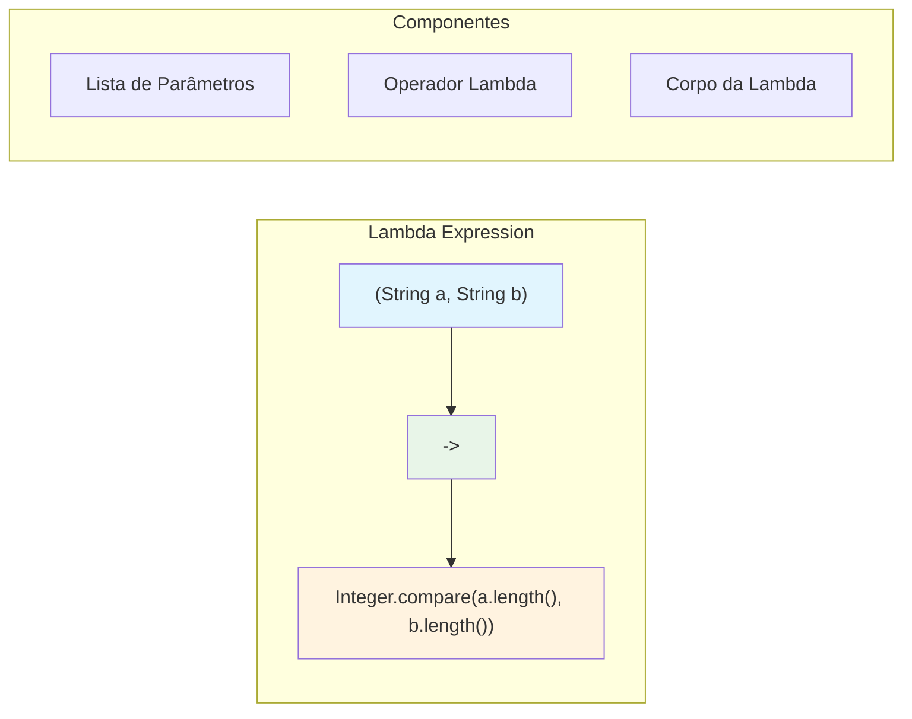

# Lambda Expressions e Functional Interfaces: O Coração da Programação Funcional

As **Lambda Expressions** e **Functional Interfaces**, introduzidas no Java 8, representam a maior evolução da linguagem desde sua criação. Elas trouxeram conceitos de programação funcional para o Java, permitindo escrever código mais conciso, expressivo e declarativo, fundamentando APIs modernas como Streams, CompletableFuture e muito mais.

---

## Conceitos Fundamentais

### O que são Lambda Expressions?

Lambda expressions são **funções anônimas** que podem ser tratadas como valores. Elas permitem passar comportamento como parâmetro de forma mais concisa que classes anônimas.

```java
// Evolução histórica da implementação

public class EvolutionOfBehaviorPassing {
    
    // 1. Classes nomeadas (Java 1.0+)
    class LengthComparator implements Comparator<String> {
        @Override
        public int compare(String a, String b) {
            return Integer.compare(a.length(), b.length());
        }
    }
    
    public void exemploClasseNomeada() {
        List<String> words = Arrays.asList("Java", "Lambda", "Stream");
        words.sort(new LengthComparator());
    }
    
    // 2. Classes anônimas (Java 1.1+)
    public void exemploClasseAnonima() {
        List<String> words = Arrays.asList("Java", "Lambda", "Stream");
        
        words.sort(new Comparator<String>() {
            @Override
            public int compare(String a, String b) {
                return Integer.compare(a.length(), b.length());
            }
        });
    }
    
    // 3. Lambda expressions (Java 8+)
    public void exemploLambda() {
        List<String> words = Arrays.asList("Java", "Lambda", "Stream");
        
        // Lambda expression
        words.sort((a, b) -> Integer.compare(a.length(), b.length()));
        
        // Ou ainda mais conciso com method reference
        words.sort(Comparator.comparing(String::length));
    }
}
```

### Anatomia de uma Lambda Expression



```java
public class LambdaAnatomy {
    
    public void exemplosSintaxe() {
        List<String> names = Arrays.asList("Ana", "Bruno", "Carlos");
        
        // 1. Sintaxe completa
        names.forEach((String name) -> {
            System.out.println("Nome: " + name);
        });
        
        // 2. Inferência de tipos
        names.forEach((name) -> {
            System.out.println("Nome: " + name);
        });
        
        // 3. Parâmetro único (sem parênteses)
        names.forEach(name -> {
            System.out.println("Nome: " + name);
        });
        
        // 4. Expressão única (sem chaves)
        names.forEach(name -> System.out.println("Nome: " + name));
        
        // 5. Sem parâmetros
        Runnable task = () -> System.out.println("Executando tarefa");
        
        // 6. Múltiplos parâmetros
        BinaryOperator<Integer> sum = (a, b) -> a + b;
        
        // 7. Retorno de valor
        Function<String, Integer> stringLength = s -> s.length();
        
        // 8. Expressão com múltiplas linhas
        Function<String, String> processText = text -> {
            String processed = text.trim().toLowerCase();
            return "Processado: " + processed;
        };
    }
}
```

---

## Functional Interfaces

### Interfaces Funcionais Principais

Uma **Functional Interface** é uma interface com **exatamente um método abstrato**. Elas são o "alvo" das lambda expressions.

```java
// Principais functional interfaces do pacote java.util.function

public class CoreFunctionalInterfaces {
    
    public void predicate() {
        // Predicate<T>: T -> boolean
        Predicate<String> isEmpty = String::isEmpty;
        Predicate<String> isLong = s -> s.length() > 10;
        Predicate<Integer> isEven = n -> n % 2 == 0;
        
        List<String> words = Arrays.asList("Java", "", "Lambda", "Programming");
        
        // Usando predicates
        List<String> nonEmpty = words.stream()
            .filter(isEmpty.negate()) // Negação
            .collect(Collectors.toList());
        
        List<String> longWords = words.stream()
            .filter(isLong)
            .collect(Collectors.toList());
        
        // Combinando predicates
        Predicate<String> nonEmptyAndLong = isEmpty.negate().and(isLong);
        
        System.out.println("Palavras não vazias: " + nonEmpty);
        System.out.println("Palavras longas: " + longWords);
    }
    
    public void function() {
        // Function<T, R>: T -> R
        Function<String, Integer> stringLength = String::length;
        Function<Integer, String> intToString = Object::toString;
        Function<String, String> toUpperCase = String::toUpperCase;
        
        List<String> words = Arrays.asList("java", "lambda", "stream");
        
        // Transformação
        List<Integer> lengths = words.stream()
            .map(stringLength)
            .collect(Collectors.toList());
        
        // Composição de funções
        Function<String, String> processString = stringLength
            .andThen(intToString)
            .andThen(s -> "Tamanho: " + s);
        
        Function<String, Integer> upperCaseLength = toUpperCase
            .andThen(stringLength);
        
        System.out.println("Comprimentos: " + lengths);
        words.forEach(word -> System.out.println(processString.apply(word)));
    }
    
    public void consumer() {
        // Consumer<T>: T -> void
        Consumer<String> print = System.out::println;
        Consumer<String> printUpper = s -> System.out.println(s.toUpperCase());
        Consumer<List<String>> printList = list -> System.out.println("Lista: " + list);
        
        List<String> words = Arrays.asList("java", "lambda", "stream");
        
        // Usando consumers
        words.forEach(print);
        
        // Combinando consumers
        Consumer<String> combinedConsumer = print.andThen(printUpper);
        words.forEach(combinedConsumer);
        
        // BiConsumer para dois parâmetros
        BiConsumer<String, Integer> printWithIndex = 
            (word, index) -> System.out.println(index + ": " + word);
        
        IntStream.range(0, words.size())
            .forEach(i -> printWithIndex.accept(words.get(i), i));
    }
    
    public void supplier() {
        // Supplier<T>: () -> T
        Supplier<String> randomUUID = () -> UUID.randomUUID().toString();
        Supplier<LocalDateTime> currentTime = LocalDateTime::now;
        Supplier<List<String>> emptyList = ArrayList::new;
        
        // Lazy evaluation
        Supplier<String> expensiveOperation = () -> {
            System.out.println("Executando operação custosa...");
            try {
                Thread.sleep(1000);
            } catch (InterruptedException e) {
                Thread.currentThread().interrupt();
            }
            return "Resultado da operação custosa";
        };
        
        // Só executa quando chamado
        System.out.println("Antes da execução");
        String result = expensiveOperation.get();
        System.out.println("Resultado: " + result);
        
        // Gerando valores
        Stream.generate(randomUUID)
            .limit(3)
            .forEach(System.out::println);
    }
    
    public void binaryOperator() {
        // BinaryOperator<T>: (T, T) -> T
        BinaryOperator<Integer> sum = Integer::sum;
        BinaryOperator<Integer> max = Integer::max;
        BinaryOperator<String> concat = String::concat;
        
        List<Integer> numbers = Arrays.asList(1, 2, 3, 4, 5);
        
        // Redução
        Optional<Integer> total = numbers.stream()
            .reduce(sum);
        
        Optional<Integer> maximum = numbers.stream()
            .reduce(max);
        
        System.out.println("Soma: " + total.orElse(0));
        System.out.println("Máximo: " + maximum.orElse(0));
        
        // UnaryOperator<T>: T -> T (especialização de Function)
        UnaryOperator<String> trimAndUpper = s -> s.trim().toUpperCase();
        
        List<String> words = Arrays.asList(" java ", " lambda ");
        List<String> processed = words.stream()
            .map(trimAndUpper)
            .collect(Collectors.toList());
        
        System.out.println("Processados: " + processed);
    }
}
```

---

## Method References

### Sintaxe e Tipos de Method References

```java
public class MethodReferences {
    
    public void tiposDeMethodReferences() {
        List<String> words = Arrays.asList("Java", "Lambda", "Stream", "API");
        
        // 1. Static method reference
        // Classe::métodoEstático
        words.stream()
            .map(Integer::parseInt) // Error - para demonstração
            .collect(Collectors.toList());
        
        // Exemplo correto
        List<String> numbers = Arrays.asList("1", "2", "3", "4");
        List<Integer> integers = numbers.stream()
            .map(Integer::parseInt)
            .collect(Collectors.toList());
        
        // 2. Instance method reference (objeto específico)
        // objeto::método
        String prefix = "Processado: ";
        words.stream()
            .map(prefix::concat)
            .forEach(System.out::println);
        
        // 3. Instance method reference (tipo arbitrário)
        // Tipo::métodoDeInstância
        words.stream()
            .map(String::toUpperCase)
            .map(String::length)
            .forEach(System.out::println);
        
        // 4. Constructor reference
        // Tipo::new
        List<StringBuilder> builders = words.stream()
            .map(StringBuilder::new)
            .collect(Collectors.toList());
        
        // Array constructor
        String[] array = words.stream()
            .toArray(String[]::new);
    }
    
    public void exemplosPraticos() {
        List<Pessoa> pessoas = Arrays.asList(
            new Pessoa("Ana", 25),
            new Pessoa("Bruno", 30),
            new Pessoa("Carlos", 22)
        );
        
        // Method references com objetos customizados
        
        // Static method reference
        pessoas.stream()
            .sorted(Comparator.comparing(Pessoa::getIdade))
            .forEach(System.out::println);
        
        // Instance method of particular object
        PessoaService service = new PessoaService();
        pessoas.stream()
            .filter(service::isAdulto)
            .forEach(service::processar);
        
        // Constructor reference para factory
        List<PessoaDTO> dtos = pessoas.stream()
            .map(PessoaDTO::new) // Constructor reference
            .collect(Collectors.toList());
    }
    
    // Classes auxiliares
    static class Pessoa {
        private String nome;
        private int idade;
        
        public Pessoa(String nome, int idade) {
            this.nome = nome;
            this.idade = idade;
        }
        
        public String getNome() { return nome; }
        public int getIdade() { return idade; }
        
        @Override
        public String toString() {
            return nome + " (" + idade + " anos)";
        }
    }
    
    static class PessoaDTO {
        private String nome;
        private int idade;
        
        public PessoaDTO(Pessoa pessoa) {
            this.nome = pessoa.getNome();
            this.idade = pessoa.getIdade();
        }
    }
    
    static class PessoaService {
        public boolean isAdulto(Pessoa pessoa) {
            return pessoa.getIdade() >= 18;
        }
        
        public void processar(Pessoa pessoa) {
            System.out.println("Processando: " + pessoa);
        }
    }
}
```

---

## Functional Interfaces Customizadas

### Criando Suas Próprias Interfaces Funcionais

```java
// A anotação @FunctionalInterface é opcional mas recomendada
@FunctionalInterface
public interface Validator<T> {
    boolean validate(T item);
    
    // Métodos default são permitidos
    default Validator<T> and(Validator<T> other) {
        return item -> this.validate(item) && other.validate(item);
    }
    
    default Validator<T> or(Validator<T> other) {
        return item -> this.validate(item) || other.validate(item);
    }
    
    default Validator<T> negate() {
        return item -> !this.validate(item);
    }
    
    // Métodos static também são permitidos
    static <T> Validator<T> alwaysTrue() {
        return item -> true;
    }
    
    static <T> Validator<T> alwaysFalse() {
        return item -> false;
    }
}

@FunctionalInterface
public interface TriFunction<T, U, V, R> {
    R apply(T t, U u, V v);
    
    // Composição para três parâmetros
    default <W> TriFunction<T, U, V, W> andThen(Function<R, W> after) {
        return (t, u, v) -> after.apply(apply(t, u, v));
    }
}

public class CustomFunctionalInterfaces {
    
    public void exemploValidator() {
        // Validators específicos
        Validator<String> notEmpty = s -> s != null && !s.trim().isEmpty();
        Validator<String> minLength = s -> s.length() >= 3;
        Validator<String> maxLength = s -> s.length() <= 50;
        Validator<String> hasUpperCase = s -> s.chars().anyMatch(Character::isUpperCase);
        
        // Combinando validators
        Validator<String> nameValidator = notEmpty
            .and(minLength)
            .and(maxLength);
        
        Validator<String> passwordValidator = notEmpty
            .and(s -> s.length() >= 8)
            .and(hasUpperCase)
            .and(s -> s.chars().anyMatch(Character::isDigit));
        
        // Testando
        List<String> names = Arrays.asList("Ana", "Jo", "", "Maria Silva");
        List<String> passwords = Arrays.asList("123", "password", "Password123", "");
        
        System.out.println("Nomes válidos:");
        names.stream()
            .filter(nameValidator::validate)
            .forEach(System.out::println);
        
        System.out.println("Senhas válidas:");
        passwords.stream()
            .filter(passwordValidator::validate)
            .forEach(System.out::println);
    }
    
    public void exemploTriFunction() {
        TriFunction<String, String, String, String> fullNameFormatter = 
            (firstName, middleName, lastName) -> 
                String.format("%s %s %s", firstName, middleName, lastName);
        
        TriFunction<Integer, Integer, Integer, Double> triangleArea =
            (a, b, c) -> {
                double s = (a + b + c) / 2.0;
                return Math.sqrt(s * (s - a) * (s - b) * (s - c));
            };
        
        // Uso
        String fullName = fullNameFormatter.apply("João", "Silva", "Santos");
        double area = triangleArea.apply(3, 4, 5);
        
        System.out.println("Nome completo: " + fullName);
        System.out.println("Área do triângulo: " + area);
        
        // Composição
        TriFunction<String, String, String, String> upperCaseFormatter = 
            fullNameFormatter.andThen(String::toUpperCase);
        
        String upperCaseName = upperCaseFormatter.apply("Maria", "da", "Silva");
        System.out.println("Nome em maiúsculas: " + upperCaseName);
    }
}
```

---

## Closures e Captura de Variáveis

### Effectively Final e Captura de Contexto

```java
public class LambdaClosures {
    
    public void capturaDeVariaveis() {
        String prefix = "Processado: "; // Effectively final
        int counter = 0; // Effectively final
        
        List<String> items = Arrays.asList("A", "B", "C");
        
        // ✅ Captura de variáveis effectively final
        List<String> processed = items.stream()
            .map(item -> prefix + item) // Captura prefix
            .collect(Collectors.toList());
        
        // ❌ Não pode modificar variáveis capturadas
        /*
        items.forEach(item -> {
            counter++; // Erro de compilação!
            System.out.println(counter + ": " + item);
        });
        */
        
        // ✅ Alternativa: usar wrapper mutável
        AtomicInteger atomicCounter = new AtomicInteger(0);
        items.forEach(item -> {
            int count = atomicCounter.incrementAndGet();
            System.out.println(count + ": " + item);
        });
        
        // ✅ Ou usar índices
        IntStream.range(0, items.size())
            .forEach(i -> System.out.println((i + 1) + ": " + items.get(i)));
    }
    
    public void exemploClosureComplexo() {
        // Configuração capturada
        String environment = "PRODUCTION";
        boolean debugMode = false;
        
        // Factory de processadores baseado no ambiente
        Function<String, Function<String, String>> processorFactory = operation -> {
            return data -> {
                String result = operation + ": " + data;
                
                if (debugMode) {
                    System.out.println("Debug - " + result);
                }
                
                if ("PRODUCTION".equals(environment)) {
                    // Log para produção
                    System.out.println("PROD LOG: " + result);
                }
                
                return result;
            };
        };
        
        // Criando processadores específicos
        Function<String, String> validator = processorFactory.apply("VALIDATE");
        Function<String, String> transformer = processorFactory.apply("TRANSFORM");
        
        // Uso
        List<String> data = Arrays.asList("data1", "data2", "data3");
        List<String> results = data.stream()
            .map(validator)
            .map(transformer)
            .collect(Collectors.toList());
    }
    
    // Exemplo de closure com estado
    public Predicate<String> createCacheFilter() {
        Set<String> processedItems = new HashSet<>();
        
        return item -> {
            boolean isNew = processedItems.add(item);
            if (isNew) {
                System.out.println("Processando novo item: " + item);
            } else {
                System.out.println("Item já processado: " + item);
            }
            return isNew;
        };
    }
    
    public void exemploEstadoEmClosure() {
        Predicate<String> filter = createCacheFilter();
        
        List<String> items = Arrays.asList("A", "B", "A", "C", "B", "D");
        
        List<String> uniqueItems = items.stream()
            .filter(filter)
            .collect(Collectors.toList());
        
        System.out.println("Itens únicos: " + uniqueItems);
    }
}
```

---

## Casos de Uso Empresariais

### 1. Sistema de Validação Flexível

```java
public class ValidationSystem {
    
    // Builder para validações complexas
    public static class ValidationBuilder<T> {
        private final List<Validator<T>> validators = new ArrayList<>();
        
        public ValidationBuilder<T> add(Validator<T> validator) {
            validators.add(validator);
            return this;
        }
        
        public ValidationBuilder<T> notNull() {
            return add(Objects::nonNull);
        }
        
        public ValidationBuilder<T> custom(Validator<T> validator) {
            return add(validator);
        }
        
        public Validator<T> build() {
            return item -> validators.stream().allMatch(v -> v.validate(item));
        }
        
        public ValidationResult validateAndCollectErrors(T item) {
            List<String> errors = new ArrayList<>();
            
            validators.forEach(validator -> {
                if (!validator.validate(item)) {
                    errors.add("Validation failed for: " + validator.toString());
                }
            });
            
            return new ValidationResult(errors.isEmpty(), errors);
        }
    }
    
    public static class ValidationResult {
        private final boolean valid;
        private final List<String> errors;
        
        public ValidationResult(boolean valid, List<String> errors) {
            this.valid = valid;
            this.errors = errors;
        }
        
        public boolean isValid() { return valid; }
        public List<String> getErrors() { return errors; }
    }
    
    // Validadores específicos para domínio
    public static class UserValidators {
        public static final Validator<String> EMAIL = email -> 
            email != null && email.contains("@") && email.split("@").length == 2;
        
        public static final Validator<String> PHONE = phone ->
            phone != null && phone.replaceAll("[^0-9]", "").length() >= 10;
        
        public static final Validator<Integer> AGE = age ->
            age != null && age >= 0 && age <= 120;
        
        public static Validator<String> minLength(int min) {
            return s -> s != null && s.length() >= min;
        }
        
        public static Validator<String> maxLength(int max) {
            return s -> s != null && s.length() <= max;
        }
    }
    
    // Exemplo de uso
    public void exemploValidacao() {
        // Validador para usuário
        Validator<User> userValidator = new ValidationBuilder<User>()
            .notNull()
            .custom(user -> UserValidators.EMAIL.validate(user.getEmail()))
            .custom(user -> UserValidators.AGE.validate(user.getAge()))
            .custom(user -> UserValidators.minLength(2).validate(user.getName()))
            .build();
        
        // Testando
        List<User> users = Arrays.asList(
            new User("João", "joao@email.com", 25),
            new User("", "invalid-email", -5),
            new User("Maria", "maria@email.com", 30)
        );
        
        users.forEach(user -> {
            boolean isValid = userValidator.validate(user);
            System.out.println(user.getName() + " é válido: " + isValid);
        });
    }
    
    static class User {
        private String name;
        private String email;
        private Integer age;
        
        public User(String name, String email, Integer age) {
            this.name = name;
            this.email = email;
            this.age = age;
        }
        
        public String getName() { return name; }
        public String getEmail() { return email; }
        public Integer getAge() { return age; }
    }
}
```

### 2. Sistema de Pipeline de Processamento

```java
public class ProcessingPipeline {
    
    // Pipeline genérico para transformação de dados
    public static class Pipeline<T> {
        private final List<Function<T, T>> transformations = new ArrayList<>();
        private final List<Predicate<T>> filters = new ArrayList<>();
        private final List<Consumer<T>> sideEffects = new ArrayList<>();
        
        public Pipeline<T> transform(Function<T, T> transformation) {
            transformations.add(transformation);
            return this;
        }
        
        public Pipeline<T> filter(Predicate<T> filter) {
            filters.add(filter);
            return this;
        }
        
        public Pipeline<T> sideEffect(Consumer<T> sideEffect) {
            sideEffects.add(sideEffect);
            return this;
        }
        
        public Stream<T> process(Stream<T> input) {
            Stream<T> result = input;
            
            // Aplicar filtros
            for (Predicate<T> filter : filters) {
                result = result.filter(filter);
            }
            
            // Aplicar transformações
            for (Function<T, T> transform : transformations) {
                result = result.map(transform);
            }
            
            // Aplicar side effects
            for (Consumer<T> sideEffect : sideEffects) {
                result = result.peek(sideEffect);
            }
            
            return result;
        }
    }
    
    // Exemplo: Pipeline de processamento de pedidos
    public void exemploProcessamentoPedidos() {
        List<Order> orders = Arrays.asList(
            new Order("ORD001", 150.0, "PENDING"),
            new Order("ORD002", 75.0, "PENDING"),
            new Order("ORD003", 300.0, "PENDING")
        );
        
        // Pipeline de processamento
        Pipeline<Order> orderPipeline = new Pipeline<Order>()
            .filter(order -> order.getAmount() > 100) // Só pedidos > 100
            .transform(this::applyDiscount)           // Aplicar desconto
            .transform(this::calculateTax)           // Calcular imposto
            .sideEffect(this::logProcessing)         // Log
            .transform(order -> order.withStatus("PROCESSED")); // Marcar como processado
        
        List<Order> processedOrders = orderPipeline
            .process(orders.stream())
            .collect(Collectors.toList());
        
        System.out.println("Pedidos processados:");
        processedOrders.forEach(System.out::println);
    }
    
    private Order applyDiscount(Order order) {
        double discount = order.getAmount() > 200 ? 0.1 : 0.05;
        return order.withAmount(order.getAmount() * (1 - discount));
    }
    
    private Order calculateTax(Order order) {
        double tax = order.getAmount() * 0.15;
        return order.withAmount(order.getAmount() + tax);
    }
    
    private void logProcessing(Order order) {
        System.out.println("Processando pedido: " + order.getId());
    }
    
    static class Order {
        private final String id;
        private final double amount;
        private final String status;
        
        public Order(String id, double amount, String status) {
            this.id = id;
            this.amount = amount;
            this.status = status;
        }
        
        public String getId() { return id; }
        public double getAmount() { return amount; }
        public String getStatus() { return status; }
        
        public Order withAmount(double newAmount) {
            return new Order(this.id, newAmount, this.status);
        }
        
        public Order withStatus(String newStatus) {
            return new Order(this.id, this.amount, newStatus);
        }
        
        @Override
        public String toString() {
            return String.format("Order{id='%s', amount=%.2f, status='%s'}", 
                id, amount, status);
        }
    }
}
```

### 3. Sistema de Event Processing

```java
public class EventProcessing {
    
    // Event handler funcional
    @FunctionalInterface
    public interface EventHandler<T extends Event> {
        void handle(T event);
        
        default EventHandler<T> andThen(EventHandler<T> after) {
            return event -> {
                this.handle(event);
                after.handle(event);
            };
        }
        
        default EventHandler<T> compose(EventHandler<T> before) {
            return event -> {
                before.handle(event);
                this.handle(event);
            };
        }
    }
    
    // Event dispatcher
    public static class EventDispatcher {
        private final Map<Class<?>, List<EventHandler<? extends Event>>> handlers = new HashMap<>();
        
        @SuppressWarnings("unchecked")
        public <T extends Event> void subscribe(Class<T> eventType, EventHandler<T> handler) {
            handlers.computeIfAbsent(eventType, k -> new ArrayList<>())
                   .add((EventHandler<? extends Event>) handler);
        }
        
        @SuppressWarnings("unchecked")
        public void publish(Event event) {
            List<EventHandler<? extends Event>> eventHandlers = 
                handlers.getOrDefault(event.getClass(), Collections.emptyList());
            
            eventHandlers.forEach(handler -> 
                ((EventHandler<Event>) handler).handle(event));
        }
        
        // Subscription fluente
        public <T extends Event> EventDispatcher on(Class<T> eventType, EventHandler<T> handler) {
            subscribe(eventType, handler);
            return this;
        }
    }
    
    // Events
    interface Event {
        String getId();
        LocalDateTime getTimestamp();
    }
    
    static class UserCreatedEvent implements Event {
        private final String id;
        private final String userId;
        private final String email;
        private final LocalDateTime timestamp;
        
        public UserCreatedEvent(String id, String userId, String email) {
            this.id = id;
            this.userId = userId;
            this.email = email;
            this.timestamp = LocalDateTime.now();
        }
        
        public String getId() { return id; }
        public String getUserId() { return userId; }
        public String getEmail() { return email; }
        public LocalDateTime getTimestamp() { return timestamp; }
    }
    
    static class OrderCompletedEvent implements Event {
        private final String id;
        private final String orderId;
        private final double amount;
        private final LocalDateTime timestamp;
        
        public OrderCompletedEvent(String id, String orderId, double amount) {
            this.id = id;
            this.orderId = orderId;
            this.amount = amount;
            this.timestamp = LocalDateTime.now();
        }
        
        public String getId() { return id; }
        public String getOrderId() { return orderId; }
        public double getAmount() { return amount; }
        public LocalDateTime getTimestamp() { return timestamp; }
    }
    
    // Exemplo de uso
    public void exemploEventProcessing() {
        EventDispatcher dispatcher = new EventDispatcher();
        
        // Configuração de handlers usando lambdas
        dispatcher
            .on(UserCreatedEvent.class, event -> 
                System.out.println("Enviando email de boas-vindas para: " + event.getEmail()))
            .on(UserCreatedEvent.class, event -> 
                System.out.println("Criando perfil padrão para usuário: " + event.getUserId()))
            .on(OrderCompletedEvent.class, event -> 
                System.out.println("Processando pagamento do pedido: " + event.getOrderId()))
            .on(OrderCompletedEvent.class, event -> {
                if (event.getAmount() > 1000) {
                    System.out.println("Pedido de alto valor detectado: " + event.getAmount());
                }
            });
        
        // Handlers compostos
        EventHandler<UserCreatedEvent> emailHandler = event -> 
            System.out.println("Email handler: " + event.getEmail());
        
        EventHandler<UserCreatedEvent> profileHandler = event -> 
            System.out.println("Profile handler: " + event.getUserId());
        
        EventHandler<UserCreatedEvent> compositeHandler = emailHandler.andThen(profileHandler);
        
        dispatcher.subscribe(UserCreatedEvent.class, compositeHandler);
        
        // Publicando eventos
        dispatcher.publish(new UserCreatedEvent("evt1", "user123", "user@example.com"));
        dispatcher.publish(new OrderCompletedEvent("evt2", "order456", 1500.0));
    }
}
```

---

## Performance e Melhores Práticas

### Otimização de Lambdas

```java
public class LambdaPerformance {
    
    public void comparacaoPerformance() {
        List<String> data = Stream.generate(() -> UUID.randomUUID().toString())
            .limit(1_000_000)
            .collect(Collectors.toList());
        
        // 1. Lambda vs Method Reference
        long start = System.nanoTime();
        long count1 = data.stream()
            .filter(s -> s.length() > 10)
            .count();
        long lambda Time = System.nanoTime() - start;
        
        start = System.nanoTime();
        long count2 = data.stream()
            .filter(this::isLongString)
            .count();
        long methodRefTime = System.nanoTime() - start;
        
        System.out.printf("Lambda: %d ns, Method Ref: %d ns%n", lambdaTime, methodRefTime);
        
        // 2. Captura vs Não Captura
        String prefix = "PREFIX_";
        
        start = System.nanoTime();
        List<String> withCapture = data.stream()
            .limit(10000)
            .map(s -> prefix + s) // Captura variável
            .collect(Collectors.toList());
        long captureTime = System.nanoTime() - start;
        
        start = System.nanoTime();
        List<String> withoutCapture = data.stream()
            .limit(10000)
            .map(this::addPrefix) // Sem captura
            .collect(Collectors.toList());
        long noCaptureTime = System.nanoTime() - start;
        
        System.out.printf("Com captura: %d ns, Sem captura: %d ns%n", 
            captureTime, noCaptureTime);
    }
    
    private boolean isLongString(String s) {
        return s.length() > 10;
    }
    
    private String addPrefix(String s) {
        return "PREFIX_" + s;
    }
    
    // Melhores práticas
    public void bestPractices() {
        List<String> data = Arrays.asList("Java", "Lambda", "Stream", "Functional");
        
        // ✅ Prefira method references quando possível
        data.stream()
            .map(String::toUpperCase)
            .forEach(System.out::println);
        
        // ✅ Evite side effects
        // ❌ Ruim
        /*
        List<String> result = new ArrayList<>();
        data.stream()
            .filter(s -> {
                result.add(s); // Side effect!
                return s.length() > 4;
            })
            .collect(Collectors.toList());
        */
        
        // ✅ Bom
        List<String> filtered = data.stream()
            .filter(s -> s.length() > 4)
            .collect(Collectors.toList());
        
        // ✅ Use final ou effectively final
        final String prefix = "PROCESSED_";
        data.stream()
            .map(s -> prefix + s)
            .forEach(System.out::println);
        
        // ✅ Considere criar functional interfaces específicas
        // em vez de usar genéricas quando a semântica for importante
        Validator<String> emailValidator = email -> email.contains("@");
        // Mais claro que Predicate<String>
    }
}
```

---

## Interoperabilidade com APIs Antigas

### Bridging Legacy Code

```java
public class LegacyInterop {
    
    // Adaptando APIs antigas para usar lambdas
    public void adaptingOldAPIs() {
        // API antiga que usa comparators
        List<String> words = Arrays.asList("Zebra", "Apple", "Banana");
        
        // Antes (Java 7)
        Collections.sort(words, new Comparator<String>() {
            @Override
            public int compare(String a, String b) {
                return a.compareTo(b);
            }
        });
        
        // Depois (Java 8+)
        words.sort(String::compareTo);
        words.sort(Comparator.naturalOrder());
        
        // Converting between lambda and interface
        Runnable task = () -> System.out.println("Task executed");
        
        // Pode ser usado em qualquer lugar que espera Runnable
        Thread thread = new Thread(task);
        ExecutorService executor = Executors.newSingleThreadExecutor();
        executor.submit(task);
    }
    
    // Wrapper para APIs que não suportam lambdas
    public static class LambdaTimer {
        public static void scheduleRepeating(long intervalMs, Runnable task) {
            Timer timer = new Timer();
            timer.scheduleAtFixedRate(new TimerTask() {
                @Override
                public void run() {
                    task.run();
                }
            }, 0, intervalMs);
        }
        
        public static void scheduleOnce(long delayMs, Runnable task) {
            Timer timer = new Timer();
            timer.schedule(new TimerTask() {
                @Override
                public void run() {
                    task.run();
                }
            }, delayMs);
        }
    }
    
    public void exemploLambdaTimer() {
        // API mais limpa usando lambdas
        LambdaTimer.scheduleRepeating(1000, () -> 
            System.out.println("Executando a cada segundo"));
        
        LambdaTimer.scheduleOnce(5000, () -> 
            System.out.println("Executado após 5 segundos"));
    }
}
```

---

**Próximos Passos:** As Lambda Expressions e Functional Interfaces são fundamentais para o Java moderno. Elas são a base para Streams, Optional, CompletableFuture e praticamente todas as APIs modernas do ecossistema Java. Dominar esses conceitos é essencial para escrever código expressivo e funcional. 