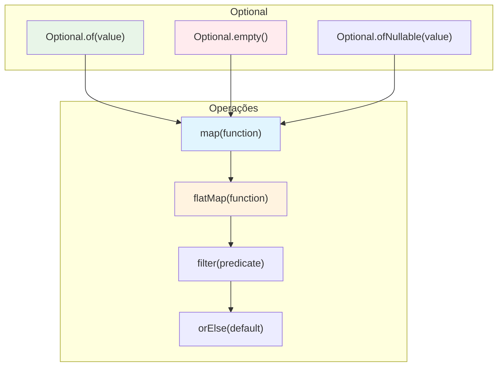

# Optional API: Programação Defensiva e Eliminação de NullPointerException

A **Optional API**, introduzida no Java 8, representa uma mudança fundamental na forma como lidamos com valores que podem estar ausentes. Inspirada em linguagens funcionais como Scala e Haskell, ela oferece uma alternativa type-safe ao uso de `null`, reduzindo drasticamente a ocorrência de `NullPointerException` e promovendo código mais expressivo e defensivo.

---

## O Problema do Null: A Bilhão de Dólares

### Por que `null` é problemático?

```java
// ❌ O pesadelo das verificações null
public class ProblemasComNull {
    
    public String processarUsuario(Long userId) {
        Usuario usuario = buscarUsuario(userId);
        if (usuario != null) {
            Endereco endereco = usuario.getEndereco();
            if (endereco != null) {
                String cep = endereco.getCep();
                if (cep != null) {
                    return formatarCep(cep);
                }
            }
        }
        return "CEP não encontrado";
    }
    
    // Quantos pontos de falha? Quantos ifs aninhados?
    // Tony Hoare chamou null de "The Billion Dollar Mistake"
}
```

### A Solução: Optional como Container

```java
// ✅ Abordagem com Optional: expressiva e type-safe
public class SolucaoComOptional {
    
    public String processarUsuario(Long userId) {
        return buscarUsuario(userId)
            .flatMap(Usuario::getEndereco)
            .map(Endereco::getCep)
            .map(this::formatarCep)
            .orElse("CEP não encontrado");
    }
    
    // Código mais limpo, intenção clara, sem NPE!
}
```

---

## Anatomia do Optional

### Conceito: Container Monádico



### Estados do Optional

```java
public class OptionalStates {
    
    public void demonstrarEstados() {
        // 1. Optional com valor presente
        Optional<String> presente = Optional.of("Hello World");
        System.out.println("Presente: " + presente.isPresent()); // true
        
        // 2. Optional vazio
        Optional<String> vazio = Optional.empty();
        System.out.println("Vazio: " + vazio.isEmpty()); // true (Java 11+)
        
        // 3. Optional que pode ser null
        String valorPossivelmenteNull = obterValor();
        Optional<String> possivelmentePresente = Optional.ofNullable(valorPossivelmenteNull);
        
        // ❌ NUNCA faça isso!
        // Optional<String> erro = Optional.of(null); // Lança NullPointerException!
    }
    
    private String obterValor() {
        return Math.random() > 0.5 ? "Valor" : null;
    }
}
```

---

## Criação de Optional

### Métodos de Factory

```java
public class OptionalCreation {
    
    public void metodosDeFactory() {
        // 1. of() - Para valores que NUNCA são null
        Optional<String> garantido = Optional.of("Nunca null");
        
        // 2. ofNullable() - Para valores que PODEM ser null
        String valorIncerto = obterValorDoExterno();
        Optional<String> seguro = Optional.ofNullable(valorIncerto);
        
        // 3. empty() - Para representar ausência intencional
        Optional<String> vazio = Optional.empty();
        
        // Exemplo prático: método que pode não encontrar resultado
        Optional<Usuario> usuario = buscarUsuarioPorEmail("test@example.com");
    }
    
    public Optional<Usuario> buscarUsuarioPorEmail(String email) {
        // Simula busca em banco de dados
        Usuario usuario = database.findByEmail(email); // Pode retornar null
        return Optional.ofNullable(usuario);
    }
    
    // ✅ Boa prática: métodos que podem não ter resultado retornam Optional
    public Optional<String> obterConfiguracaoAvancada(String chave) {
        String valor = configuracoes.get(chave);
        return Optional.ofNullable(valor);
    }
    
    private String obterValorDoExterno() {
        // Simula chamada externa que pode retornar null
        return Math.random() > 0.5 ? "Valor encontrado" : null;
    }
}
```

---

## Verificação e Extração de Valores

### Métodos de Verificação

```java
public class OptionalChecking {
    
    public void metodosDeVerificacao() {
        Optional<String> opcional = Optional.ofNullable(obterValor());
        
        // Verificações básicas
        if (opcional.isPresent()) {
            String valor = opcional.get(); // ⚠️ Use com cuidado!
            System.out.println("Valor encontrado: " + valor);
        }
        
        // Java 11+: isEmpty() é mais expressivo que !isPresent()
        if (opcional.isEmpty()) {
            System.out.println("Nenhum valor encontrado");
        }
        
        // ✅ Melhor: usar ifPresent()
        opcional.ifPresent(valor -> System.out.println("Valor: " + valor));
        
        // Java 9+: ifPresentOrElse()
        opcional.ifPresentOrElse(
            valor -> System.out.println("Encontrado: " + valor),
            () -> System.out.println("Não encontrado")
        );
    }
    
    // ❌ Antipadrão: usar get() sem verificação
    public void antipadrao() {
        Optional<String> opcional = Optional.empty();
        String valor = opcional.get(); // 💥 NoSuchElementException!
    }
    
    // ✅ Padrões corretos de extração
    public void extraçãoSegura() {
        Optional<String> opcional = Optional.ofNullable(obterValor());
        
        // 1. Com valor padrão
        String valor1 = opcional.orElse("Valor padrão");
        
        // 2. Com supplier (avaliação lazy)
        String valor2 = opcional.orElseGet(() -> calcularValorPadrao());
        
        // 3. Com exceção customizada
        String valor3 = opcional.orElseThrow(() -> 
            new IllegalStateException("Valor obrigatório não encontrado"));
        
        // 4. Com exceção padrão (Java 10+)
        String valor4 = opcional.orElseThrow(); // Lança NoSuchElementException
    }
    
    private String obterValor() {
        return Math.random() > 0.5 ? "Valor" : null;
    }
    
    private String calcularValorPadrao() {
        // Operação custosa só executada se necessária
        return "Valor calculado: " + System.currentTimeMillis();
    }
}
```

---

## Transformações: map() e flatMap()

### map(): Transformação Simples

```java
public class OptionalTransformations {
    
    public void exemploMap() {
        Optional<String> nome = Optional.of("João Silva");
        
        // Transformações encadeadas
        Optional<String> nomeUpperCase = nome.map(String::toUpperCase);
        Optional<Integer> tamanhoNome = nome.map(String::length);
        Optional<String> primeiraLetra = nome.map(s -> s.substring(0, 1));
        
        System.out.println("Nome original: " + nome.orElse("N/A"));
        System.out.println("Nome maiúsculo: " + nomeUpperCase.orElse("N/A"));
        System.out.println("Tamanho: " + tamanhoNome.orElse(0));
        System.out.println("Primeira letra: " + primeiraLetra.orElse("N/A"));
        
        // Encadeamento fluente
        String resultado = Optional.of("  João Silva  ")
            .map(String::trim)
            .map(String::toUpperCase)
            .map(s -> "Sr. " + s)
            .orElse("Nome não disponível");
        
        System.out.println("Resultado final: " + resultado);
    }
    
    // Transformação de objetos complexos
    public void transformacaoCompleta() {
        Optional<Usuario> usuario = buscarUsuario(123L);
        
        // Extrair informações aninhadas
        Optional<String> nomeCompleto = usuario
            .map(u -> u.getNome() + " " + u.getSobrenome());
        
        Optional<String> email = usuario
            .map(Usuario::getEmail)
            .map(String::toLowerCase);
        
        Optional<Integer> idade = usuario
            .map(Usuario::getDataNascimento)
            .map(data -> Period.between(data, LocalDate.now()).getYears());
        
        // Usando os valores transformados
        nomeCompleto.ifPresent(nome -> System.out.println("Nome: " + nome));
        email.ifPresent(e -> System.out.println("Email: " + e));
        idade.ifPresent(i -> System.out.println("Idade: " + i));
    }
}
```

### flatMap(): Lidando com Optional Aninhados

```java
public class OptionalFlatMap {
    
    // Problema: Optional dentro de Optional
    public void problemaAninhamento() {
        Optional<Usuario> usuario = buscarUsuario(123L);
        
        // ❌ Isso resulta em Optional<Optional<String>>
        Optional<Optional<String>> telefoneAninhado = usuario.map(u -> u.getTelefone());
        
        // ✅ flatMap() "achata" o resultado
        Optional<String> telefone = usuario.flatMap(Usuario::getTelefone);
        
        telefone.ifPresent(t -> System.out.println("Telefone: " + t));
    }
    
    // Encadeamento de operações que retornam Optional
    public void encadeamentoComplexo() {
        Optional<String> resultado = buscarUsuario(123L)
            .flatMap(Usuario::getEndereco)
            .flatMap(Endereco::getCidade)
            .map(Cidade::getNome)
            .map(String::toUpperCase);
        
        System.out.println("Cidade: " + resultado.orElse("Não encontrada"));
    }
    
    // Exemplo prático: validação em cadeia
    public Optional<String> validarEProcessarEmail(String emailInput) {
        return Optional.ofNullable(emailInput)
            .filter(email -> !email.trim().isEmpty())
            .map(String::trim)
            .map(String::toLowerCase)
            .filter(email -> email.contains("@"))
            .filter(email -> email.split("@").length == 2)
            .flatMap(this::validarDominio)
            .map(email -> "Email válido: " + email);
    }
    
    private Optional<String> validarDominio(String email) {
        String dominio = email.split("@")[1];
        List<String> dominiosValidos = List.of("gmail.com", "yahoo.com", "empresa.com");
        
        return dominiosValidos.contains(dominio) 
            ? Optional.of(email) 
            : Optional.empty();
    }
}
```

---

## Filtragem com filter()

### Aplicando Predicados

```java
public class OptionalFiltering {
    
    public void exemplosFiltros() {
        Optional<Integer> numero = Optional.of(42);
        
        // Filtros simples
        Optional<Integer> par = numero.filter(n -> n % 2 == 0);
        Optional<Integer> maior20 = numero.filter(n -> n > 20);
        Optional<Integer> menorQue10 = numero.filter(n -> n < 10); // Vazio
        
        par.ifPresent(n -> System.out.println("Número par: " + n));
        maior20.ifPresent(n -> System.out.println("Maior que 20: " + n));
        menorQue10.ifPresentOrElse(
            n -> System.out.println("Menor que 10: " + n),
            () -> System.out.println("Não é menor que 10")
        );
    }
    
    // Filtros em objetos complexos
    public void filtrosComplexos() {
        Optional<Usuario> usuario = buscarUsuario(123L);
        
        // Filtrar usuários ativos
        Optional<Usuario> usuarioAtivo = usuario
            .filter(Usuario::isAtivo);
        
        // Filtrar por idade
        Optional<Usuario> usuarioAdulto = usuario
            .filter(u -> calcularIdade(u.getDataNascimento()) >= 18);
        
        // Filtros encadeados
        Optional<String> emailVerificado = usuario
            .filter(Usuario::isAtivo)
            .filter(u -> u.getEmail() != null)
            .filter(u -> u.isEmailVerificado())
            .map(Usuario::getEmail);
        
        emailVerificado.ifPresentOrElse(
            email -> enviarNotificacao(email),
            () -> System.out.println("Usuário não elegível para notificação")
        );
    }
    
    // Validação de entrada com filtros
    public Optional<String> validarSenha(String senha) {
        return Optional.ofNullable(senha)
            .filter(s -> s.length() >= 8)
            .filter(s -> s.matches(".*[A-Z].*")) // Tem maiúscula
            .filter(s -> s.matches(".*[a-z].*")) // Tem minúscula
            .filter(s -> s.matches(".*\\d.*"))   // Tem número
            .filter(s -> s.matches(".*[!@#$%^&*].*")) // Tem símbolo
            .map(s -> "Senha válida");
    }
    
    private int calcularIdade(LocalDate nascimento) {
        return Period.between(nascimento, LocalDate.now()).getYears();
    }
    
    private void enviarNotificacao(String email) {
        System.out.println("Notificação enviada para: " + email);
    }
}
```

---

## Combinação de Optionals

### or() - Alternativas (Java 9+)

```java
public class OptionalCombination {
    
    public void exemploOr() {
        // Tentar múltiplas fontes de dados
        Optional<String> configuracao = buscarConfiguracaoLocal()
            .or(() -> buscarConfiguracaoRemota())
            .or(() -> buscarConfiguracaoDefault());
        
        configuracao.ifPresentOrElse(
            config -> System.out.println("Configuração: " + config),
            () -> System.out.println("Nenhuma configuração encontrada")
        );
    }
    
    // Padrão: Chain of Responsibility com Optional
    public Optional<String> buscarUsuarioPorQualquerCritério(String input) {
        return buscarPorEmail(input)
            .or(() -> buscarPorTelefone(input))
            .or(() -> buscarPorCpf(input))
            .or(() -> buscarPorNome(input));
    }
    
    // Combinação manual de múltiplos optionals
    public Optional<String> combinarInformacoes(Long userId) {
        Optional<Usuario> usuario = buscarUsuario(userId);
        Optional<Empresa> empresa = buscarEmpresa(userId);
        
        // Se ambos estão presentes, combinar
        if (usuario.isPresent() && empresa.isPresent()) {
            return Optional.of(usuario.get().getNome() + " - " + empresa.get().getNome());
        }
        
        return Optional.empty();
    }
    
    // Versão mais funcional da combinação
    public Optional<String> combinarInformacoesFuncional(Long userId) {
        return buscarUsuario(userId)
            .flatMap(usuario -> 
                buscarEmpresa(userId)
                    .map(empresa -> usuario.getNome() + " - " + empresa.getNome())
            );
    }
    
    private Optional<String> buscarConfiguracaoLocal() { return Optional.of("config-local"); }
    private Optional<String> buscarConfiguracaoRemota() { return Optional.empty(); }
    private Optional<String> buscarConfiguracaoDefault() { return Optional.of("config-default"); }
    
    private Optional<String> buscarPorEmail(String input) { return Optional.empty(); }
    private Optional<String> buscarPorTelefone(String input) { return Optional.empty(); }
    private Optional<String> buscarPorCpf(String input) { return Optional.empty(); }
    private Optional<String> buscarPorNome(String input) { return Optional.of("Usuário encontrado"); }
}
```

---

## Casos de Uso Empresariais

### 1. Sistema de Cache Defensivo

```java
public class CacheDefensivo<K, V> {
    private final Map<K, V> cache = new ConcurrentHashMap<>();
    private final Function<K, V> loader;
    
    public CacheDefensivo(Function<K, V> loader) {
        this.loader = loader;
    }
    
    public Optional<V> get(K key) {
        return Optional.ofNullable(cache.get(key));
    }
    
    public V getOrLoad(K key) {
        return get(key).orElseGet(() -> {
            V value = loader.apply(key);
            if (value != null) {
                cache.put(key, value);
            }
            return value;
        });
    }
    
    public Optional<V> getOrTryLoad(K key) {
        return get(key)
            .or(() -> {
                try {
                    V value = loader.apply(key);
                    if (value != null) {
                        cache.put(key, value);
                    }
                    return Optional.ofNullable(value);
                } catch (Exception e) {
                    System.err.println("Erro ao carregar valor: " + e.getMessage());
                    return Optional.empty();
                }
            });
    }
    
    public void evict(K key) {
        cache.remove(key);
    }
    
    public void clear() {
        cache.clear();
    }
}
```

### 2. API de Configuração Type-Safe

```java
public class ConfigurationService {
    private final Properties properties;
    
    public ConfigurationService(Properties properties) {
        this.properties = properties;
    }
    
    public Optional<String> getString(String key) {
        return Optional.ofNullable(properties.getProperty(key))
            .filter(value -> !value.trim().isEmpty());
    }
    
    public Optional<Integer> getInteger(String key) {
        return getString(key)
            .flatMap(this::parseInteger);
    }
    
    public Optional<Boolean> getBoolean(String key) {
        return getString(key)
            .flatMap(this::parseBoolean);
    }
    
    public Optional<Duration> getDuration(String key) {
        return getString(key)
            .flatMap(this::parseDuration);
    }
    
    public Optional<List<String>> getStringList(String key) {
        return getString(key)
            .map(value -> Arrays.asList(value.split(",")))
            .map(list -> list.stream()
                .map(String::trim)
                .filter(s -> !s.isEmpty())
                .collect(Collectors.toList()))
            .filter(list -> !list.isEmpty());
    }
    
    // Configuração com valor padrão
    public String getString(String key, String defaultValue) {
        return getString(key).orElse(defaultValue);
    }
    
    public int getInteger(String key, int defaultValue) {
        return getInteger(key).orElse(defaultValue);
    }
    
    // Configuração obrigatória
    public String getRequiredString(String key) {
        return getString(key)
            .orElseThrow(() -> new IllegalStateException(
                "Configuração obrigatória não encontrada: " + key));
    }
    
    private Optional<Integer> parseInteger(String value) {
        try {
            return Optional.of(Integer.parseInt(value));
        } catch (NumberFormatException e) {
            return Optional.empty();
        }
    }
    
    private Optional<Boolean> parseBoolean(String value) {
        String lower = value.toLowerCase();
        if ("true".equals(lower) || "yes".equals(lower) || "1".equals(lower)) {
            return Optional.of(true);
        } else if ("false".equals(lower) || "no".equals(lower) || "0".equals(lower)) {
            return Optional.of(false);
        }
        return Optional.empty();
    }
    
    private Optional<Duration> parseDuration(String value) {
        try {
            return Optional.of(Duration.parse(value));
        } catch (Exception e) {
            return Optional.empty();
        }
    }
}
```

### 3. Builder Pattern com Validação

```java
public class UsuarioBuilder {
    private String nome;
    private String email;
    private LocalDate dataNascimento;
    private String telefone;
    
    public UsuarioBuilder setNome(String nome) {
        this.nome = nome;
        return this;
    }
    
    public UsuarioBuilder setEmail(String email) {
        this.email = email;
        return this;
    }
    
    public UsuarioBuilder setDataNascimento(LocalDate dataNascimento) {
        this.dataNascimento = dataNascimento;
        return this;
    }
    
    public UsuarioBuilder setTelefone(String telefone) {
        this.telefone = telefone;
        return this;
    }
    
    public Optional<Usuario> build() {
        return validarNome()
            .flatMap(n -> validarEmail())
            .flatMap(e -> validarDataNascimento())
            .map(d -> new Usuario(nome, email, dataNascimento, telefone));
    }
    
    private Optional<String> validarNome() {
        return Optional.ofNullable(nome)
            .filter(n -> !n.trim().isEmpty())
            .filter(n -> n.length() >= 2)
            .filter(n -> n.length() <= 100);
    }
    
    private Optional<String> validarEmail() {
        return Optional.ofNullable(email)
            .filter(e -> e.contains("@"))
            .filter(e -> e.split("@").length == 2)
            .filter(e -> !e.startsWith("@"))
            .filter(e -> !e.endsWith("@"));
    }
    
    private Optional<LocalDate> validarDataNascimento() {
        return Optional.ofNullable(dataNascimento)
            .filter(d -> d.isBefore(LocalDate.now()))
            .filter(d -> d.isAfter(LocalDate.now().minusYears(120)));
    }
}
```

---

## Stream API e Optional

### Integração Natural

```java
public class OptionalWithStreams {
    
    public void exemploIntegracao() {
        List<Optional<String>> optionals = List.of(
            Optional.of("João"),
            Optional.empty(),
            Optional.of("Maria"),
            Optional.empty(),
            Optional.of("Pedro")
        );
        
        // Filtrar apenas valores presentes
        List<String> valores = optionals.stream()
            .filter(Optional::isPresent)
            .map(Optional::get)
            .collect(Collectors.toList());
        
        // Java 9+: mais elegante com flatMap
        List<String> valoresModerno = optionals.stream()
            .flatMap(Optional::stream)
            .collect(Collectors.toList());
        
        System.out.println("Valores encontrados: " + valoresModerno);
    }
    
    public void buscarPrimeiroValido(List<String> emails) {
        Optional<String> emailValido = emails.stream()
            .map(this::validarEmail)
            .filter(Optional::isPresent)
            .map(Optional::get)
            .findFirst();
        
        emailValido.ifPresentOrElse(
            email -> System.out.println("Email válido encontrado: " + email),
            () -> System.out.println("Nenhum email válido na lista")
        );
    }
    
    private Optional<String> validarEmail(String email) {
        return Optional.ofNullable(email)
            .filter(e -> e.contains("@"))
            .map(String::toLowerCase);
    }
}
```

---

## Melhores Práticas e Antipadrões

### ✅ Melhores Práticas

```java
public class BestPractices {
    
    // 1. Use Optional como tipo de retorno, não como parâmetro
    public Optional<Usuario> buscarUsuario(Long id) { // ✅ Bom
        return Optional.ofNullable(database.findById(id));
    }
    
    // 2. Não use get() sem verificação
    public void processarUsuario(Optional<Usuario> usuario) {
        // ❌ Perigoso
        // Usuario u = usuario.get();
        
        // ✅ Seguro
        usuario.ifPresent(this::processar);
        
        // ✅ Com valor padrão
        Usuario u = usuario.orElse(criarUsuarioDefault());
    }
    
    // 3. Use orElseGet() para computação lazy
    public String obterConfiguracao(String key) {
        return configService.get(key)
            .orElseGet(() -> calcularConfiguracaoDefault(key)); // Só executa se necessário
    }
    
    // 4. Prefira map/flatMap a isPresent() + get()
    public Optional<String> processarNome(Optional<Usuario> usuario) {
        // ❌ Imperativo
        /*
        if (usuario.isPresent()) {
            return Optional.of(usuario.get().getNome().toUpperCase());
        }
        return Optional.empty();
        */
        
        // ✅ Funcional
        return usuario.map(Usuario::getNome).map(String::toUpperCase);
    }
}
```

### ❌ Antipadrões Comuns

```java
public class AntiPatterns {
    
    // ❌ Nunca retorne null quando esperado Optional
    public Optional<String> buscarValor(String key) {
        return null; // NUNCA!
    }
    
    // ❌ Não use Optional para coleções
    public Optional<List<String>> obterLista() {
        return Optional.of(Collections.emptyList()); // Use lista vazia diretamente
    }
    
    // ❌ Não use Optional como parâmetro
    public void processar(Optional<String> valor) { // Preferir sobrecarga
        // Força o caller a criar Optional
    }
    
    // ✅ Melhor: sobrecarga de métodos
    public void processar(String valor) {
        if (valor != null) {
            processarInterno(valor);
        }
    }
    
    public void processar() {
        // versão sem parâmetro
    }
    
    // ❌ Não use Optional.of() com valores que podem ser null
    public Optional<String> criar(String input) {
        return Optional.of(input); // 💥 NPE se input for null
    }
    
    // ✅ Use ofNullable()
    public Optional<String> criarSeguro(String input) {
        return Optional.ofNullable(input);
    }
}
```

---

**Próximos Passos:** Com o domínio do Optional, você eliminou uma das principais fontes de bugs em Java. Esta API se integra perfeitamente com Streams, Spring, e praticamente todos os frameworks modernos do ecossistema Java. 