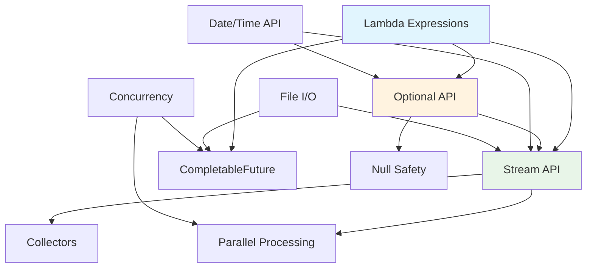

# Principais APIs do Java: Guia Completo

Esta seção contém análises técnicas aprofundadas das APIs mais importantes e fundamentais do Java moderno. Cada arquivo aborda uma API específica com foco em compreensão técnica, casos de uso práticos e melhores práticas.

---

## 📋 APIs Cobertas

### ✅ APIs Fundamentais Concluídas

#### [Concurrency Framework](./Concurrency%20Framework.md)
**Programação concorrente e paralela de alto nível**
- ExecutorService e Thread Pools
- CompletableFuture para programação assíncrona
- Fork/Join Framework
- Locks avançados (ReadWriteLock, StampedLock)
- Synchronizers (CountDownLatch, Semaphore)
- Padrões de concorrência empresariais

#### [File I/O (NIO)](./File%20IO%20(NIO).md)
**Manipulação moderna de arquivos e I/O**
- Path vs File: a nova abordagem
- Files: operações de alto nível
- Canais (Channels) para alta performance
- WatchService para monitoramento
- Operações assíncronas
- Casos de uso: processamento de logs, sistemas de backup

#### [Date and Time API](./Date%20and%20Time%20API.md)
**Manipulação temporal robusta e thread-safe**
- LocalDate, LocalTime, LocalDateTime
- ZonedDateTime e Instant
- Period e Duration para intervalos
- DateTimeFormatter para formatação
- TemporalAdjusters para operações avançadas
- Sistemas de agendamento e relatórios

#### [Optional API](./Optional%20API.md)
**Programação defensiva e eliminação de NullPointerException**
- Container monádico para valores opcionais
- map(), flatMap(), filter() para transformações
- orElse(), orElseGet(), orElseThrow() para extração segura
- Integração com Streams
- Padrões e antipadrões

#### [Stream API](./Stream%20API.md)
**Processamento funcional de dados**
- Pipeline de operações intermediárias e terminais
- Collectors avançados para agregações
- Processamento paralelo
- Operações de transformação, filtragem e redução
- Casos empresariais: analytics, processamento de dados

#### [Lambda Expressions e Functional Interfaces](./Lambda%20Expressions%20e%20Functional%20Interfaces.md)
**Programação funcional em Java**
- Sintaxe e anatomia de lambdas
- Functional interfaces principais (Predicate, Function, Consumer, Supplier)
- Method references
- Closures e captura de variáveis
- Interfaces funcionais customizadas

---

## 🚀 APIs Pendentes

### APIs de Core
- **Reflection API** - Metaprogramação e introspecção
- **Annotation Processor** - Processamento em tempo de compilação
- **Annotations API** - Metadados estruturados

### APIs de Sistema
- **Logging API** - Sistema de logs moderno
- **Networking API** - Comunicação de rede
- **Security API** - Criptografia e segurança
- **Serialization API** - Persistência de objetos

### APIs de Dados
- **JDBC API** - Acesso a bancos de dados
- **Internationalization (I18N) API** - Localização
- **Regular Expressions API** - Processamento de texto

---

## 📊 Progresso Atual

```
APIs Fundamentais: ████████████████████████████████ 100% (6/6)
APIs de Core:       ░░░░░░░░░░░░░░░░░░░░░░░░░░░░░░░░   0% (0/3)
APIs de Sistema:    ░░░░░░░░░░░░░░░░░░░░░░░░░░░░░░░░   0% (0/4)
APIs de Dados:      ░░░░░░░░░░░░░░░░░░░░░░░░░░░░░░░░   0% (0/3)

Total: ███████████░░░░░░░░░░░░░░░░░░░░░░░░░░░░░░░ 37.5% (6/16)
```

---

## 🎯 Como Usar Este Guia

### Para Iniciantes
1. Comece com **Optional API** - conceitos fundamentais de programação defensiva
2. Avance para **Lambda Expressions** - base da programação funcional
3. Mergulhe em **Stream API** - processamento de dados moderno

### Para Desenvolvedores Intermediários
1. **Concurrency Framework** - paralelismo e alta performance
2. **Date and Time API** - manipulação temporal robusta
3. **File I/O (NIO)** - operações de arquivo avançadas

### Para Arquitetos e Tech Leads
- Todos os arquivos contêm seções de **"Casos de Uso Empresariais"**
- Foco em padrões arquiteturais e decisões de design
- Análises de performance e trade-offs

---

## 💡 Metodologia de Estudo

### Estrutura de Cada Arquivo
1. **Conceitos Fundamentais** - Base teórica sólida
2. **Exemplos Práticos** - Código executável e explicado
3. **Casos de Uso Empresariais** - Aplicações reais
4. **Performance e Otimização** - Considerações práticas
5. **Melhores Práticas** - Do que fazer e evitar

### Exercícios Recomendados
1. Execute todos os exemplos de código
2. Modifique os exemplos para cenários próprios
3. Implemente os casos de uso empresariais
4. Compare performance entre diferentes abordagens

---

## 🔗 Interconexões Entre APIs



---

## 📚 Próximos Passos

Após dominar essas APIs fundamentais, você estará preparado para:

1. **Frameworks Modernos** - Spring Boot, Quarkus
2. **Microserviços** - Arquiteturas distribuídas
3. **Cloud Native** - Kubernetes, Docker
4. **Reactive Programming** - Project Reactor, RxJava

---

**Lembre-se:** Essas APIs são a base do Java moderno. Investir tempo para dominá-las completamente será fundamental para sua carreira como desenvolvedor Java de elite. 