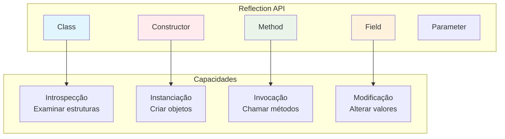

# Reflection API: Metaprogramação e Introspecção

A **Reflection API** é uma das funcionalidades mais poderosas do Java, permitindo que programas examinem e modifiquem sua própria estrutura e comportamento em tempo de execução. Ela é a base de frameworks como Spring, Hibernate, JUnit e praticamente toda ferramenta que precisa trabalhar com metadados de classes, métodos e campos.

---

## Conceitos Fundamentais

### O que é Reflection?

**Reflection** é a capacidade de um programa examinar e modificar sua própria estrutura e comportamento durante a execução. Em Java, isso significa poder acessar informações sobre classes, interfaces, campos e métodos em runtime, mesmo quando não conhecemos esses detalhes em tempo de compilação.



### Por que Reflection é Importante?

```java
// Exemplo: Por que frameworks precisam de Reflection?
public class WhyReflection {
    
    // Sem Reflection: código rígido e acoplado
    public void exemploSemReflection() {
        // Para criar diferentes tipos de objetos, precisaríamos de:
        if (tipo.equals("Usuario")) {
            Usuario obj = new Usuario();
            obj.setNome("João");
            obj.setEmail("joao@email.com");
        } else if (tipo.equals("Produto")) {
            Produto obj = new Produto();
            obj.setNome("Notebook");
            obj.setPreco(2500.0);
        }
        // ... código repetitivo para cada tipo
    }
    
    // Com Reflection: código genérico e flexível
    public Object exemploComReflection(String className, Map<String, Object> properties) 
            throws Exception {
        // 1. Obter a classe dinamicamente
        Class<?> clazz = Class.forName(className);
        
        // 2. Criar instância
        Object instance = clazz.getDeclaredConstructor().newInstance();
        
        // 3. Definir propriedades dinamicamente
        for (Map.Entry<String, Object> entry : properties.entrySet()) {
            String propertyName = entry.getKey();
            Object value = entry.getValue();
            
            // Encontrar método setter
            String setterName = "set" + capitalize(propertyName);
            Method setter = clazz.getMethod(setterName, value.getClass());
            
            // Invocar setter
            setter.invoke(instance, value);
        }
        
        return instance;
    }
    
    private String capitalize(String str) {
        return str.substring(0, 1).toUpperCase() + str.substring(1);
    }
}
```

---

## Class<?> - O Coração da Reflection

### Obtendo Referências de Classe

```java
public class ClassReflection {
    
    public void formasDeObterClass() throws ClassNotFoundException {
        // 1. A partir de um objeto
        String texto = "Hello World";
        Class<?> stringClass1 = texto.getClass();
        
        // 2. A partir do literal de classe
        Class<?> stringClass2 = String.class;
        
        // 3. A partir do nome da classe (carregamento dinâmico)
        Class<?> stringClass3 = Class.forName("java.lang.String");
        
        // 4. Para tipos primitivos
        Class<?> intClass = int.class;
        Class<?> intWrapperClass = Integer.TYPE;
        
        // 5. Para arrays
        Class<?> intArrayClass = int[].class;
        Class<?> stringArrayClass = String[].class;
        
        System.out.println("Todas são iguais: " + 
            (stringClass1 == stringClass2 && stringClass2 == stringClass3));
    }
    
    public void informacoesBasicasDaClasse() {
        Class<?> clazz = ArrayList.class;
        
        // Informações básicas
        System.out.println("Nome simples: " + clazz.getSimpleName());
        System.out.println("Nome completo: " + clazz.getName());
        System.out.println("Nome canônico: " + clazz.getCanonicalName());
        System.out.println("Package: " + clazz.getPackage().getName());
        
        // Hierarquia
        System.out.println("Superclasse: " + clazz.getSuperclass());
        System.out.println("Interfaces: " + Arrays.toString(clazz.getInterfaces()));
        
        // Modificadores
        int modifiers = clazz.getModifiers();
        System.out.println("É public: " + Modifier.isPublic(modifiers));
        System.out.println("É abstract: " + Modifier.isAbstract(modifiers));
        System.out.println("É final: " + Modifier.isFinal(modifiers));
        
        // Verificações de tipo
        System.out.println("É interface: " + clazz.isInterface());
        System.out.println("É enum: " + clazz.isEnum());
        System.out.println("É annotation: " + clazz.isAnnotation());
        System.out.println("É array: " + clazz.isArray());
    }
}
```

---

## Trabalhando com Fields (Campos)

### Acessando e Modificando Campos

```java
public class FieldReflection {
    
    // Classe de exemplo
    static class Pessoa {
        public String nome;
        private int idade;
        protected String email;
        private static final String TIPO = "PESSOA";
        
        public Pessoa(String nome, int idade) {
            this.nome = nome;
            this.idade = idade;
        }
        
        @Override
        public String toString() {
            return String.format("Pessoa{nome='%s', idade=%d, email='%s'}", 
                nome, idade, email);
        }
    }
    
    public void acessarCampos() throws Exception {
        Pessoa pessoa = new Pessoa("João", 30);
        Class<?> clazz = Pessoa.class;
        
        // 1. Obter todos os campos públicos (incluindo herdados)
        Field[] publicFields = clazz.getFields();
        System.out.println("Campos públicos: " + Arrays.toString(publicFields));
        
        // 2. Obter todos os campos declarados (todos os modificadores, só da classe)
        Field[] declaredFields = clazz.getDeclaredFields();
        System.out.println("Campos declarados: " + Arrays.toString(declaredFields));
        
        // 3. Obter campo específico
        Field nomeField = clazz.getField("nome"); // Só públicos
        Field idadeField = clazz.getDeclaredField("idade"); // Qualquer modificador
        
        // 4. Ler valores
        String nome = (String) nomeField.get(pessoa);
        System.out.println("Nome: " + nome);
        
        // Para campos privados, precisamos torná-los acessíveis
        idadeField.setAccessible(true);
        int idade = (int) idadeField.get(pessoa);
        System.out.println("Idade: " + idade);
        
        // 5. Modificar valores
        nomeField.set(pessoa, "Maria");
        idadeField.set(pessoa, 25);
        
        System.out.println("Após modificação: " + pessoa);
        
        // 6. Campos estáticos
        Field tipoField = clazz.getDeclaredField("TIPO");
        tipoField.setAccessible(true);
        String tipo = (String) tipoField.get(null); // null para campos estáticos
        System.out.println("Tipo: " + tipo);
    }
    
    public void informacoesDoCampo() throws Exception {
        Field idadeField = Pessoa.class.getDeclaredField("idade");
        
        System.out.println("Nome: " + idadeField.getName());
        System.out.println("Tipo: " + idadeField.getType());
        System.out.println("Tipo genérico: " + idadeField.getGenericType());
        
        int modifiers = idadeField.getModifiers();
        System.out.println("É private: " + Modifier.isPrivate(modifiers));
        System.out.println("É static: " + Modifier.isStatic(modifiers));
        System.out.println("É final: " + Modifier.isFinal(modifiers));
    }
}
```

### Utilitários para Campos

```java
public class FieldUtils {
    
    // Copiar propriedades entre objetos
    public static void copyProperties(Object source, Object target) throws Exception {
        Class<?> sourceClass = source.getClass();
        Class<?> targetClass = target.getClass();
        
        Field[] sourceFields = sourceClass.getDeclaredFields();
        
        for (Field sourceField : sourceFields) {
            // Pular campos estáticos e finais
            if (Modifier.isStatic(sourceField.getModifiers()) || 
                Modifier.isFinal(sourceField.getModifiers())) {
                continue;
            }
            
            try {
                // Encontrar campo correspondente no target
                Field targetField = targetClass.getDeclaredField(sourceField.getName());
                
                // Verificar se os tipos são compatíveis
                if (!targetField.getType().isAssignableFrom(sourceField.getType())) {
                    continue;
                }
                
                // Tornar acessíveis
                sourceField.setAccessible(true);
                targetField.setAccessible(true);
                
                // Copiar valor
                Object value = sourceField.get(source);
                targetField.set(target, value);
                
            } catch (NoSuchFieldException e) {
                // Campo não existe no target, continuar
                continue;
            }
        }
    }
    
    // Converter objeto para Map
    public static Map<String, Object> objectToMap(Object obj) throws Exception {
        Map<String, Object> map = new HashMap<>();
        Class<?> clazz = obj.getClass();
        
        Field[] fields = clazz.getDeclaredFields();
        
        for (Field field : fields) {
            // Pular campos estáticos
            if (Modifier.isStatic(field.getModifiers())) {
                continue;
            }
            
            field.setAccessible(true);
            Object value = field.get(obj);
            map.put(field.getName(), value);
        }
        
        return map;
    }
    
    // Encontrar campos com anotação específica
    public static List<Field> findFieldsWithAnnotation(Class<?> clazz, 
                                                       Class<? extends Annotation> annotationClass) {
        return Arrays.stream(clazz.getDeclaredFields())
            .filter(field -> field.isAnnotationPresent(annotationClass))
            .collect(Collectors.toList());
    }
}
```

---

## Trabalhando com Methods (Métodos)

### Invocação Dinâmica de Métodos

```java
public class MethodReflection {
    
    static class Calculator {
        public int add(int a, int b) {
            return a + b;
        }
        
        public double multiply(double a, double b) {
            return a * b;
        }
        
        private String formatResult(double result) {
            return String.format("Resultado: %.2f", result);
        }
        
        public static String getVersion() {
            return "Calculator v1.0";
        }
        
        // Método com varargs
        public int sum(int... numbers) {
            return Arrays.stream(numbers).sum();
        }
    }
    
    public void invocarMetodos() throws Exception {
        Calculator calc = new Calculator();
        Class<?> clazz = Calculator.class;
        
        // 1. Obter método específico
        Method addMethod = clazz.getMethod("add", int.class, int.class);
        
        // 2. Invocar método
        Object result = addMethod.invoke(calc, 10, 20);
        System.out.println("10 + 20 = " + result);
        
        // 3. Método com tipos diferentes
        Method multiplyMethod = clazz.getMethod("multiply", double.class, double.class);
        Object multiplyResult = multiplyMethod.invoke(calc, 3.5, 2.0);
        System.out.println("3.5 * 2.0 = " + multiplyResult);
        
        // 4. Método privado
        Method formatMethod = clazz.getDeclaredMethod("formatResult", double.class);
        formatMethod.setAccessible(true);
        String formatted = (String) formatMethod.invoke(calc, 42.5);
        System.out.println("Formatado: " + formatted);
        
        // 5. Método estático
        Method versionMethod = clazz.getMethod("getVersion");
        String version = (String) versionMethod.invoke(null); // null para métodos estáticos
        System.out.println("Versão: " + version);
        
        // 6. Método com varargs
        Method sumMethod = clazz.getMethod("sum", int[].class);
        int sum = (int) sumMethod.invoke(calc, new int[]{1, 2, 3, 4, 5});
        System.out.println("Soma: " + sum);
    }
    
    public void listarTodosMetodos() {
        Class<?> clazz = Calculator.class;
        
        System.out.println("=== Métodos Públicos (incluindo herdados) ===");
        Method[] publicMethods = clazz.getMethods();
        for (Method method : publicMethods) {
            System.out.println(formatMethodSignature(method));
        }
        
        System.out.println("\n=== Métodos Declarados (todos os modificadores) ===");
        Method[] declaredMethods = clazz.getDeclaredMethods();
        for (Method method : declaredMethods) {
            System.out.println(formatMethodSignature(method));
        }
    }
    
    private String formatMethodSignature(Method method) {
        StringBuilder sb = new StringBuilder();
        
        // Modificadores
        sb.append(Modifier.toString(method.getModifiers())).append(" ");
        
        // Tipo de retorno
        sb.append(method.getReturnType().getSimpleName()).append(" ");
        
        // Nome do método
        sb.append(method.getName()).append("(");
        
        // Parâmetros
        Class<?>[] paramTypes = method.getParameterTypes();
        for (int i = 0; i < paramTypes.length; i++) {
            if (i > 0) sb.append(", ");
            sb.append(paramTypes[i].getSimpleName());
        }
        
        sb.append(")");
        
        // Exceções
        Class<?>[] exceptions = method.getExceptionTypes();
        if (exceptions.length > 0) {
            sb.append(" throws ");
            for (int i = 0; i < exceptions.length; i++) {
                if (i > 0) sb.append(", ");
                sb.append(exceptions[i].getSimpleName());
            }
        }
        
        return sb.toString();
    }
}
```

---

## Trabalhando com Constructors

### Criação Dinâmica de Objetos

```java
public class ConstructorReflection {
    
    static class Produto {
        private String nome;
        private double preco;
        private String categoria;
        
        public Produto() {
            this("Produto Genérico", 0.0, "Geral");
        }
        
        public Produto(String nome) {
            this(nome, 0.0, "Geral");
        }
        
        public Produto(String nome, double preco) {
            this(nome, preco, "Geral");
        }
        
        public Produto(String nome, double preco, String categoria) {
            this.nome = nome;
            this.preco = preco;
            this.categoria = categoria;
        }
        
        @Override
        public String toString() {
            return String.format("Produto{nome='%s', preco=%.2f, categoria='%s'}", 
                nome, preco, categoria);
        }
    }
    
    public void criarObjetosDinamicamente() throws Exception {
        Class<?> clazz = Produto.class;
        
        // 1. Construtor padrão
        Constructor<?> defaultConstructor = clazz.getConstructor();
        Produto produto1 = (Produto) defaultConstructor.newInstance();
        System.out.println("Construtor padrão: " + produto1);
        
        // 2. Construtor com um parâmetro
        Constructor<?> singleParamConstructor = clazz.getConstructor(String.class);
        Produto produto2 = (Produto) singleParamConstructor.newInstance("Notebook");
        System.out.println("Um parâmetro: " + produto2);
        
        // 3. Construtor com múltiplos parâmetros
        Constructor<?> multiParamConstructor = clazz.getConstructor(
            String.class, double.class, String.class);
        Produto produto3 = (Produto) multiParamConstructor.newInstance(
            "Mouse", 50.0, "Eletrônicos");
        System.out.println("Múltiplos parâmetros: " + produto3);
        
        // 4. Listar todos os construtores
        Constructor<?>[] constructors = clazz.getConstructors();
        System.out.println("\n=== Todos os Construtores ===");
        for (Constructor<?> constructor : constructors) {
            System.out.println(formatConstructorSignature(constructor));
        }
    }
    
    private String formatConstructorSignature(Constructor<?> constructor) {
        StringBuilder sb = new StringBuilder();
        
        sb.append(Modifier.toString(constructor.getModifiers())).append(" ");
        sb.append(constructor.getDeclaringClass().getSimpleName()).append("(");
        
        Class<?>[] paramTypes = constructor.getParameterTypes();
        for (int i = 0; i < paramTypes.length; i++) {
            if (i > 0) sb.append(", ");
            sb.append(paramTypes[i].getSimpleName());
        }
        
        sb.append(")");
        return sb.toString();
    }
}
```

---

## Casos de Uso Empresariais

### 1. Framework de Injeção de Dependência Simples

```java
public class SimpleDIContainer {
    
    // Anotação para marcar dependências
    @Retention(RetentionPolicy.RUNTIME)
    @Target(ElementType.FIELD)
    public @interface Inject {
    }
    
    // Anotação para marcar componentes
    @Retention(RetentionPolicy.RUNTIME)
    @Target(ElementType.TYPE)
    public @interface Component {
        String value() default "";
    }
    
    private final Map<Class<?>, Object> instances = new ConcurrentHashMap<>();
    private final Map<String, Class<?>> namedComponents = new ConcurrentHashMap<>();
    
    // Registrar componente
    public <T> void register(Class<T> type, T instance) {
        instances.put(type, instance);
    }
    
    // Criar e injetar dependências
    @SuppressWarnings("unchecked")
    public <T> T getInstance(Class<T> type) throws Exception {
        // Verificar se já existe instância
        T instance = (T) instances.get(type);
        if (instance != null) {
            return instance;
        }
        
        // Criar nova instância
        instance = createInstance(type);
        
        // Injetar dependências
        injectDependencies(instance);
        
        // Armazenar instância
        instances.put(type, instance);
        
        return instance;
    }
    
    @SuppressWarnings("unchecked")
    private <T> T createInstance(Class<T> type) throws Exception {
        Constructor<T> constructor = (Constructor<T>) type.getDeclaredConstructor();
        constructor.setAccessible(true);
        return constructor.newInstance();
    }
    
    private void injectDependencies(Object instance) throws Exception {
        Class<?> clazz = instance.getClass();
        Field[] fields = clazz.getDeclaredFields();
        
        for (Field field : fields) {
            if (field.isAnnotationPresent(Inject.class)) {
                field.setAccessible(true);
                
                Class<?> fieldType = field.getType();
                Object dependency = getInstance(fieldType);
                
                field.set(instance, dependency);
            }
        }
    }
    
    // Exemplo de uso
    @Component
    static class UserService {
        @Inject
        private UserRepository repository;
        
        public void createUser(String name) {
            System.out.println("Criando usuário: " + name);
            repository.save(name);
        }
    }
    
    @Component
    static class UserRepository {
        public void save(String name) {
            System.out.println("Salvando usuário no banco: " + name);
        }
    }
    
    public void exemploUso() throws Exception {
        SimpleDIContainer container = new SimpleDIContainer();
        
        // O container cria as instâncias e injeta automaticamente
        UserService userService = container.getInstance(UserService.class);
        userService.createUser("João");
    }
}
```

### 2. Mapeador Objeto-Relacional Simples

```java
public class SimpleORM {
    
    // Anotações para mapeamento
    @Retention(RetentionPolicy.RUNTIME)
    @Target(ElementType.TYPE)
    public @interface Table {
        String value();
    }
    
    @Retention(RetentionPolicy.RUNTIME)
    @Target(ElementType.FIELD)
    public @interface Column {
        String value() default "";
        boolean primaryKey() default false;
    }
    
    // Classe de exemplo
    @Table("usuarios")
    static class Usuario {
        @Column(value = "id", primaryKey = true)
        private Long id;
        
        @Column("nome")
        private String nome;
        
        @Column("email")
        private String email;
        
        @Column("idade")
        private Integer idade;
        
        // Construtores, getters, setters...
        public Usuario() {}
        
        public Usuario(String nome, String email, Integer idade) {
            this.nome = nome;
            this.email = email;
            this.idade = idade;
        }
        
        // Getters e Setters
        public Long getId() { return id; }
        public void setId(Long id) { this.id = id; }
        public String getNome() { return nome; }
        public void setNome(String nome) { this.nome = nome; }
        public String getEmail() { return email; }
        public void setEmail(String email) { this.email = email; }
        public Integer getIdade() { return idade; }
        public void setIdade(Integer idade) { this.idade = idade; }
        
        @Override
        public String toString() {
            return String.format("Usuario{id=%d, nome='%s', email='%s', idade=%d}", 
                id, nome, email, idade);
        }
    }
    
    // Gerador de SQL
    public String generateInsertSQL(Object entity) throws Exception {
        Class<?> clazz = entity.getClass();
        
        // Obter nome da tabela
        Table tableAnnotation = clazz.getAnnotation(Table.class);
        if (tableAnnotation == null) {
            throw new IllegalArgumentException("Classe deve ter anotação @Table");
        }
        String tableName = tableAnnotation.value();
        
        // Obter campos com @Column
        List<Field> columnFields = Arrays.stream(clazz.getDeclaredFields())
            .filter(field -> field.isAnnotationPresent(Column.class))
            .filter(field -> !field.getAnnotation(Column.class).primaryKey()) // Pular PK auto-increment
            .collect(Collectors.toList());
        
        if (columnFields.isEmpty()) {
            throw new IllegalArgumentException("Nenhum campo com @Column encontrado");
        }
        
        // Construir SQL
        StringBuilder sql = new StringBuilder("INSERT INTO ");
        sql.append(tableName).append(" (");
        
        // Nomes das colunas
        List<String> columnNames = columnFields.stream()
            .map(field -> {
                Column column = field.getAnnotation(Column.class);
                return column.value().isEmpty() ? field.getName() : column.value();
            })
            .collect(Collectors.toList());
        
        sql.append(String.join(", ", columnNames));
        sql.append(") VALUES (");
        
        // Placeholders
        sql.append(columnNames.stream()
            .map(name -> "?")
            .collect(Collectors.joining(", ")));
        
        sql.append(")");
        
        return sql.toString();
    }
    
    public String generateSelectSQL(Class<?> entityClass) throws Exception {
        // Obter nome da tabela
        Table tableAnnotation = entityClass.getAnnotation(Table.class);
        if (tableAnnotation == null) {
            throw new IllegalArgumentException("Classe deve ter anotação @Table");
        }
        String tableName = tableAnnotation.value();
        
        // Obter campos com @Column
        List<Field> columnFields = Arrays.stream(entityClass.getDeclaredFields())
            .filter(field -> field.isAnnotationPresent(Column.class))
            .collect(Collectors.toList());
        
        // Nomes das colunas
        List<String> columnNames = columnFields.stream()
            .map(field -> {
                Column column = field.getAnnotation(Column.class);
                return column.value().isEmpty() ? field.getName() : column.value();
            })
            .collect(Collectors.toList());
        
        return "SELECT " + String.join(", ", columnNames) + " FROM " + tableName;
    }
    
    // Mapear ResultSet para objeto
    public <T> T mapResultSetToObject(ResultSet rs, Class<T> entityClass) throws Exception {
        T instance = entityClass.getDeclaredConstructor().newInstance();
        
        Field[] fields = entityClass.getDeclaredFields();
        for (Field field : fields) {
            if (field.isAnnotationPresent(Column.class)) {
                Column column = field.getAnnotation(Column.class);
                String columnName = column.value().isEmpty() ? field.getName() : column.value();
                
                field.setAccessible(true);
                Object value = rs.getObject(columnName);
                
                // Conversão de tipos básica
                if (value != null && field.getType().isAssignableFrom(value.getClass())) {
                    field.set(instance, value);
                }
            }
        }
        
        return instance;
    }
    
    public void exemploUso() throws Exception {
        Usuario usuario = new Usuario("João Silva", "joao@email.com", 30);
        
        // Gerar SQL de inserção
        String insertSQL = generateInsertSQL(usuario);
        System.out.println("SQL Insert: " + insertSQL);
        
        // Gerar SQL de seleção
        String selectSQL = generateSelectSQL(Usuario.class);
        System.out.println("SQL Select: " + selectSQL);
        
        // Em uma aplicação real, você executaria o SQL e mapearia os resultados
    }
}
```

### 3. Validador Genérico com Anotações

```java
public class AnnotationValidator {
    
    // Anotações de validação
    @Retention(RetentionPolicy.RUNTIME)
    @Target(ElementType.FIELD)
    public @interface NotNull {
        String message() default "Campo não pode ser nulo";
    }
    
    @Retention(RetentionPolicy.RUNTIME)
    @Target(ElementType.FIELD)
    public @interface NotEmpty {
        String message() default "Campo não pode estar vazio";
    }
    
    @Retention(RetentionPolicy.RUNTIME)
    @Target(ElementType.FIELD)
    public @interface MinLength {
        int value();
        String message() default "Campo deve ter pelo menos {value} caracteres";
    }
    
    @Retention(RetentionPolicy.RUNTIME)
    @Target(ElementType.FIELD)
    public @interface Email {
        String message() default "Email inválido";
    }
    
    @Retention(RetentionPolicy.RUNTIME)
    @Target(ElementType.FIELD)
    public @interface Range {
        int min() default Integer.MIN_VALUE;
        int max() default Integer.MAX_VALUE;
        String message() default "Valor deve estar entre {min} e {max}";
    }
    
    // Classe de exemplo para validação
    static class UsuarioDTO {
        @NotNull
        @NotEmpty
        @MinLength(2)
        private String nome;
        
        @NotNull
        @Email
        private String email;
        
        @Range(min = 0, max = 120)
        private Integer idade;
        
        public UsuarioDTO(String nome, String email, Integer idade) {
            this.nome = nome;
            this.email = email;
            this.idade = idade;
        }
        
        // Getters
        public String getNome() { return nome; }
        public String getEmail() { return email; }
        public Integer getIdade() { return idade; }
    }
    
    // Resultado da validação
    static class ValidationResult {
        private final boolean valid;
        private final List<String> errors;
        
        public ValidationResult(boolean valid, List<String> errors) {
            this.valid = valid;
            this.errors = errors;
        }
        
        public boolean isValid() { return valid; }
        public List<String> getErrors() { return errors; }
        
        @Override
        public String toString() {
            return valid ? "Válido" : "Inválido: " + String.join(", ", errors);
        }
    }
    
    // Validador principal
    public ValidationResult validate(Object object) throws Exception {
        List<String> errors = new ArrayList<>();
        Class<?> clazz = object.getClass();
        
        Field[] fields = clazz.getDeclaredFields();
        
        for (Field field : fields) {
            field.setAccessible(true);
            Object value = field.get(object);
            
            // Validação @NotNull
            if (field.isAnnotationPresent(NotNull.class)) {
                if (value == null) {
                    NotNull annotation = field.getAnnotation(NotNull.class);
                    errors.add(field.getName() + ": " + annotation.message());
                    continue; // Se é null, outras validações não fazem sentido
                }
            }
            
            // Validação @NotEmpty (para Strings)
            if (field.isAnnotationPresent(NotEmpty.class) && value instanceof String) {
                String stringValue = (String) value;
                if (stringValue.trim().isEmpty()) {
                    NotEmpty annotation = field.getAnnotation(NotEmpty.class);
                    errors.add(field.getName() + ": " + annotation.message());
                }
            }
            
            // Validação @MinLength
            if (field.isAnnotationPresent(MinLength.class) && value instanceof String) {
                String stringValue = (String) value;
                MinLength annotation = field.getAnnotation(MinLength.class);
                if (stringValue.length() < annotation.value()) {
                    String message = annotation.message()
                        .replace("{value}", String.valueOf(annotation.value()));
                    errors.add(field.getName() + ": " + message);
                }
            }
            
            // Validação @Email
            if (field.isAnnotationPresent(Email.class) && value instanceof String) {
                String stringValue = (String) value;
                if (!isValidEmail(stringValue)) {
                    Email annotation = field.getAnnotation(Email.class);
                    errors.add(field.getName() + ": " + annotation.message());
                }
            }
            
            // Validação @Range
            if (field.isAnnotationPresent(Range.class) && value instanceof Integer) {
                Integer intValue = (Integer) value;
                Range annotation = field.getAnnotation(Range.class);
                if (intValue < annotation.min() || intValue > annotation.max()) {
                    String message = annotation.message()
                        .replace("{min}", String.valueOf(annotation.min()))
                        .replace("{max}", String.valueOf(annotation.max()));
                    errors.add(field.getName() + ": " + message);
                }
            }
        }
        
        return new ValidationResult(errors.isEmpty(), errors);
    }
    
    private boolean isValidEmail(String email) {
        return email != null && email.contains("@") && email.split("@").length == 2;
    }
    
    public void exemploUso() throws Exception {
        // Casos de teste
        UsuarioDTO validUser = new UsuarioDTO("João Silva", "joao@email.com", 30);
        UsuarioDTO invalidUser = new UsuarioDTO("", "email-invalido", 150);
        
        System.out.println("Usuário válido: " + validate(validUser));
        System.out.println("Usuário inválido: " + validate(invalidUser));
    }
}
```

---

## Performance e Considerações

### Custos da Reflection

```java
public class ReflectionPerformance {
    
    static class TestClass {
        private String value = "test";
        
        public String getValue() {
            return value;
        }
        
        public void setValue(String value) {
            this.value = value;
        }
    }
    
    public void compararPerformance() throws Exception {
        TestClass obj = new TestClass();
        Class<?> clazz = TestClass.class;
        Method getter = clazz.getMethod("getValue");
        Method setter = clazz.getMethod("setValue", String.class);
        
        int iterations = 1_000_000;
        
        // 1. Acesso direto
        long start = System.nanoTime();
        for (int i = 0; i < iterations; i++) {
            String value = obj.getValue();
            obj.setValue(value);
        }
        long directTime = System.nanoTime() - start;
        
        // 2. Reflection
        start = System.nanoTime();
        for (int i = 0; i < iterations; i++) {
            String value = (String) getter.invoke(obj);
            setter.invoke(obj, value);
        }
        long reflectionTime = System.nanoTime() - start;
        
        // 3. Reflection com cache (Method já obtido)
        start = System.nanoTime();
        for (int i = 0; i < iterations; i++) {
            String value = (String) getter.invoke(obj);
            setter.invoke(obj, value);
        }
        long cachedReflectionTime = System.nanoTime() - start;
        
        System.out.printf("Acesso direto: %d ns%n", directTime);
        System.out.printf("Reflection: %d ns (%.2fx mais lento)%n", 
            reflectionTime, (double) reflectionTime / directTime);
        System.out.printf("Reflection cached: %d ns (%.2fx mais lento)%n", 
            cachedReflectionTime, (double) cachedReflectionTime / directTime);
    }
    
    // Otimizações
    private static final Map<String, Method> METHOD_CACHE = new ConcurrentHashMap<>();
    
    public Method getCachedMethod(Class<?> clazz, String methodName, Class<?>... paramTypes) 
            throws NoSuchMethodException {
        String key = clazz.getName() + "#" + methodName + "#" + Arrays.toString(paramTypes);
        return METHOD_CACHE.computeIfAbsent(key, k -> {
            try {
                return clazz.getMethod(methodName, paramTypes);
            } catch (NoSuchMethodException e) {
                throw new RuntimeException(e);
            }
        });
    }
}
```

---

## Melhores Práticas e Armadilhas

### ✅ Melhores Práticas

```java
public class ReflectionBestPractices {
    
    // 1. Cache de métodos, campos e construtores
    private static final Map<String, Field> FIELD_CACHE = new ConcurrentHashMap<>();
    private static final Map<String, Method> METHOD_CACHE = new ConcurrentHashMap<>();
    
    // 2. Verificação de segurança
    public void exemploSeguranca(Object obj, String fieldName) throws Exception {
        // Verificar se o campo existe antes de tentar acessar
        Field field = obj.getClass().getDeclaredField(fieldName);
        
        // Verificar modificadores antes de tornar acessível
        if (Modifier.isFinal(field.getModifiers())) {
            throw new IllegalAccessException("Campo é final e não pode ser modificado");
        }
        
        field.setAccessible(true);
        // ... usar o campo
    }
    
    // 3. Tratamento adequado de exceções
    public Optional<Object> safeGetFieldValue(Object obj, String fieldName) {
        try {
            Field field = obj.getClass().getDeclaredField(fieldName);
            field.setAccessible(true);
            return Optional.ofNullable(field.get(obj));
        } catch (NoSuchFieldException | IllegalAccessException e) {
            // Log do erro, não exposição da exception
            System.err.println("Erro ao acessar campo " + fieldName + ": " + e.getMessage());
            return Optional.empty();
        }
    }
    
    // 4. Verificação de tipos
    public boolean isCompatibleType(Class<?> expected, Class<?> actual) {
        if (expected.equals(actual)) {
            return true;
        }
        
        // Verificar herança
        if (expected.isAssignableFrom(actual)) {
            return true;
        }
        
        // Verificar tipos primitivos e wrappers
        if (expected.isPrimitive() || actual.isPrimitive()) {
            return isCompatiblePrimitive(expected, actual);
        }
        
        return false;
    }
    
    private boolean isCompatiblePrimitive(Class<?> expected, Class<?> actual) {
        Map<Class<?>, Class<?>> primitiveToWrapper = Map.of(
            int.class, Integer.class,
            long.class, Long.class,
            double.class, Double.class,
            boolean.class, Boolean.class,
            char.class, Character.class,
            byte.class, Byte.class,
            short.class, Short.class,
            float.class, Float.class
        );
        
        return primitiveToWrapper.get(expected) == actual || 
               primitiveToWrapper.get(actual) == expected;
    }
}
```

### ❌ Armadilhas Comuns

```java
public class ReflectionPitfalls {
    
    // ❌ Não fazer cache de reflexão
    public void exemploSemCache(Object obj) throws Exception {
        // Ruim: buscar o método a cada chamada
        Method method = obj.getClass().getMethod("toString");
        method.invoke(obj);
    }
    
    // ❌ Não tratar SecurityException
    public void exemploSemTratamentoSeguranca(Object obj) throws Exception {
        Field field = obj.getClass().getDeclaredField("privateField");
        // Pode lançar SecurityException em alguns ambientes
        field.setAccessible(true);
    }
    
    // ❌ Ignorar performance em loops
    public void exemploPerformanceRuim(List<Object> objects) throws Exception {
        for (Object obj : objects) {
            // Busca o método a cada iteração!
            Method method = obj.getClass().getMethod("process");
            method.invoke(obj);
        }
    }
    
    // ✅ Versão otimizada
    public void exemploPerformanceBom(List<Object> objects) throws Exception {
        if (objects.isEmpty()) return;
        
        // Cache do método fora do loop
        Method method = objects.get(0).getClass().getMethod("process");
        
        for (Object obj : objects) {
            method.invoke(obj);
        }
    }
    
    // ❌ Não verificar tipos antes de cast
    public void exemploSemVerificacaoTipo(Object obj, String fieldName) throws Exception {
        Field field = obj.getClass().getDeclaredField(fieldName);
        field.setAccessible(true);
        
        // Pode lançar ClassCastException
        String value = (String) field.get(obj);
    }
    
    // ✅ Com verificação
    public void exemploComVerificacaoTipo(Object obj, String fieldName) throws Exception {
        Field field = obj.getClass().getDeclaredField(fieldName);
        field.setAccessible(true);
        
        Object value = field.get(obj);
        if (value instanceof String) {
            String stringValue = (String) value;
            // Usar stringValue
        }
    }
}
```

---

**Próximos Passos:** A Reflection API é fundamental para frameworks e ferramentas avançadas. Dominar seus conceitos permite criar soluções mais genéricas e flexíveis, mas sempre com atenção à performance e segurança. 