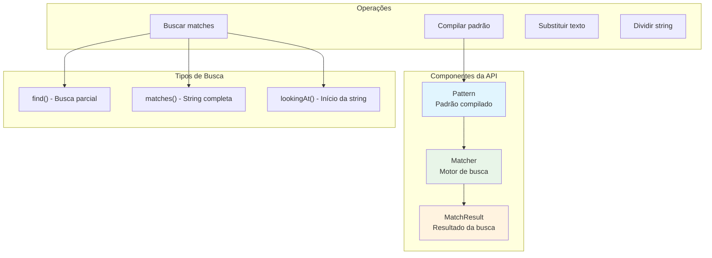

# Regular Expressions API: Processamento Avançado de Texto

A **Regular Expressions API** do Java fornece um conjunto robusto de ferramentas para busca, validação e manipulação de texto usando padrões. Baseada na biblioteca PCRE (Perl Compatible Regular Expressions), ela é fundamental para validação de dados, parsing de logs, extração de informações e processamento de texto em geral.

---

## Conceitos Fundamentais

### O que são Regular Expressions?

**Regular Expressions (RegEx)** são padrões que descrevem conjuntos de strings. Elas permitem definir regras complexas para buscar, validar ou manipular texto de forma muito mais poderosa que métodos simples de string.



### Anatomia da API Java

```java
public class RegexBasics {
    
    public void exemploBasico() {
        String texto = "João tem 25 anos e Maria tem 30 anos";
        String padrao = "\\d+"; // Buscar números
        
        // Método 1: Usando String.matches() (para string completa)
        boolean isNumber = "123".matches("\\d+");
        System.out.println("'123' é número: " + isNumber);
        
        // Método 2: Usando Pattern e Matcher (mais controle)
        Pattern pattern = Pattern.compile(padrao);
        Matcher matcher = pattern.matcher(texto);
        
        System.out.println("Números encontrados:");
        while (matcher.find()) {
            System.out.println("Número: " + matcher.group() + 
                             " na posição " + matcher.start() + "-" + matcher.end());
        }
        
        // Método 3: Métodos utilitários de String
        String[] palavras = texto.split("\\s+"); // Dividir por espaços
        System.out.println("Palavras: " + Arrays.toString(palavras));
        
        String semNumeros = texto.replaceAll("\\d+", "X");
        System.out.println("Sem números: " + semNumeros);
    }
    
    public void exemploFlags() {
        String texto = "João\nMaria\nPEDRO";
        
        // Case insensitive
        Pattern caseInsensitive = Pattern.compile("joão", Pattern.CASE_INSENSITIVE);
        boolean found = caseInsensitive.matcher(texto).find();
        System.out.println("Encontrou 'joão' (case insensitive): " + found);
        
        // Multiline mode
        Pattern multiline = Pattern.compile("^[A-Z]+$", Pattern.MULTILINE);
        Matcher matcher = multiline.matcher(texto);
        while (matcher.find()) {
            System.out.println("Linha em maiúsculas: " + matcher.group());
        }
        
        // Dot matches all (incluindo quebras de linha)
        Pattern dotAll = Pattern.compile("João.*Pedro", Pattern.DOTALL);
        boolean matches = dotAll.matcher(texto).find();
        System.out.println("Encontrou João...Pedro: " + matches);
        
        // Combinando flags
        Pattern combined = Pattern.compile("joão.*pedro", 
            Pattern.CASE_INSENSITIVE | Pattern.DOTALL);
        System.out.println("Combinado: " + combined.matcher(texto).find());
    }
}
```

---

## Padrões Fundamentais

### Metacaracteres e Classes de Caracteres

```java
public class RegexPatterns {
    
    public void caracteresBasicos() {
        String texto = "abc123XYZ!@#";
        
        // Classes de caracteres predefinidas
        demonstrarPadrao("\\d", texto, "Dígitos");           // [0-9]
        demonstrarPadrao("\\D", texto, "Não-dígitos");       // [^0-9]
        demonstrarPadrao("\\w", texto, "Caracteres palavra"); // [a-zA-Z0-9_]
        demonstrarPadrao("\\W", texto, "Não-palavra");       // [^a-zA-Z0-9_]
        demonstrarPadrao("\\s", "a b\tc\nd", "Espaços");     // [ \t\n\r\f]
        demonstrarPadrao("\\S", "a b\tc\nd", "Não-espaços"); // [^ \t\n\r\f]
        
        // Classes customizadas
        demonstrarPadrao("[aeiou]", texto, "Vogais");
        demonstrarPadrao("[^aeiou]", texto, "Consoantes");
        demonstrarPadrao("[a-z]", texto, "Minúsculas");
        demonstrarPadrao("[A-Z]", texto, "Maiúsculas");
        demonstrarPadrao("[0-9]", texto, "Dígitos customizado");
        demonstrarPadrao("[a-zA-Z0-9]", texto, "Alfanuméricos");
    }
    
    public void quantificadores() {
        // Quantificadores básicos
        demonstrarPadrao("a?", "a aa aaa", "Zero ou um 'a'");        // {0,1}
        demonstrarPadrao("a*", "a aa aaa", "Zero ou mais 'a'");      // {0,}
        demonstrarPadrao("a+", "a aa aaa", "Um ou mais 'a'");        // {1,}
        
        // Quantificadores específicos
        demonstrarPadrao("a{2}", "a aa aaa", "Exatamente 2 'a'");
        demonstrarPadrao("a{2,}", "a aa aaa", "2 ou mais 'a'");
        demonstrarPadrao("a{1,3}", "a aa aaa aaaa", "1 a 3 'a'");
        
        // Quantificadores não-gulosos (lazy)
        String html = "<div>conteudo</div><span>outro</span>";
        demonstrarPadrao("<.*>", html, "Guloso (greedy)");
        demonstrarPadrao("<.*?>", html, "Não-guloso (lazy)");
        
        // Quantificadores possessivos (Java específico)
        demonstrarPadrao("a++", "aaa", "Possessivo");
    }
    
    public void ancoras() {
        String texto = "linha1\nlinha2\nlinha3";
        
        // Âncoras de posição
        demonstrarPadrao("^linha", texto, "Início da string");
        demonstrarPadrao("linha$", texto, "Fim da string");
        demonstrarPadrao("^linha", texto, "Início de linha", Pattern.MULTILINE);
        demonstrarPadrao("linha$", texto, "Fim de linha", Pattern.MULTILINE);
        
        // Âncoras de palavra
        String palavras = "palavra subpalavra palavra123";
        demonstrarPadrao("\\bpalavra\\b", palavras, "Palavra completa");
        demonstrarPadrao("\\Bpalavra\\B", palavras, "Palavra dentro de outra");
    }
    
    private void demonstrarPadrao(String padrao, String texto, String descricao) {
        demonstrarPadrao(padrao, texto, descricao, 0);
    }
    
    private void demonstrarPadrao(String padrao, String texto, String descricao, int flags) {
        System.out.println("\n" + descricao + " (" + padrao + "):");
        Pattern pattern = Pattern.compile(padrao, flags);
        Matcher matcher = pattern.matcher(texto);
        
        boolean found = false;
        while (matcher.find()) {
            System.out.println("  Encontrado: '" + matcher.group() + 
                             "' em [" + matcher.start() + "-" + matcher.end() + "]");
            found = true;
        }
        
        if (!found) {
            System.out.println("  Nenhum match encontrado");
        }
    }
}
```

---

## Grupos e Captura

### Trabalhando com Grupos

```java
public class RegexGroups {
    
    public void gruposBasicos() {
        String texto = "João Silva (30 anos) - joao@email.com";
        String padrao = "(\\w+)\\s+(\\w+)\\s+\\((\\d+)\\s+anos\\)\\s+-\\s+([\\w@.]+)";
        
        Pattern pattern = Pattern.compile(padrao);
        Matcher matcher = pattern.matcher(texto);
        
        if (matcher.find()) {
            System.out.println("Match completo: " + matcher.group(0)); // Grupo 0 = match completo
            System.out.println("Nome: " + matcher.group(1));           // Primeiro grupo
            System.out.println("Sobrenome: " + matcher.group(2));      // Segundo grupo
            System.out.println("Idade: " + matcher.group(3));          // Terceiro grupo
            System.out.println("Email: " + matcher.group(4));          // Quarto grupo
            
            System.out.println("Total de grupos: " + matcher.groupCount());
        }
    }
    
    public void gruposNomeados() {
        String texto = "João Silva (30 anos) - joao@email.com";
        String padrao = "(?<nome>\\w+)\\s+(?<sobrenome>\\w+)\\s+\\((?<idade>\\d+)\\s+anos\\)\\s+-\\s+(?<email>[\\w@.]+)";
        
        Pattern pattern = Pattern.compile(padrao);
        Matcher matcher = pattern.matcher(texto);
        
        if (matcher.find()) {
            System.out.println("Nome: " + matcher.group("nome"));
            System.out.println("Sobrenome: " + matcher.group("sobrenome"));
            System.out.println("Idade: " + matcher.group("idade"));
            System.out.println("Email: " + matcher.group("email"));
        }
    }
    
    public void gruposNaoCapturantes() {
        String texto = "http://www.exemplo.com https://secure.exemplo.com";
        
        // Grupo capturante normal
        String padraoCapturante = "(https?)://([\\w.]+)";
        
        // Grupo não-capturante (?:...)
        String padraoNaoCapturante = "(?:https?)://([\\w.]+)";
        
        System.out.println("=== Grupo Capturante ===");
        Pattern pattern1 = Pattern.compile(padraoCapturante);
        Matcher matcher1 = pattern1.matcher(texto);
        while (matcher1.find()) {
            System.out.println("Match: " + matcher1.group(0));
            System.out.println("Protocolo: " + matcher1.group(1));
            System.out.println("Domínio: " + matcher1.group(2));
            System.out.println("Grupos: " + matcher1.groupCount());
            System.out.println();
        }
        
        System.out.println("=== Grupo Não-Capturante ===");
        Pattern pattern2 = Pattern.compile(padraoNaoCapturante);
        Matcher matcher2 = pattern2.matcher(texto);
        while (matcher2.find()) {
            System.out.println("Match: " + matcher2.group(0));
            System.out.println("Domínio: " + matcher2.group(1)); // Só um grupo agora
            System.out.println("Grupos: " + matcher2.groupCount());
            System.out.println();
        }
    }
    
    public void backreferences() {
        // Encontrar palavras duplicadas
        String texto = "Este este texto tem tem palavras duplicadas duplicadas";
        String padrao = "\\b(\\w+)\\s+\\1\\b"; // \\1 referencia o primeiro grupo
        
        Pattern pattern = Pattern.compile(padrao, Pattern.CASE_INSENSITIVE);
        Matcher matcher = pattern.matcher(texto);
        
        System.out.println("Palavras duplicadas:");
        while (matcher.find()) {
            System.out.println("Duplicada: " + matcher.group(1));
        }
        
        // Substituir usando backreferences
        String corrigido = texto.replaceAll("\\b(\\w+)\\s+\\1\\b", "$1");
        System.out.println("Texto corrigido: " + corrigido);
    }
    
    public void lookaheadLookbehind() {
        String texto = "senha123 password abc123 test456";
        
        // Positive lookahead: encontrar palavra seguida de números
        String lookahead = "\\w+(?=\\d+)";
        demonstrarPadrao(lookahead, texto, "Palavra seguida de números (lookahead)");
        
        // Negative lookahead: encontrar palavra NÃO seguida de números
        String negativeLookahead = "\\w+(?!\\d+)";
        demonstrarPadrao(negativeLookahead, texto, "Palavra NÃO seguida de números");
        
        // Positive lookbehind: encontrar números precedidos de palavra
        String lookbehind = "(?<=\\w)\\d+";
        demonstrarPadrao(lookbehind, texto, "Números precedidos de palavra (lookbehind)");
        
        // Negative lookbehind: encontrar números NÃO precedidos de palavra
        String negativeLookbehind = "(?<!\\w)\\d+";
        demonstrarPadrao(negativeLookbehind, "123 abc456 789", "Números NÃO precedidos de palavra");
    }
    
    private void demonstrarPadrao(String padrao, String texto, String descricao) {
        System.out.println("\n" + descricao + " (" + padrao + "):");
        Pattern pattern = Pattern.compile(padrao);
        Matcher matcher = pattern.matcher(texto);
        
        while (matcher.find()) {
            System.out.println("  Encontrado: '" + matcher.group() + "'");
        }
    }
}
```

---

## Validação de Dados

### Padrões Comuns de Validação

```java
public class RegexValidation {
    
    // Padrões de validação comuns
    private static final Map<String, Pattern> PATTERNS = Map.of(
        "EMAIL", Pattern.compile("^[a-zA-Z0-9._%+-]+@[a-zA-Z0-9.-]+\\.[a-zA-Z]{2,}$"),
        "PHONE_BR", Pattern.compile("^\\(?\\d{2}\\)?\\s?9?\\d{4}-?\\d{4}$"),
        "CPF", Pattern.compile("^\\d{3}\\.\\d{3}\\.\\d{3}-\\d{2}$"),
        "CNPJ", Pattern.compile("^\\d{2}\\.\\d{3}\\.\\d{3}/\\d{4}-\\d{2}$"),
        "CEP", Pattern.compile("^\\d{5}-?\\d{3}$"),
        "PASSWORD_STRONG", Pattern.compile("^(?=.*[a-z])(?=.*[A-Z])(?=.*\\d)(?=.*[@$!%*?&])[A-Za-z\\d@$!%*?&]{8,}$"),
        "URL", Pattern.compile("^https?://[\\w.-]+(?:\\.[a-zA-Z]{2,})+(?:/[\\w.-]*)*/?(?:\\?[\\w=&.-]*)?$"),
        "IPV4", Pattern.compile("^(?:(?:25[0-5]|2[0-4][0-9]|[01]?[0-9][0-9]?)\\.){3}(?:25[0-5]|2[0-4][0-9]|[01]?[0-9][0-9]?)$"),
        "CREDIT_CARD", Pattern.compile("^(?:4[0-9]{12}(?:[0-9]{3})?|5[1-5][0-9]{14}|3[47][0-9]{13}|3[0-9]{13}|6(?:011|5[0-9]{2})[0-9]{12})$")
    );
    
    public boolean validate(String type, String value) {
        Pattern pattern = PATTERNS.get(type.toUpperCase());
        if (pattern == null) {
            throw new IllegalArgumentException("Tipo de validação não suportado: " + type);
        }
        
        return pattern.matcher(value).matches();
    }
    
    public void exemploValidacoes() {
        // Testes de validação
        String[][] testCases = {
            {"EMAIL", "joao@email.com", "true"},
            {"EMAIL", "email-invalido", "false"},
            {"PHONE_BR", "(11) 99999-9999", "true"},
            {"PHONE_BR", "11999999999", "true"},
            {"PHONE_BR", "123", "false"},
            {"CPF", "123.456.789-01", "true"},
            {"CPF", "12345678901", "false"},
            {"PASSWORD_STRONG", "MinhaSenh@123", "true"},
            {"PASSWORD_STRONG", "senha", "false"},
            {"URL", "https://www.exemplo.com", "true"},
            {"URL", "not-a-url", "false"},
            {"IPV4", "192.168.1.1", "true"},
            {"IPV4", "256.256.256.256", "false"}
        };
        
        System.out.println("=== Testes de Validação ===");
        for (String[] testCase : testCases) {
            String type = testCase[0];
            String value = testCase[1];
            boolean expected = Boolean.parseBoolean(testCase[2]);
            boolean result = validate(type, value);
            
            String status = result == expected ? "✓" : "✗";
            System.out.printf("%s %s: '%s' = %b%n", status, type, value, result);
        }
    }
    
    // Validador avançado com detalhes do erro
    public static class ValidationResult {
        private final boolean valid;
        private final String message;
        private final List<String> errors;
        
        public ValidationResult(boolean valid, String message, List<String> errors) {
            this.valid = valid;
            this.message = message;
            this.errors = errors;
        }
        
        public boolean isValid() { return valid; }
        public String getMessage() { return message; }
        public List<String> getErrors() { return errors; }
        
        @Override
        public String toString() {
            return valid ? "Válido" : "Inválido: " + message + 
                   (errors.isEmpty() ? "" : " - " + String.join(", ", errors));
        }
    }
    
    public ValidationResult validatePassword(String password) {
        List<String> errors = new ArrayList<>();
        
        if (password == null || password.length() < 8) {
            errors.add("Deve ter pelo menos 8 caracteres");
        }
        
        if (!password.matches(".*[a-z].*")) {
            errors.add("Deve conter pelo menos uma letra minúscula");
        }
        
        if (!password.matches(".*[A-Z].*")) {
            errors.add("Deve conter pelo menos uma letra maiúscula");
        }
        
        if (!password.matches(".*\\d.*")) {
            errors.add("Deve conter pelo menos um número");
        }
        
        if (!password.matches(".*[@$!%*?&].*")) {
            errors.add("Deve conter pelo menos um caractere especial (@$!%*?&)");
        }
        
        boolean valid = errors.isEmpty();
        String message = valid ? "Senha válida" : "Senha não atende aos critérios";
        
        return new ValidationResult(valid, message, errors);
    }
    
    public void exemploValidacaoDetalhada() {
        String[] passwords = {
            "MinhaSenh@123",  // Válida
            "senha",          // Muito simples
            "SENHA123",       // Sem minúscula e sem especial
            "MinhaSenh123",   // Sem especial
            "MinhaSenh@"      // Sem número
        };
        
        System.out.println("\n=== Validação Detalhada de Senhas ===");
        for (String password : passwords) {
            ValidationResult result = validatePassword(password);
            System.out.printf("'%s': %s%n", password, result);
        }
    }
}
```

---

## Extração e Parsing de Dados

### Extraindo Informações Estruturadas

```java
public class RegexExtraction {
    
    // Extrator de dados de log
    public static class LogEntry {
        private final String ip;
        private final LocalDateTime timestamp;
        private final String method;
        private final String path;
        private final int status;
        private final long size;
        private final String userAgent;
        
        public LogEntry(String ip, LocalDateTime timestamp, String method, 
                       String path, int status, long size, String userAgent) {
            this.ip = ip;
            this.timestamp = timestamp;
            this.method = method;
            this.path = path;
            this.status = status;
            this.size = size;
            this.userAgent = userAgent;
        }
        
        // Getters
        public String getIp() { return ip; }
        public LocalDateTime getTimestamp() { return timestamp; }
        public String getMethod() { return method; }
        public String getPath() { return path; }
        public int getStatus() { return status; }
        public long getSize() { return size; }
        public String getUserAgent() { return userAgent; }
        
        @Override
        public String toString() {
            return String.format("LogEntry{ip='%s', timestamp=%s, method='%s', path='%s', status=%d, size=%d}", 
                ip, timestamp, method, path, status, size);
        }
    }
    
    public List<LogEntry> parseApacheLog(String logContent) {
        // Padrão para log do Apache (Common Log Format + User Agent)
        String pattern = "^(\\S+)\\s+\\S+\\s+\\S+\\s+\\[([^\\]]+)\\]\\s+\"(\\S+)\\s+(\\S+)\\s+\\S+\"\\s+(\\d+)\\s+(\\d+|-)\\s+\"[^\"]*\"\\s+\"([^\"]+)\"";
        
        Pattern logPattern = Pattern.compile(pattern, Pattern.MULTILINE);
        Matcher matcher = logPattern.matcher(logContent);
        
        List<LogEntry> entries = new ArrayList<>();
        DateTimeFormatter formatter = DateTimeFormatter.ofPattern("dd/MMM/yyyy:HH:mm:ss Z", Locale.ENGLISH);
        
        while (matcher.find()) {
            try {
                String ip = matcher.group(1);
                String timestampStr = matcher.group(2);
                String method = matcher.group(3);
                String path = matcher.group(4);
                int status = Integer.parseInt(matcher.group(5));
                long size = matcher.group(6).equals("-") ? 0 : Long.parseLong(matcher.group(6));
                String userAgent = matcher.group(7);
                
                // Parse timestamp
                LocalDateTime timestamp = LocalDateTime.parse(timestampStr, formatter);
                
                entries.add(new LogEntry(ip, timestamp, method, path, status, size, userAgent));
                
            } catch (Exception e) {
                System.err.println("Erro ao processar linha de log: " + matcher.group(0));
            }
        }
        
        return entries;
    }
    
    // Extrator de dados de CSV com escape
    public List<List<String>> parseCSV(String csvContent) {
        // Padrão para CSV com suporte a campos com aspas e vírgulas internas
        String pattern = "\"([^\"]*(?:\"\"[^\"]*)*)\"|([^,]*)";
        
        Pattern csvPattern = Pattern.compile(pattern);
        List<List<String>> rows = new ArrayList<>();
        
        String[] lines = csvContent.split("\n");
        
        for (String line : lines) {
            if (line.trim().isEmpty()) continue;
            
            List<String> fields = new ArrayList<>();
            Matcher matcher = csvPattern.matcher(line);
            
            while (matcher.find()) {
                String quotedField = matcher.group(1);
                String unquotedField = matcher.group(2);
                
                if (quotedField != null) {
                    // Remover escape de aspas duplas
                    fields.add(quotedField.replace("\"\"", "\""));
                } else {
                    fields.add(unquotedField != null ? unquotedField.trim() : "");
                }
            }
            
            rows.add(fields);
        }
        
        return rows;
    }
    
    // Extrator de URLs e emails de texto
    public Map<String, List<String>> extractUrlsAndEmails(String text) {
        Map<String, List<String>> results = new HashMap<>();
        
        // Padrão para URLs
        String urlPattern = "https?://[\\w.-]+(?:\\.[a-zA-Z]{2,})+(?:/[\\w.-]*)*/?(?:\\?[\\w=&.-]*)?";
        Pattern urlRegex = Pattern.compile(urlPattern, Pattern.CASE_INSENSITIVE);
        Matcher urlMatcher = urlRegex.matcher(text);
        
        List<String> urls = new ArrayList<>();
        while (urlMatcher.find()) {
            urls.add(urlMatcher.group());
        }
        
        // Padrão para emails
        String emailPattern = "[a-zA-Z0-9._%+-]+@[a-zA-Z0-9.-]+\\.[a-zA-Z]{2,}";
        Pattern emailRegex = Pattern.compile(emailPattern);
        Matcher emailMatcher = emailRegex.matcher(text);
        
        List<String> emails = new ArrayList<>();
        while (emailMatcher.find()) {
            emails.add(emailMatcher.group());
        }
        
        results.put("urls", urls);
        results.put("emails", emails);
        
        return results;
    }
    
    // Extrator de metadados de arquivo
    public Map<String, Object> extractFileMetadata(String filename) {
        Map<String, Object> metadata = new HashMap<>();
        
        // Padrão para nome de arquivo com metadados
        // Exemplo: "documento_v2.1_2023-12-25_final.pdf"
        String pattern = "^(?<basename>[^_]+)(?:_v(?<version>[\\d.]+))?(?:_(?<date>\\d{4}-\\d{2}-\\d{2}))?(?:_(?<modifier>\\w+))?\\.(?<extension>\\w+)$";
        
        Pattern filePattern = Pattern.compile(pattern);
        Matcher matcher = filePattern.matcher(filename);
        
        if (matcher.find()) {
            metadata.put("basename", matcher.group("basename"));
            metadata.put("version", matcher.group("version"));
            metadata.put("date", matcher.group("date"));
            metadata.put("modifier", matcher.group("modifier"));
            metadata.put("extension", matcher.group("extension"));
            
            // Parse da data se presente
            String dateStr = matcher.group("date");
            if (dateStr != null) {
                try {
                    LocalDate date = LocalDate.parse(dateStr);
                    metadata.put("parsedDate", date);
                } catch (Exception e) {
                    // Ignorar erro de parse
                }
            }
        }
        
        return metadata;
    }
    
    public void exemploExtracao() {
        // Exemplo de log do Apache
        String logContent = """
            192.168.1.1 - - [25/Dec/2023:10:00:01 +0000] "GET /index.html HTTP/1.1" 200 1024 "-" "Mozilla/5.0 (Windows NT 10.0; Win64; x64) AppleWebKit/537.36"
            192.168.1.2 - - [25/Dec/2023:10:00:02 +0000] "POST /api/login HTTP/1.1" 401 256 "-" "curl/7.68.0"
            """;
        
        List<LogEntry> logEntries = parseApacheLog(logContent);
        System.out.println("=== Entradas de Log ===");
        logEntries.forEach(System.out::println);
        
        // Exemplo de CSV
        String csvContent = """
            Nome,Email,Idade
            "João Silva","joao@email.com",30
            "Maria, Santos","maria@email.com",25
            Pedro,"pedro@email.com",35
            """;
        
        List<List<String>> csvData = parseCSV(csvContent);
        System.out.println("\n=== Dados CSV ===");
        csvData.forEach(row -> System.out.println(String.join(" | ", row)));
        
        // Exemplo de extração de URLs e emails
        String text = """
            Visite nosso site https://www.exemplo.com para mais informações.
            Entre em contato: contato@exemplo.com ou suporte@exemplo.com.br
            Também temos https://blog.exemplo.com/artigos
            """;
        
        Map<String, List<String>> extracted = extractUrlsAndEmails(text);
        System.out.println("\n=== URLs e Emails Extraídos ===");
        System.out.println("URLs: " + extracted.get("urls"));
        System.out.println("Emails: " + extracted.get("emails"));
        
        // Exemplo de metadados de arquivo
        String[] filenames = {
            "documento_v2.1_2023-12-25_final.pdf",
            "relatorio_2023-11-30.xlsx",
            "foto.jpg",
            "backup_v1.0_draft.zip"
        };
        
        System.out.println("\n=== Metadados de Arquivos ===");
        for (String filename : filenames) {
            Map<String, Object> metadata = extractFileMetadata(filename);
            System.out.println(filename + " -> " + metadata);
        }
    }
}
```

---

## Substituição e Transformação

### Substituições Avançadas

```java
public class RegexReplacement {
    
    public void substituicoesBasicas() {
        String texto = "João tem 25 anos e Maria tem 30 anos";
        
        // Substituição simples
        String resultado1 = texto.replaceAll("\\d+", "X");
        System.out.println("Números por X: " + resultado1);
        
        // Substituição com grupos
        String resultado2 = texto.replaceAll("(\\w+) tem (\\d+) anos", "$1 ($2)");
        System.out.println("Com parênteses: " + resultado2);
        
        // Substituição case-insensitive
        String resultado3 = Pattern.compile("joão", Pattern.CASE_INSENSITIVE)
            .matcher(texto)
            .replaceAll("JOÃO");
        System.out.println("Case insensitive: " + resultado3);
    }
    
    public void substituicaoComFuncao() {
        String texto = "Produto custa R$ 100,50 e outro custa R$ 200,75";
        
        // Usar MatchResult para substituições complexas
        Pattern pattern = Pattern.compile("R\\$\\s*([\\d,]+)");
        Matcher matcher = pattern.matcher(texto);
        
        StringBuffer resultado = new StringBuffer();
        while (matcher.find()) {
            String valorStr = matcher.group(1).replace(",", ".");
            double valor = Double.parseDouble(valorStr);
            double valorComDesconto = valor * 0.9; // 10% de desconto
            
            String replacement = String.format("R$ %.2f (10%% off)", valorComDesconto);
            matcher.appendReplacement(resultado, replacement);
        }
        matcher.appendTail(resultado);
        
        System.out.println("Com desconto: " + resultado);
    }
    
    // Formatador de texto avançado
    public String formatText(String text) {
        // 1. Normalizar espaços em branco
        text = text.replaceAll("\\s+", " ").trim();
        
        // 2. Capitalizar primeira letra de cada sentença
        text = Pattern.compile("(^|[.!?]\\s+)(\\w)")
            .matcher(text)
            .replaceAll(match -> 
                match.group(1) + match.group(2).toUpperCase());
        
        // 3. Corrigir espaços antes de pontuação
        text = text.replaceAll("\\s+([.!?,:;])", "$1");
        
        // 4. Adicionar espaço após pontuação se necessário
        text = text.replaceAll("([.!?,:;])([a-zA-Z])", "$1 $2");
        
        // 5. Corrigir aspas
        text = text.replaceAll("\"\\s*([^\"]+)\\s*\"", ""$1"");
        
        return text;
    }
    
    // Mascarador de dados sensíveis
    public String maskSensitiveData(String text) {
        // Mascarar CPF
        text = text.replaceAll("(\\d{3})\\.(\\d{3})\\.(\\d{3})-(\\d{2})", "$1.***.$3-**");
        
        // Mascarar email
        text = text.replaceAll("([a-zA-Z0-9._%+-]+)@([a-zA-Z0-9.-]+\\.[a-zA-Z]{2,})", 
            match -> {
                String localPart = match.group(1);
                String domain = match.group(2);
                
                if (localPart.length() <= 2) {
                    return "***@" + domain;
                } else {
                    return localPart.substring(0, 2) + "***@" + domain;
                }
            });
        
        // Mascarar cartão de crédito
        text = text.replaceAll("(\\d{4})[\\s-]?(\\d{4})[\\s-]?(\\d{4})[\\s-]?(\\d{4})", 
            "$1-****-****-$4");
        
        // Mascarar telefone
        text = text.replaceAll("\\(?\\d{2}\\)?\\s?9?(\\d{4})-(\\d{4})", "(XX) 9XXXX-$2");
        
        return text;
    }
    
    // Conversor de formato de data
    public String convertDateFormat(String text, String fromPattern, String toPattern) {
        DateTimeFormatter fromFormatter = DateTimeFormatter.ofPattern(fromPattern);
        DateTimeFormatter toFormatter = DateTimeFormatter.ofPattern(toPattern);
        
        // Criar padrão regex baseado no formato de data
        String regexPattern = fromPattern
            .replaceAll("yyyy", "(\\\\d{4})")
            .replaceAll("MM", "(\\\\d{2})")
            .replaceAll("dd", "(\\\\d{2})")
            .replaceAll("HH", "(\\\\d{2})")
            .replaceAll("mm", "(\\\\d{2})")
            .replaceAll("ss", "(\\\\d{2})");
        
        Pattern pattern = Pattern.compile(regexPattern);
        Matcher matcher = pattern.matcher(text);
        
        StringBuffer result = new StringBuffer();
        while (matcher.find()) {
            try {
                LocalDateTime dateTime = LocalDateTime.parse(matcher.group(), fromFormatter);
                String formattedDate = dateTime.format(toFormatter);
                matcher.appendReplacement(result, formattedDate);
            } catch (Exception e) {
                // Manter texto original se não conseguir fazer parse
                matcher.appendReplacement(result, matcher.group());
            }
        }
        matcher.appendTail(result);
        
        return result.toString();
    }
    
    public void exemploTransformacoes() {
        // Formatação de texto
        String textoDesordenado = "  este   texto  está    mal formatado.sem espaços adequados!e com problemas   de   pontuação  .  ";
        String textoFormatado = formatText(textoDesordenado);
        System.out.println("Original: " + textoDesordenado);
        System.out.println("Formatado: " + textoFormatado);
        
        // Mascaramento de dados
        String dadosSensiveis = """
            CPF: 123.456.789-01
            Email: joao.silva@email.com
            Cartão: 4532 1234 5678 9012
            Telefone: (11) 99999-9999
            """;
        
        String dadosMascarados = maskSensitiveData(dadosSensiveis);
        System.out.println("\n=== Dados Sensíveis ===");
        System.out.println("Original:\n" + dadosSensiveis);
        System.out.println("Mascarado:\n" + dadosMascarados);
        
        // Conversão de formato de data
        String textoComDatas = "Evento em 25/12/2023 e reunião em 30/12/2023";
        String datasConvertidas = convertDateFormat(textoComDatas, "dd/MM/yyyy", "yyyy-MM-dd");
        System.out.println("Datas originais: " + textoComDatas);
        System.out.println("Datas convertidas: " + datasConvertidas);
    }
}
```

---

## Performance e Otimização

### Melhores Práticas de Performance

```java
public class RegexPerformance {
    
    public void compilacaoVsCacheamento() {
        String texto = "Este é um texto de teste para medir performance";
        int iterations = 100_000;
        
        // 1. Compilação a cada uso (RUIM)
        long start = System.nanoTime();
        for (int i = 0; i < iterations; i++) {
            Pattern.compile("\\b\\w{4,}\\b").matcher(texto).find();
        }
        long tempoSemCache = System.nanoTime() - start;
        
        // 2. Pattern compilado uma vez (BOM)
        Pattern pattern = Pattern.compile("\\b\\w{4,}\\b");
        start = System.nanoTime();
        for (int i = 0; i < iterations; i++) {
            pattern.matcher(texto).find();
        }
        long tempoComCache = System.nanoTime() - start;
        
        // 3. Reutilização do Matcher (MELHOR)
        Matcher matcher = pattern.matcher("");
        start = System.nanoTime();
        for (int i = 0; i < iterations; i++) {
            matcher.reset(texto).find();
        }
        long tempoComReutilizacao = System.nanoTime() - start;
        
        System.out.printf("Sem cache: %d ns%n", tempoSemCache);
        System.out.printf("Com cache: %d ns (%.2fx mais rápido)%n", 
            tempoComCache, (double) tempoSemCache / tempoComCache);
        System.out.printf("Com reutilização: %d ns (%.2fx mais rápido que cache)%n", 
            tempoComReutilizacao, (double) tempoComCache / tempoComReutilizacao);
    }
    
    // Cache thread-safe de patterns
    private static final Map<String, Pattern> PATTERN_CACHE = new ConcurrentHashMap<>();
    
    public static Pattern getCompiledPattern(String regex) {
        return PATTERN_CACHE.computeIfAbsent(regex, Pattern::compile);
    }
    
    public static Pattern getCompiledPattern(String regex, int flags) {
        String key = regex + ":" + flags;
        return PATTERN_CACHE.computeIfAbsent(key, k -> Pattern.compile(regex, flags));
    }
    
    // Validador otimizado
    public static class OptimizedValidator {
        
        // Patterns pré-compilados
        private static final Pattern EMAIL_PATTERN = 
            Pattern.compile("^[a-zA-Z0-9._%+-]+@[a-zA-Z0-9.-]+\\.[a-zA-Z]{2,}$");
        
        private static final Pattern PHONE_PATTERN = 
            Pattern.compile("^\\(?\\d{2}\\)?\\s?9?\\d{4}-?\\d{4}$");
        
        private static final Pattern URL_PATTERN = 
            Pattern.compile("^https?://[\\w.-]+(?:\\.[a-zA-Z]{2,})+(?:/[\\w.-]*)*/?(?:\\?[\\w=&.-]*)?$");
        
        // Matchers reutilizáveis (thread-local para thread safety)
        private static final ThreadLocal<Matcher> EMAIL_MATCHER = 
            ThreadLocal.withInitial(() -> EMAIL_PATTERN.matcher(""));
        
        private static final ThreadLocal<Matcher> PHONE_MATCHER = 
            ThreadLocal.withInitial(() -> PHONE_PATTERN.matcher(""));
        
        private static final ThreadLocal<Matcher> URL_MATCHER = 
            ThreadLocal.withInitial(() -> URL_PATTERN.matcher(""));
        
        public static boolean isValidEmail(String email) {
            return EMAIL_MATCHER.get().reset(email).matches();
        }
        
        public static boolean isValidPhone(String phone) {
            return PHONE_MATCHER.get().reset(phone).matches();
        }
        
        public static boolean isValidUrl(String url) {
            return URL_MATCHER.get().reset(url).matches();
        }
    }
    
    public void benchmarkValidacao() {
        String[] emails = {
            "test@example.com", "user@domain.org", "invalid-email",
            "another@test.co.uk", "bad@", "@domain.com"
        };
        
        int iterations = 50_000;
        
        // Validação tradicional (compilando pattern a cada vez)
        long start = System.nanoTime();
        for (int i = 0; i < iterations; i++) {
            for (String email : emails) {
                Pattern.compile("^[a-zA-Z0-9._%+-]+@[a-zA-Z0-9.-]+\\.[a-zA-Z]{2,}$")
                    .matcher(email).matches();
            }
        }
        long tempoTradicional = System.nanoTime() - start;
        
        // Validação otimizada
        start = System.nanoTime();
        for (int i = 0; i < iterations; i++) {
            for (String email : emails) {
                OptimizedValidator.isValidEmail(email);
            }
        }
        long tempoOtimizado = System.nanoTime() - start;
        
        System.out.printf("Validação tradicional: %d ns%n", tempoTradicional);
        System.out.printf("Validação otimizada: %d ns (%.2fx mais rápido)%n", 
            tempoOtimizado, (double) tempoTradicional / tempoOtimizado);
    }
    
    // Dicas de otimização de padrões
    public void dicasOtimizacao() {
        String texto = "Este é um texto longo com muitas palavras para testar diferentes padrões regex";
        
        // ❌ Padrão ineficiente com backtracking excessivo
        Pattern ineficiente = Pattern.compile("(a+)+b");
        
        // ✅ Padrão eficiente
        Pattern eficiente = Pattern.compile("a+b");
        
        // ❌ Alternativas longas no início
        Pattern alternativasRuim = Pattern.compile("palavra1|palavra2|palavra3|\\w+");
        
        // ✅ Alternativas mais prováveis primeiro
        Pattern alternativasBom = Pattern.compile("\\w+|palavra1|palavra2|palavra3");
        
        // ❌ Grupos desnecessários
        Pattern gruposDesnecessarios = Pattern.compile("(\\w+)\\s+(\\w+)");
        
        // ✅ Grupos não-capturantes quando não precisar dos grupos
        Pattern gruposOtimizados = Pattern.compile("(?:\\w+)\\s+(?:\\w+)");
        
        System.out.println("Dicas aplicadas - veja os padrões acima para comparação");
    }
    
    public void exemploPerformance() {
        System.out.println("=== Benchmark: Compilação vs Cache ===");
        compilacaoVsCacheamento();
        
        System.out.println("\n=== Benchmark: Validação ===");
        benchmarkValidacao();
        
        System.out.println("\n=== Dicas de Otimização ===");
        dicasOtimizacao();
    }
}
```

---

## Casos de Uso Empresariais

### 1. Sistema de Log Analysis

```java
public class LogAnalysisSystem {
    
    // Diferentes tipos de log patterns
    private static final Map<String, Pattern> LOG_PATTERNS = Map.of(
        "APACHE_COMMON", Pattern.compile(
            "^(\\S+)\\s+(\\S+)\\s+(\\S+)\\s+\\[([^\\]]+)\\]\\s+\"(\\S+)\\s+(\\S+)\\s+(\\S+)\"\\s+(\\d+)\\s+(\\d+|-)"),
        
        "NGINX", Pattern.compile(
            "^(\\S+)\\s+-\\s+-\\s+\\[([^\\]]+)\\]\\s+\"(\\S+)\\s+([^\"]+)\\s+(\\S+)\"\\s+(\\d+)\\s+(\\d+)\\s+\"([^\"]+)\"\\s+\"([^\"]+)\""),
        
        "APPLICATION", Pattern.compile(
            "^(\\d{4}-\\d{2}-\\d{2}\\s+\\d{2}:\\d{2}:\\d{2})\\s+(\\w+)\\s+\\[([^\\]]+)\\]\\s+(.+)"),
        
        "ERROR", Pattern.compile(
            "(?i)\\b(error|exception|failed|failure|fatal)\\b")
    );
    
    public static class LogAnalysisResult {
        private final Map<String, Integer> statusCodes = new HashMap<>();
        private final Map<String, Integer> ipAddresses = new HashMap<>();
        private final Map<String, Integer> userAgents = new HashMap<>();
        private final List<String> errors = new ArrayList<>();
        private final Map<String, Long> methodCounts = new HashMap<>();
        private long totalRequests = 0;
        
        // Getters e métodos de análise
        public Map<String, Integer> getStatusCodes() { return statusCodes; }
        public Map<String, Integer> getIpAddresses() { return ipAddresses; }
        public Map<String, Integer> getUserAgents() { return userAgents; }
        public List<String> getErrors() { return errors; }
        public Map<String, Long> getMethodCounts() { return methodCounts; }
        public long getTotalRequests() { return totalRequests; }
        
        public void incrementStatusCode(String code) {
            statusCodes.merge(code, 1, Integer::sum);
        }
        
        public void incrementIpAddress(String ip) {
            ipAddresses.merge(ip, 1, Integer::sum);
        }
        
        public void incrementUserAgent(String userAgent) {
            userAgents.merge(userAgent, 1, Integer::sum);
        }
        
        public void addError(String error) {
            errors.add(error);
        }
        
        public void incrementMethod(String method) {
            methodCounts.merge(method, 1L, Long::sum);
        }
        
        public void incrementTotalRequests() {
            totalRequests++;
        }
    }
    
    public LogAnalysisResult analyzeApacheLogs(String logContent) {
        LogAnalysisResult result = new LogAnalysisResult();
        Pattern pattern = LOG_PATTERNS.get("APACHE_COMMON");
        Pattern errorPattern = LOG_PATTERNS.get("ERROR");
        
        String[] lines = logContent.split("\n");
        
        for (String line : lines) {
            if (line.trim().isEmpty()) continue;
            
            Matcher matcher = pattern.matcher(line);
            if (matcher.find()) {
                String ip = matcher.group(1);
                String method = matcher.group(5);
                String statusCode = matcher.group(8);
                
                result.incrementIpAddress(ip);
                result.incrementMethod(method);
                result.incrementStatusCode(statusCode);
                result.incrementTotalRequests();
                
                // Verificar se é erro
                if (errorPattern.matcher(line).find() || 
                    statusCode.startsWith("4") || statusCode.startsWith("5")) {
                    result.addError(line);
                }
            }
        }
        
        return result;
    }
    
    // Detector de ataques baseado em patterns
    public List<String> detectAttacks(String logContent) {
        List<String> attacks = new ArrayList<>();
        
        // Patterns de ataque comuns
        Map<String, Pattern> attackPatterns = Map.of(
            "SQL_INJECTION", Pattern.compile(
                "(?i).*(union|select|insert|delete|drop|exec|script).*(from|where|order|group).*", 
                Pattern.CASE_INSENSITIVE),
            
            "XSS", Pattern.compile(
                "(?i).*(<script|javascript:|onload=|onerror=|alert\\(|document\\.).*", 
                Pattern.CASE_INSENSITIVE),
            
            "PATH_TRAVERSAL", Pattern.compile(
                ".*(\\.\\.[\\/\\\\]|%2e%2e%2f|%2e%2e%5c).*"),
            
            "COMMAND_INJECTION", Pattern.compile(
                "(?i).*(;|\\||&|`|\\$\\(|exec|system|cmd).*"),
            
            "BRUTE_FORCE", Pattern.compile(
                ".*(/login|/admin|/wp-admin).*"),
            
            "USER_AGENT_ATTACK", Pattern.compile(
                "(?i).*(nikto|sqlmap|nmap|burp|havij|acunetix|nessus).*")
        );
        
        String[] lines = logContent.split("\n");
        
        for (String line : lines) {
            for (Map.Entry<String, Pattern> entry : attackPatterns.entrySet()) {
                if (entry.getValue().matcher(line).find()) {
                    attacks.add(entry.getKey() + ": " + line);
                }
            }
        }
        
        return attacks;
    }
    
    // Gerador de relatório
    public void generateReport(LogAnalysisResult result) {
        System.out.println("=== RELATÓRIO DE ANÁLISE DE LOG ===");
        System.out.println("Total de requisições: " + result.getTotalRequests());
        
        System.out.println("\n--- Top 10 IPs ---");
        result.getIpAddresses().entrySet().stream()
            .sorted(Map.Entry.<String, Integer>comparingByValue().reversed())
            .limit(10)
            .forEach(entry -> System.out.printf("%s: %d requisições%n", 
                entry.getKey(), entry.getValue()));
        
        System.out.println("\n--- Status Codes ---");
        result.getStatusCodes().entrySet().stream()
            .sorted(Map.Entry.<String, Integer>comparingByValue().reversed())
            .forEach(entry -> System.out.printf("%s: %d ocorrências%n", 
                entry.getKey(), entry.getValue()));
        
        System.out.println("\n--- Métodos HTTP ---");
        result.getMethodCounts().entrySet().stream()
            .sorted(Map.Entry.<String, Long>comparingByValue().reversed())
            .forEach(entry -> System.out.printf("%s: %d requisições%n", 
                entry.getKey(), entry.getValue()));
        
        System.out.println("\n--- Erros Encontrados ---");
        System.out.println("Total de erros: " + result.getErrors().size());
        result.getErrors().stream()
            .limit(5)
            .forEach(error -> System.out.println("  " + error));
    }
    
    public void exemploAnaliseLog() {
        // Log de exemplo
        String logContent = """
            192.168.1.1 - - [25/Dec/2023:10:00:01 +0000] "GET /index.html HTTP/1.1" 200 1024
            192.168.1.2 - - [25/Dec/2023:10:00:02 +0000] "POST /api/login HTTP/1.1" 401 256
            192.168.1.1 - - [25/Dec/2023:10:00:03 +0000] "GET /admin/../../../etc/passwd HTTP/1.1" 404 128
            192.168.1.3 - - [25/Dec/2023:10:00:04 +0000] "GET /search?q=<script>alert('xss')</script> HTTP/1.1" 200 512
            192.168.1.2 - - [25/Dec/2023:10:00:05 +0000] "POST /login HTTP/1.1" 401 256
            192.168.1.4 - - [25/Dec/2023:10:00:06 +0000] "GET /api/users HTTP/1.1" 500 128
            """;
        
        // Análise do log
        LogAnalysisResult result = analyzeApacheLogs(logContent);
        generateReport(result);
        
        // Detecção de ataques
        List<String> attacks = detectAttacks(logContent);
        System.out.println("\n--- Ataques Detectados ---");
        attacks.forEach(System.out::println);
    }
}
```

---

## Melhores Práticas

### ✅ Recomendações

```java
public class RegexBestPractices {
    
    // 1. Sempre compile patterns que serão reutilizados
    private static final Pattern EMAIL_PATTERN = 
        Pattern.compile("^[a-zA-Z0-9._%+-]+@[a-zA-Z0-9.-]+\\.[a-zA-Z]{2,}$");
    
    // 2. Use raw strings para evitar escape duplo
    private static final Pattern PATH_PATTERN = 
        Pattern.compile("^/[\\w/-]+$"); // Em vez de "^/[\\\\w/-]+$"
    
    // 3. Seja específico com quantificadores
    private static final Pattern PHONE_PATTERN = 
        Pattern.compile("^\\d{10,11}$"); // Em vez de "^\\d+$"
    
    // 4. Use grupos não-capturantes quando não precisar do grupo
    private static final Pattern URL_PATTERN = 
        Pattern.compile("^(?:https?://)([\\w.-]+)$"); // (?:...) não captura
    
    // 5. Valide entrada antes de aplicar regex complexa
    public boolean isValidEmail(String email) {
        // Verificação rápida primeiro
        if (email == null || email.length() > 254 || !email.contains("@")) {
            return false;
        }
        
        // Regex mais complexa apenas se passou na verificação básica
        return EMAIL_PATTERN.matcher(email).matches();
    }
    
    // 6. Use flags apropriadas
    private static final Pattern CASE_INSENSITIVE_PATTERN = 
        Pattern.compile("^hello", Pattern.CASE_INSENSITIVE);
    
    // 7. Documente padrões complexos
    /**
     * Pattern para validar números de cartão de crédito
     * - Visa: 4xxx xxxx xxxx xxxx (13-19 dígitos)
     * - MasterCard: 5xxx xxxx xxxx xxxx (16 dígitos)
     * - American Express: 3xxx xxxxxx xxxxx (15 dígitos)
     */
    private static final Pattern CREDIT_CARD_PATTERN = Pattern.compile(
        "^(?:" +
        "4[0-9]{12}(?:[0-9]{3})?" +        // Visa
        "|5[1-5][0-9]{14}" +               // MasterCard
        "|3[47][0-9]{13}" +                // American Express
        ")$"
    );
    
    // 8. Trate exceções apropriadamente
    public Optional<String> extractDomain(String url) {
        try {
            Pattern pattern = Pattern.compile("^https?://([^/]+)");
            Matcher matcher = pattern.matcher(url);
            
            if (matcher.find()) {
                return Optional.of(matcher.group(1));
            }
        } catch (PatternSyntaxException e) {
            System.err.println("Padrão regex inválido: " + e.getMessage());
        } catch (Exception e) {
            System.err.println("Erro ao processar URL: " + e.getMessage());
        }
        
        return Optional.empty();
    }
}
```

### ❌ Armadilhas Comuns

```java
public class RegexPitfalls {
    
    // ❌ Compilar pattern repetidamente
    public boolean badValidation(String email) {
        return Pattern.compile("^[a-zA-Z0-9._%+-]+@[a-zA-Z0-9.-]+\\.[a-zA-Z]{2,}$")
            .matcher(email).matches(); // Compila a cada chamada!
    }
    
    // ❌ Padrões que causam backtracking excessivo
    private static final Pattern CATASTROPHIC_BACKTRACKING = 
        Pattern.compile("(a+)+b"); // Pode travar com "aaaaaaaaaaaaaaaaaac"
    
    // ❌ Não escapar metacaracteres
    public boolean badLiteralMatch(String text) {
        return text.matches("$100.00"); // $ e . são metacaracteres!
    }
    
    // ✅ Versão correta
    public boolean goodLiteralMatch(String text) {
        return text.matches("\\$100\\.00"); // Escapados corretamente
    }
    
    // ❌ Usar regex para parsing de HTML/XML
    public List<String> badHtmlParsing(String html) {
        Pattern pattern = Pattern.compile("<a[^>]*href=\"([^\"]*)\">"); // Problemático!
        // HTML é muito complexo para regex simples
        return new ArrayList<>();
    }
    
    // ❌ Não considerar unicode
    public boolean badUnicodeHandling(String text) {
        return text.matches("[a-zA-Z]+"); // Não funciona com acentos!
    }
    
    // ✅ Versão correta
    public boolean goodUnicodeHandling(String text) {
        return text.matches("\\p{L}+"); // Funciona com qualquer letra Unicode
    }
    
    // ❌ Grupos desnecessários afetando performance
    private static final Pattern UNNECESSARY_GROUPS = 
        Pattern.compile("(\\w+)\\s+(\\w+)\\s+(\\w+)"); // Se não usar os grupos
    
    // ✅ Grupos não-capturantes
    private static final Pattern NON_CAPTURING_GROUPS = 
        Pattern.compile("(?:\\w+)\\s+(?:\\w+)\\s+(?:\\w+)");
    
    // ❌ Não validar entrada
    public boolean dangerousRegex(String input) {
        // Se input for null, vai dar NullPointerException
        return Pattern.compile("\\d+").matcher(input).matches();
    }
    
    // ✅ Com validação
    public boolean safeRegex(String input) {
        if (input == null) {
            return false;
        }
        return Pattern.compile("\\d+").matcher(input).matches();
    }
}
```

---

**Próximos Passos:** A Regular Expressions API é fundamental para processamento de texto, validação de dados e análise de logs. Dominar seus padrões e otimizações é essencial para qualquer desenvolvedor que trabalha com dados textuais em aplicações empresariais. 