# Stream API: Programação Funcional e Processamento de Dados

A **Stream API**, introduzida no Java 8, representa uma revolução na forma como processamos coleções de dados. Inspirada em linguagens funcionais e conceitos de programação reativa, ela permite escrever código mais expressivo, conciso e paralelo para operações de transformação, filtragem e agregação de dados.

---

## Conceitos Fundamentais

### O que é um Stream?

Um **Stream** não é uma estrutura de dados, mas sim uma **sequência de elementos** que suporta operações agregadas sequenciais e paralelas. Pense em um Stream como uma "linha de produção" onde dados fluem através de uma série de operações.

```mermaid
graph LR;
    subgraph "Pipeline de Stream"
        Source["Fonte<br/>(Collection, Array, etc)"]
        Intermediate1["Operação<br/>Intermediária<br/>(filter)"]
        Intermediate2["Operação<br/>Intermediária<br/>(map)"]
        Terminal["Operação<br/>Terminal<br/>(collect)"]
    end
    
    Source --> Intermediate1
    Intermediate1 --> Intermediate2
    Intermediate2 --> Terminal
    Terminal --> Result["Resultado"]
    
    style Source fill:#e1f5fe
    style Intermediate1 fill:#e8f5e8
    style Intermediate2 fill:#e8f5e8
    style Terminal fill:#ffebee
```



### Características dos Streams

```java
public class StreamCharacteristics {
    
    public void demonstrarCaracteristicas() {
        List<Integer> numeros = List.of(1, 2, 3, 4, 5, 6, 7, 8, 9, 10);
        
        // 1. LAZY EVALUATION: operações intermediárias só executam quando terminal é chamada
        Stream<Integer> stream = numeros.stream()
            .filter(n -> {
                System.out.println("Filtrando: " + n);
                return n % 2 == 0;
            })
            .map(n -> {
                System.out.println("Mapeando: " + n);
                return n * 2;
            });
        
        System.out.println("Stream criado, mas nada foi executado ainda!");
        
        // Só agora as operações são executadas
        List<Integer> resultado = stream.collect(Collectors.toList());
        System.out.println("Resultado: " + resultado);
        
        // 2. STREAMS SÃO CONSUMIDOS: não podem ser reutilizados
        try {
            stream.count(); // 💥 IllegalStateException!
        } catch (IllegalStateException e) {
            System.out.println("Stream já foi consumido!");
        }
    }
    
    public void comparacaoImperativoVsFuncional() {
        List<String> nomes = List.of("João", "Maria", "Pedro", "Ana", "Carlos");
        
        // ❌ Estilo imperativo (tradicional)
        List<String> nomesGrandesMaiusculos = new ArrayList<>();
        for (String nome : nomes) {
            if (nome.length() > 4) {
                nomesGrandesMaiusculos.add(nome.toUpperCase());
            }
        }
        
        // ✅ Estilo funcional com Streams
        List<String> resultado = nomes.stream()
            .filter(nome -> nome.length() > 4)
            .map(String::toUpperCase)
            .collect(Collectors.toList());
        
        System.out.println("Imperativo: " + nomesGrandesMaiusculos);
        System.out.println("Funcional: " + resultado);
    }
}
```

---

## Criação de Streams

### Fontes de Streams

```java
public class StreamCreation {
    
    public void variasFontes() {
        // 1. De Collections
        List<String> lista = List.of("a", "b", "c");
        Stream<String> streamLista = lista.stream();
        Stream<String> parallelStream = lista.parallelStream();
        
        // 2. De Arrays
        String[] array = {"x", "y", "z"};
        Stream<String> streamArray = Arrays.stream(array);
        Stream<String> streamArrayRange = Arrays.stream(array, 1, 3); // índices 1 e 2
        
        // 3. De valores individuais
        Stream<String> streamValores = Stream.of("um", "dois", "três");
        Stream<Integer> streamUnico = Stream.of(42);
        
        // 4. Stream vazio
        Stream<String> streamVazio = Stream.empty();
        
        // 5. Stream infinito com generate()
        Stream<Double> randomNumbers = Stream.generate(Math::random);
        Stream<String> constantValues = Stream.generate(() -> "Constante");
        
        // 6. Stream infinito com iterate()
        Stream<Integer> numeros = Stream.iterate(0, n -> n + 2); // 0, 2, 4, 6, 8...
        Stream<Integer> fibonacci = Stream.iterate(new int[]{0, 1}, 
            arr -> new int[]{arr[1], arr[0] + arr[1]})
            .mapToInt(arr -> arr[0]);
        
        // 7. Stream de range (primitivos)
        IntStream range = IntStream.range(1, 5); // 1, 2, 3, 4
        IntStream rangeClosed = IntStream.rangeClosed(1, 5); // 1, 2, 3, 4, 5
        
        // Demonstração de uso
        randomNumbers.limit(5).forEach(System.out::println);
        fibonacci.limit(10).forEach(System.out::println);
    }
    
    // Criação a partir de arquivos
    public void streamDeArquivos() {
        try {
            // Linhas de um arquivo
            Stream<String> linhas = Files.lines(Paths.get("arquivo.txt"));
            
            // Arquivos em um diretório
            Stream<Path> arquivos = Files.list(Paths.get("."));
            
            // Busca recursiva
            Stream<Path> todosArquivos = Files.walk(Paths.get("."));
            
            // Usar com try-with-resources para fechamento automático
            try (Stream<String> lines = Files.lines(Paths.get("arquivo.txt"))) {
                lines.filter(line -> line.contains("ERROR"))
                     .forEach(System.out::println);
            }
            
        } catch (IOException e) {
            e.printStackTrace();
        }
    }
}
```

---

## Operações Intermediárias

### Transformação e Filtragem

```java
public class IntermediateOperations {
    
    public void operacoesBasicas() {
        List<String> palavras = List.of("Java", "Stream", "API", "Programação", "Funcional");
        
        // FILTER: filtragem com predicado
        palavras.stream()
            .filter(palavra -> palavra.length() > 4)
            .filter(palavra -> palavra.contains("a"))
            .forEach(System.out::println);
        
        // MAP: transformação 1:1
        palavras.stream()
            .map(String::toUpperCase)
            .map(palavra -> "-> " + palavra)
            .forEach(System.out::println);
        
        // DISTINCT: remove duplicatas
        List<Integer> numerosComDuplicatas = List.of(1, 2, 2, 3, 3, 3, 4);
        numerosComDuplicatas.stream()
            .distinct()
            .forEach(System.out::println); // 1, 2, 3, 4
        
        // SORTED: ordenação
        palavras.stream()
            .sorted() // Ordem natural
            .forEach(System.out::println);
        
        palavras.stream()
            .sorted(Comparator.comparing(String::length).reversed())
            .forEach(System.out::println);
        
        // LIMIT e SKIP: paginação
        palavras.stream()
            .skip(2)        // Pula os 2 primeiros
            .limit(2)       // Pega apenas 2
            .forEach(System.out::println);
    }
    
    public void flatMap() {
        // FLATMAP: achatamento de estruturas aninhadas
        List<List<String>> listaDeListas = List.of(
            List.of("Java", "Python"),
            List.of("JavaScript", "TypeScript"),
            List.of("Go", "Rust")
        );
        
        // Achatar em uma única lista
        List<String> linguagens = listaDeListas.stream()
            .flatMap(List::stream)
            .collect(Collectors.toList());
        
        System.out.println("Linguagens: " + linguagens);
        
        // Exemplo prático: palavras de frases
        List<String> frases = List.of(
            "Java é incrível",
            "Streams são poderosos",
            "Programação funcional"
        );
        
        List<String> todasPalavras = frases.stream()
            .flatMap(frase -> Arrays.stream(frase.split(" ")))
            .map(String::toLowerCase)
            .distinct()
            .sorted()
            .collect(Collectors.toList());
        
        System.out.println("Todas as palavras: " + todasPalavras);
    }
    
    public void operacoesComObjetos() {
        List<Produto> produtos = List.of(
            new Produto("Notebook", 2500.0, "Eletrônicos"),
            new Produto("Mouse", 50.0, "Eletrônicos"),
            new Produto("Livro Java", 80.0, "Livros"),
            new Produto("Caneta", 5.0, "Escritório")
        );
        
        // Filtrar e transformar
        List<String> produtosCaros = produtos.stream()
            .filter(p -> p.getPreco() > 100)
            .map(Produto::getNome)
            .collect(Collectors.toList());
        
        // Agrupar por categoria
        Map<String, List<Produto>> porCategoria = produtos.stream()
            .collect(Collectors.groupingBy(Produto::getCategoria));
        
        // Calcular preço médio por categoria
        Map<String, Double> precoMedioPorCategoria = produtos.stream()
            .collect(Collectors.groupingBy(
                Produto::getCategoria,
                Collectors.averagingDouble(Produto::getPreco)
            ));
        
        System.out.println("Produtos caros: " + produtosCaros);
        System.out.println("Preço médio por categoria: " + precoMedioPorCategoria);
    }
}
```

---

## Operações Terminais

### Coleta e Agregação

```java
public class TerminalOperations {
    
    public void operacoesDeColeta() {
        List<Integer> numeros = IntStream.rangeClosed(1, 100).boxed().collect(Collectors.toList());
        
        // COLLECT: a operação terminal mais versátil
        
        // 1. Para List
        List<Integer> pares = numeros.stream()
            .filter(n -> n % 2 == 0)
            .collect(Collectors.toList());
        
        // 2. Para Set
        Set<Integer> paresUnicos = numeros.stream()
            .filter(n -> n % 2 == 0)
            .collect(Collectors.toSet());
        
        // 3. Para Map
        Map<Integer, String> numeroParaString = numeros.stream()
            .limit(10)
            .collect(Collectors.toMap(
                n -> n,                    // chave
                n -> "Número: " + n       // valor
            ));
        
        // 4. Joining (para Strings)
        String numerosTexto = numeros.stream()
            .limit(5)
            .map(String::valueOf)
            .collect(Collectors.joining(", ", "[", "]"));
        
        System.out.println("Números como texto: " + numerosTexto);
        
        // 5. Agrupamento
        Map<String, List<Integer>> agrupados = numeros.stream()
            .limit(20)
            .collect(Collectors.groupingBy(
                n -> n % 2 == 0 ? "Par" : "Ímpar"
            ));
        
        // 6. Particionamento (boolean)
        Map<Boolean, List<Integer>> particionados = numeros.stream()
            .limit(20)
            .collect(Collectors.partitioningBy(n -> n > 10));
        
        System.out.println("Agrupados: " + agrupados);
        System.out.println("Particionados: " + particionados);
    }
    
    public void operacoesEstatisticas() {
        List<Double> vendas = List.of(1200.0, 850.0, 2300.0, 450.0, 1800.0, 950.0);
        
        // Operações de redução
        double somaVendas = vendas.stream()
            .mapToDouble(Double::doubleValue)
            .sum();
        
        OptionalDouble mediaVendas = vendas.stream()
            .mapToDouble(Double::doubleValue)
            .average();
        
        OptionalDouble maxVenda = vendas.stream()
            .mapToDouble(Double::doubleValue)
            .max();
        
        long quantidadeVendas = vendas.stream().count();
        
        // Estatísticas resumidas
        DoubleSummaryStatistics stats = vendas.stream()
            .mapToDouble(Double::doubleValue)
            .summaryStatistics();
        
        System.out.println("Soma: " + somaVendas);
        System.out.println("Média: " + mediaVendas.orElse(0.0));
        System.out.println("Máximo: " + maxVenda.orElse(0.0));
        System.out.println("Quantidade: " + quantidadeVendas);
        System.out.println("Estatísticas completas: " + stats);
    }
    
    public void operacoesDeBusca() {
        List<String> nomes = List.of("Ana", "Bruno", "Carlos", "Diana", "Eduardo");
        
        // FIND: busca elementos
        Optional<String> primeiroComC = nomes.stream()
            .filter(nome -> nome.startsWith("C"))
            .findFirst();
        
        Optional<String> qualquerComE = nomes.stream()
            .filter(nome -> nome.contains("e"))
            .findAny(); // Útil em streams paralelos
        
        // MATCH: verificações boolean
        boolean temNomeComA = nomes.stream()
            .anyMatch(nome -> nome.contains("a"));
        
        boolean todosTemMaisDe2Chars = nomes.stream()
            .allMatch(nome -> nome.length() > 2);
        
        boolean nenhumComeca ComZ = nomes.stream()
            .noneMatch(nome -> nome.startsWith("Z"));
        
        System.out.println("Primeiro com C: " + primeiroComC);
        System.out.println("Tem nome com 'a': " + temNomeComA);
        System.out.println("Todos têm mais de 2 chars: " + todosTemMaisDe2Chars);
    }
}
```

---

## Collectors Avançados

### Agregações Complexas

```java
public class AdvancedCollectors {
    
    public void coletoresPersonalizados() {
        List<Produto> produtos = List.of(
            new Produto("Notebook", 2500.0, "Eletrônicos"),
            new Produto("Mouse", 50.0, "Eletrônicos"),
            new Produto("Teclado", 150.0, "Eletrônicos"),
            new Produto("Livro Java", 80.0, "Livros"),
            new Produto("Livro Python", 90.0, "Livros"),
            new Produto("Caneta", 5.0, "Escritório")
        );
        
        // Agrupamento com downstream collectors
        Map<String, Double> valorTotalPorCategoria = produtos.stream()
            .collect(Collectors.groupingBy(
                Produto::getCategoria,
                Collectors.summingDouble(Produto::getPreco)
            ));
        
        // Produto mais caro por categoria
        Map<String, Optional<Produto>> maisCaro PorCategoria = produtos.stream()
            .collect(Collectors.groupingBy(
                Produto::getCategoria,
                Collectors.maxBy(Comparator.comparing(Produto::getPreco))
            ));
        
        // Contagem por categoria
        Map<String, Long> contagemPorCategoria = produtos.stream()
            .collect(Collectors.groupingBy(
                Produto::getCategoria,
                Collectors.counting()
            ));
        
        // Múltiplas estatísticas por categoria
        Map<String, DoubleSummaryStatistics> estatisticasPorCategoria = produtos.stream()
            .collect(Collectors.groupingBy(
                Produto::getCategoria,
                Collectors.summarizingDouble(Produto::getPreco)
            ));
        
        // Concatenar nomes por categoria
        Map<String, String> nomesPorCategoria = produtos.stream()
            .collect(Collectors.groupingBy(
                Produto::getCategoria,
                Collectors.mapping(
                    Produto::getNome,
                    Collectors.joining(", ")
                )
            ));
        
        System.out.println("Valor total por categoria: " + valorTotalPorCategoria);
        System.out.println("Nomes por categoria: " + nomesPorCategoria);
    }
    
    // Collector customizado
    public void collectorCustomizado() {
        List<String> palavras = List.of("Java", "Stream", "API", "Collection");
        
        // Collector que conta caracteres totais
        Collector<String, ?, Integer> contadorCaracteres = Collector.of(
            () -> new int[1],                    // supplier
            (acc, item) -> acc[0] += item.length(), // accumulator
            (acc1, acc2) -> {                    // combiner
                acc1[0] += acc2[0];
                return acc1;
            },
            acc -> acc[0]                        // finisher
        );
        
        Integer totalCaracteres = palavras.stream()
            .collect(contadorCaracteres);
        
        System.out.println("Total de caracteres: " + totalCaracteres);
        
        // Collector que cria estatísticas de string
        Collector<String, ?, Map<String, Object>> estatisticasString = Collector.of(
            HashMap::new,
            (map, str) -> {
                map.merge("count", 1, Integer::sum);
                map.merge("totalLength", str.length(), Integer::sum);
                map.merge("maxLength", str.length(), Integer::max);
                map.merge("minLength", str.length(), Integer::min);
            },
            (map1, map2) -> {
                map1.merge("count", map2.get("count"), Integer::sum);
                map1.merge("totalLength", map2.get("totalLength"), Integer::sum);
                map1.merge("maxLength", map2.get("maxLength"), Integer::max);
                map1.merge("minLength", map2.get("minLength"), Integer::min);
                return map1;
            }
        );
        
        Map<String, Object> stats = palavras.stream()
            .collect(estatisticasString);
        
        System.out.println("Estatísticas: " + stats);
    }
}
```

---

## Processamento Paralelo

### Streams Paralelos

```java
public class ParallelStreams {
    
    public void processamentoParalelo() {
        List<Integer> numeros = IntStream.rangeClosed(1, 10_000_000)
            .boxed()
            .collect(Collectors.toList());
        
        // Processamento sequencial
        long inicioSeq = System.currentTimeMillis();
        long somaSequencial = numeros.stream()
            .mapToLong(n -> n * n)
            .sum();
        long fimSeq = System.currentTimeMillis();
        
        // Processamento paralelo
        long inicioParalelo = System.currentTimeMillis();
        long somaParalela = numeros.parallelStream()
            .mapToLong(n -> n * n)
            .sum();
        long fimParalelo = System.currentTimeMillis();
        
        System.out.println("Sequencial: " + (fimSeq - inicioSeq) + "ms");
        System.out.println("Paralelo: " + (fimParalelo - inicioParalelo) + "ms");
        System.out.println("Resultados iguais: " + (somaSequencial == somaParalela));
        
        // Verificar se está sendo executado em paralelo
        numeros.parallelStream()
            .limit(20)
            .forEach(n -> System.out.println(
                Thread.currentThread().getName() + ": " + n));
    }
    
    public void cuidadosComParalelismo() {
        List<Integer> numeros = IntStream.rangeClosed(1, 1000).boxed().collect(Collectors.toList());
        
        // ❌ CUIDADO: operações que dependem de ordem
        List<Integer> resultado = numeros.parallelStream()
            .map(n -> n * 2)
            .collect(Collectors.toList());
        // A ordem pode não ser preservada!
        
        // ❌ CUIDADO: estados compartilhados mutáveis
        List<Integer> listaMutavel = new ArrayList<>(); // NÃO thread-safe
        numeros.parallelStream()
            .forEach(listaMutavel::add); // Race condition!
        
        // ✅ CORRETO: usar collectors thread-safe
        List<Integer> resultadoSeguro = numeros.parallelStream()
            .map(n -> n * 2)
            .collect(Collectors.toList());
        
        // ✅ CORRETO: operações que não dependem de ordem
        int soma = numeros.parallelStream()
            .mapToInt(Integer::intValue)
            .sum(); // Associativa e comutativa - segura para paralelismo
    }
    
    // Quando usar paralelismo
    public void quandoUsarParalelismo() {
        // Fatores a considerar:
        // 1. Tamanho dos dados (maior = melhor para paralelismo)
        // 2. Custo computacional por elemento (maior = melhor)
        // 3. Tipo de estrutura de dados (ArrayList melhor que LinkedList)
        // 4. Número de cores disponíveis
        
        int tamanho = 1_000_000;
        List<Double> dadosGrandes = IntStream.range(0, tamanho)
            .mapToDouble(i -> Math.random())
            .boxed()
            .collect(Collectors.toList());
        
        // Operação computacionalmente custosa
        double resultado = dadosGrandes.parallelStream()
            .mapToDouble(x -> Math.sin(x) * Math.cos(x) * Math.log(x + 1))
            .sum();
        
        System.out.println("Resultado de operação custosa: " + resultado);
    }
}
```

---

## Casos de Uso Empresariais

### 1. Processamento de Dados de Vendas

```java
public class VendasAnalytics {
    
    public class RelatorioVendas {
        private final List<Venda> vendas;
        
        public RelatorioVendas(List<Venda> vendas) {
            this.vendas = vendas;
        }
        
        // Top produtos por receita
        public List<String> topProdutosPorReceita(int limite) {
            return vendas.stream()
                .collect(Collectors.groupingBy(
                    Venda::getProduto,
                    Collectors.summingDouble(v -> v.getQuantidade() * v.getPrecoUnitario())
                ))
                .entrySet().stream()
                .sorted(Map.Entry.<String, Double>comparingByValue().reversed())
                .limit(limite)
                .map(Map.Entry::getKey)
                .collect(Collectors.toList());
        }
        
        // Vendas por mês
        public Map<Month, Double> vendasPorMes() {
            return vendas.stream()
                .collect(Collectors.groupingBy(
                    venda -> venda.getData().getMonth(),
                    Collectors.summingDouble(v -> v.getQuantidade() * v.getPrecoUnitario())
                ));
        }
        
        // Vendedores mais eficientes
        public List<String> vendedoresMaisEficientes(int limite) {
            return vendas.stream()
                .collect(Collectors.groupingBy(
                    Venda::getVendedor,
                    Collectors.collectingAndThen(
                        Collectors.toList(),
                        lista -> {
                            double totalVendas = lista.stream()
                                .mapToDouble(v -> v.getQuantidade() * v.getPrecoUnitario())
                                .sum();
                            long diasAtivos = lista.stream()
                                .map(v -> v.getData().toLocalDate())
                                .distinct()
                                .count();
                            return totalVendas / diasAtivos; // Média por dia
                        }
                    )
                ))
                .entrySet().stream()
                .sorted(Map.Entry.<String, Double>comparingByValue().reversed())
                .limit(limite)
                .map(Map.Entry::getKey)
                .collect(Collectors.toList());
        }
        
        // Análise de tendência
        public Map<String, Double> analiseTendencia() {
            Map<Month, Double> vendasMensais = vendasPorMes();
            
            return vendas.stream()
                .collect(Collectors.groupingBy(
                    Venda::getProduto,
                    Collectors.collectingAndThen(
                        Collectors.groupingBy(
                            venda -> venda.getData().getMonth(),
                            Collectors.summingDouble(v -> v.getQuantidade() * v.getPrecoUnitario())
                        ),
                        monthlyData -> calcularTendencia(monthlyData)
                    )
                ));
        }
        
        private double calcularTendencia(Map<Month, Double> dadosMensais) {
            List<Double> valores = dadosMensais.entrySet().stream()
                .sorted(Map.Entry.comparingByKey())
                .map(Map.Entry::getValue)
                .collect(Collectors.toList());
            
            if (valores.size() < 2) return 0.0;
            
            double primeiro = valores.get(0);
            double ultimo = valores.get(valores.size() - 1);
            return ((ultimo - primeiro) / primeiro) * 100; // Percentual de crescimento
        }
    }
}
```

### 2. Sistema de Recomendação

```java
public class SistemaRecomendacao {
    
    public List<String> recomendarProdutos(String usuarioId, List<Compra> historicoCompras, 
                                          List<Produto> todosProduitos, int limiterecomendacoes) {
        
        // 1. Encontrar produtos comprados pelo usuário
        Set<String> produtosComprados = historicoCompras.stream()
            .filter(compra -> compra.getUsuarioId().equals(usuarioId))
            .map(Compra::getProdutoId)
            .collect(Collectors.toSet());
        
        // 2. Encontrar usuários similares (que compraram produtos em comum)
        Map<String, Long> usuariosSimilares = historicoCompras.stream()
            .filter(compra -> produtosComprados.contains(compra.getProdutoId()))
            .filter(compra -> !compra.getUsuarioId().equals(usuarioId))
            .collect(Collectors.groupingBy(
                Compra::getUsuarioId,
                Collectors.counting()
            ));
        
        // 3. Encontrar produtos que usuários similares compraram
        Set<String> candidatos = usuariosSimilares.entrySet().stream()
            .sorted(Map.Entry.<String, Long>comparingByValue().reversed())
            .limit(10) // Top 10 usuários similares
            .map(Map.Entry::getKey)
            .flatMap(userId -> 
                historicoCompras.stream()
                    .filter(compra -> compra.getUsuarioId().equals(userId))
                    .map(Compra::getProdutoId)
            )
            .filter(produtoId -> !produtosComprados.contains(produtoId))
            .collect(Collectors.toSet());
        
        // 4. Calcular score de recomendação
        return candidatos.stream()
            .collect(Collectors.toMap(
                produtoId -> produtoId,
                produtoId -> calcularScore(produtoId, usuariosSimilares, historicoCompras)
            ))
            .entrySet().stream()
            .sorted(Map.Entry.<String, Double>comparingByValue().reversed())
            .limit(limiterecomendacoes)
            .map(Map.Entry::getKey)
            .collect(Collectors.toList());
    }
    
    private double calcularScore(String produtoId, Map<String, Long> usuariosSimilares, 
                                List<Compra> historicoCompras) {
        return usuariosSimilares.entrySet().stream()
            .filter(entry -> 
                historicoCompras.stream()
                    .anyMatch(compra -> 
                        compra.getUsuarioId().equals(entry.getKey()) && 
                        compra.getProdutoId().equals(produtoId)
                    )
            )
            .mapToDouble(entry -> entry.getValue()) // Peso baseado na similaridade
            .sum();
    }
}
```

---

## Performance e Otimização

### Benchmarking de Operações

```java
public class StreamPerformance {
    
    public void compararImplementacoes() {
        List<Integer> dados = IntStream.rangeClosed(1, 1_000_000)
            .boxed()
            .collect(Collectors.toList());
        
        // Benchmark: soma de quadrados
        
        // 1. Loop tradicional
        long inicio = System.nanoTime();
        long soma1 = 0;
        for (Integer n : dados) {
            soma1 += n * n;
        }
        long tempo1 = System.nanoTime() - inicio;
        
        // 2. Stream sequencial
        inicio = System.nanoTime();
        long soma2 = dados.stream()
            .mapToLong(n -> n * n)
            .sum();
        long tempo2 = System.nanoTime() - inicio;
        
        // 3. Stream paralelo
        inicio = System.nanoTime();
        long soma3 = dados.parallelStream()
            .mapToLong(n -> n * n)
            .sum();
        long tempo3 = System.nanoTime() - inicio;
        
        // 4. Primitive streams
        inicio = System.nanoTime();
        long soma4 = dados.stream()
            .mapToInt(Integer::intValue)
            .asLongStream()
            .map(n -> n * n)
            .sum();
        long tempo4 = System.nanoTime() - inicio;
        
        System.out.printf("Loop tradicional: %d ns%n", tempo1);
        System.out.printf("Stream sequencial: %d ns%n", tempo2);
        System.out.printf("Stream paralelo: %d ns%n", tempo3);
        System.out.printf("Primitive stream: %d ns%n", tempo4);
        
        System.out.printf("Todas as somas são iguais: %b%n", 
            soma1 == soma2 && soma2 == soma3 && soma3 == soma4);
    }
}
```

---

## Melhores Práticas

### ✅ Recomendações

```java
public class StreamBestPractices {
    
    // 1. Use primitive streams quando possível
    public long somaNumeros(List<Integer> numeros) {
        // ✅ Melhor
        return numeros.stream()
            .mapToInt(Integer::intValue)
            .sum();
        
        // ❌ Menos eficiente (boxing/unboxing)
        // return numeros.stream()
        //     .map(n -> (long) n)
        //     .reduce(0L, Long::sum);
    }
    
    // 2. Evite side effects em operações intermediárias
    public List<String> processarNomes(List<String> nomes) {
        List<String> processados = new ArrayList<>(); // Side effect container
        
        // ❌ Side effect nas operações intermediárias
        return nomes.stream()
            .filter(nome -> {
                processados.add(nome); // Side effect!
                return nome.length() > 3;
            })
            .collect(Collectors.toList());
    }
    
    // 3. Use collectors em vez de reduce quando possível
    public String juntarStrings(List<String> strings) {
        // ✅ Melhor
        return strings.stream()
            .collect(Collectors.joining(", "));
        
        // ❌ Menos eficiente
        // return strings.stream()
        //     .reduce("", (a, b) -> a + ", " + b);
    }
    
    // 4. Considere a ordem das operações para performance
    public List<String> filtrarETransformar(List<String> dados) {
        // ✅ Filtre primeiro (reduz elementos para map())
        return dados.stream()
            .filter(s -> s.length() > 10)
            .map(String::toUpperCase)
            .collect(Collectors.toList());
        
        // ❌ Menos eficiente
        // return dados.stream()
        //     .map(String::toUpperCase)
        //     .filter(s -> s.length() > 10)
        //     .collect(Collectors.toList());
    }
}
```

---

**Próximos Passos:** A Stream API é fundamental para o Java moderno e se integra perfeitamente com todas as outras APIs que estudamos. Dominar seus conceitos e padrões é essencial para escrever código Java expressivo e performático. 